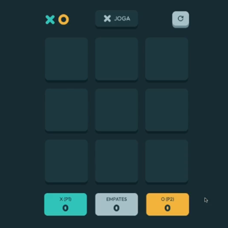

# JOGO DA VELHA v1

___

## Sumário

- [Visão Geral](#visão-geral)
- [Configuração do Projeto](#configuração-do-projeto)
- [Criando o Novo Projeto Front-end](#criando-o-novo-projeto-front-end)
- [Criando o Projeto Core](#criando-o-projeto-core)
- [Criando o Diretório Compartilhado](#criando-o-diretório-compartilhado)
- [Criando a Classe Player](#criando-a-classe-player)

___

## Visão Geral

Quando falamos de Modelagem de Domínio, estamos falando de uma área de atuação de uma empresa como por exemplo um hospital, ele possui um domínio de atender pacientes, outro refente ao plano de saúde, etc.  

Com isso, temos o Domínio relacionado ao problema e o Domínio relacionado a Solução do Problema que tentará resolver a partir da Modelagem, da Orientação a Objetos, da Herança do Polimorfismo, e das soluções técnicas para resolver os problemas existentes no mundo real.  

A modelagem é muito particular, podendo ir para qualquer caminho segundo o pensamento lógico de cada programador.  
O que veremos adiante, não é uma resposta única e correta para o problema, mas sim, uma abordagem de uma possível modelagem de um problema simples.  

Foram utilizados diversos Elementos que poderiam ser simplificados, mas que, facilmente poderiam ser retirados, pois, tudo vai depender do contexto do problema.  

> ***Pensamento:***  
*"Sempre que vamos aplicar um padrão de Projeto, se tem um problema recorrente e uma solução proposta, mas essa solução possui um padrão que será adaptado para a aplicação real"*  
>  
> ***Cristopher Alexander*** foi um arquiteto, matemático e urbanista austríaco. Era professor emérito da Universidade da Califórnia em Berkeley. Foi um dos críticos da arquitetura moderna apontando a desagregação social causada por ela.  
E foi escrito do livro ***A Pattern Language - Uma Linguagem de Padrões***, neste livro, Christopher Alexander propõe uma catalogação dos tipos de problemas *(ou desafios de projeto)* e analisa o que está por trás de cada situação.  

A Modelagem, não visa acrescentar complexidade chamada também de ***Complexidade Acidental***, existe uma ***Complexidade Intrínseca*** do problema.  

***Complexidade Intrínseca*** é quando existem problemas complexos como por exemplo, conceder um benefício do INSS, pois, existe um cálculo complexo por trás.  

***Complexidade Acidental*** é quando o problema está relacionado a uma escolha da equipe que está complicando algo que deveria ser simples.  

Em nosso Projeto, temos um problema simples *(um jogo da velha)*, mas, que iremos criar uma série de elementos para que possamos criar uma modelagem interessante, e é lógico que cada pessoa tem uma maneira de modelar este mesmo Projeto, esse será só um norte de como pode ser feito.  

[^ Sumário ^](#sumário)

## Configuração do Projeto

De início, iremos criar um Projeto de uma Aplicação Front-end simples mas utilizando Modelagem de Domínio para caso a aplicação precise crescer mais adiante, facilite o processo.  

Pois se não utilizarmos a Modelagem de Domínio logo no início, corre-se o risco de deixar o código totalmente acoplado dificultando o crescimento da aplicação.  

Será utilizado o [Turbo Build](https://turbo.build/), ele cria um Repositório Único e dentro ele gerencia uma série de projetos, por exemplo:  

- Uma aplicação de e-Commerce;
  - Tem o front-end da aplicação;
  - Tem o Módulo PDV;
  - Pode ter um Totem de Auto-Serviço;
  - Pode ter uma aplicação de Retaguarda (para os funcionários);

Todos esses Projetos, pode ser controlados a partir de um único repositório.  

A ideia do ***TurboRepo***, é trabalhar com o conceito de ***MonoRepo*** que seria um ***Repositório Único*** e dentro desse repositório existem todos os Projetos separados e Ele irá controlar o Build da Aplicação, as Dependências entre os Projetos, além de não existir mais a necessidade publicar um projeto no NPM para poder ser reutilizado em outros projetos, tudo pode ficar salvo em um único repositório sem a necessidade de se deixar salvo na internet.  

Agora iremos criar o Repositório Único da nossa Aplicação dentro da pasta `JOGO-DA-VELHA-v1`, através do Terminal com o comando `npx create-turbo@latest jogo-velha` que cria utilizando a última versão.  

Depois de executar o comando acima, ele pedirá a confirmação da instalação da versão, então, é só digitar "Y" e depois enter, ele irá instalar a versão do TurboRepo e depois irá perguntar ***"Which package manager do you want to use?"*** Qual gerenciador de pacotes você deseja usar? em nosso caso iremos utilizar o `> npm`.  

```zsh
// Terminal

apps
 - apps\docs
 - apps\web
packages
 - packages\eslint-config-custom
 - packages\tsconfig
 - packages\ui
```

Com isso, ele irá criar a pasta do Projeto `/jogo-velha` e dentro, irá criar toda a estrutura de pastas além de criar Dois projetos Front-end dentro da pasta `/apps`, um chamado `/docs` e outro chamado `/web`, os mesmos podem ser acessados pelo navegador em <http://localhost:3000> e <http://localhost:3001> respectivamente, mas antes *(no Terminal)*, precisamos entrar na pasta do Projeto, clicando com o botão direito do mouse na pasta `/jogo-velha` e escolhendo ***"Abrir no Terminal Integrado"*** e executar o comando `npm run dev` para poder rodar a Aplicação em Modo Desenvolvimento e poder acessar os endereços no navegador.  

Mas apesar dele ter criado os Projetos Front-end *(/docs e /web)*, não iremos utiliza-los, pois, ele criou fora da pasta `/src` que é onde iremos salvar nosso Projeto Front-end e que por sinal será simples de se fazer.  

O projeto será criado do ZERO, bastando criar dentro da pasta `/apps` que o TurboRepo procura o que tiver dentro e já disponibiliza o acesso, com a vantagem de se conseguir acessar outros Projetos e compartilhá-los.  

Por padrão ele cria uma pasta de Aplicações `/apps` e outra de Pacotes `/packages` onde ficariam as nossas Bibliotecas, no caso uma Dependência Interna do Projeto.  

Os dois Projetos Docs e Web que ele criou por padrão, dependem do Pacote/Biblioteca chamado `/ui` que são Elementos de Interface Gráfica, que se encontra dentro da pasta `/packages`.  

Esse é o projeto propriamente dito, dentro se encontram todos os arquivos referentes ao visual da Aplicação.

```zsh
// Terminal

/ui
|-- card.tsx
|-- index.tsx
|-- node_modules
|-- package.json
|-- tsconfig.json
`-- turbo
    `-- generators
        |-- config.ts
        `-- templates
            `-- component.hbs
```

Que possui um arquivo `index.tsx` como podemos ver acima e esse arquivo exporta um Componente `Card()` que é compartilhado pelo dois Projetos Front-end ***"Docs e Web"***.

```tsx
// index.tsx

...
// component exports
export { Card } from "./card";
...
```

***Componente Card:***

```tsx
// card.tsx

...
import * as React from "react";

export function Card({
  className,
  title,
  children,
  href,
}: {
  className?: string;
  title: string;
  children: React.ReactNode;
  href: string;
}): JSX.Element {
  return (
    <a
      className={className}
      href={`${href}?utm_source=create-turbo&utm_medium=basic&utm_campaign=create-turbo"`}
      rel="noopener noreferrer"
      target="_blank"
    >
      <h2>
        {title} <span>-&gt;</span>
      </h2>
      <p>{children}</p>
    </a>
  );
}
...
```

***Relembrando...***  
Executando no Terminal o comando `npm run dev` dentro do Projeto pasta `/jogo-velha` iremos rodar os Projetos no modo desenvolvimento e estarão acessíveis no navegador.  

Teremos os dois Projetos Front-end rodando, o ***web*** na ***porta 3000*** e o ***docs*** na ***porta 3001***, os dois compartilham o mesmo Componente que neste caso é o `Card()`, pois se consegue criar toda Biblioteca de Elementos e Componentes e reutilizar essa Biblioteca em todos os Projetos dentro do mesmo repositório, sem que seja preciso publicar na internet, colocar em um repositório privado e utilizar chaves de acesso para os pacotes privados no NPM, simplificando assim a configuração dentro do projeto.  

[^ Sumário ^](#sumário)

## Criando o Novo Projeto Front-end

Como não iremos utilizar os Projetos Front-end ***"web e docs"***, vamos excluí-los e criar nosso projeto do ZERO.  

Agora no Terminal e dentro da pasta `/apps` vamos executar o comando `npx create-next-app@latest frontend` confirmando com ***"Yes"*** para todas as perguntas.

```zsh
// Terminal

$ npx create-next-app@latest frontend

√ Would you like to use TypeScript? ... No / Yes
√ Would you like to use ESLint? ... No / Yes
√ Would you like to use Tailwind CSS? ... No / Yes
√ Would you like to use `src/` directory? ... No / Yes
√ Would you like to use App Router? (recommended) ... No / Yes
√ Would you like to customize the default import alias? ... No / Yes
√ What import alias would you like configured? ... @/*
```

Agora vamos sair da pasta `/apps` com o comando `cd ..` e estaremos na pasta do Projeto `/jogo-velha`, agora iremos executar o comando para rodar o Projeto e acessível pelo navegador `npm run dev` que poderemos acessar pelo endereço <http://localhost:3000>, no momento irá aparecer uma página com a logo do Next representando o Front-end da Aplicação.  

Agora, dentro da pasta `/frontend` iremos instalar uma Dependência chamada [Tabler](https://tabler.io/) que é uma Biblioteca de ícones, através do comando `npm i @tabler/icons-react`

[^ Sumário ^](#sumário)

## Criando o Projeto Core

Agora iremos criar o ***Core da Aplicação*** que irá representar as ***Regras da Aplicação***, então usando o terminal, supondo que estamos na raiz do Projeto `/jogo-velha`, execute o comando `cd packages` para entrar na pasta `/packages` e depois crie o Diretório/Pasta chamado `/core` com o comando `mkdir core`.  

```zsh
// Terminal

$ mkdir core  
```

Agora entre na pasta Core `cd core` e crie um arquivo `package.json` com o comando `npm init -y`.  

Criando assim a estrutura base do arquivo `package.json`.

```zsh
// Terminal

$ npm init -y  
```

> ***DICA:***  
*Para que a chave `author:` seja preenchida automaticamente através do comando acima, é preciso que o nome do mesmo seja adicionado nas configurações globais através do comando `npm config set init-author-name "SEU NOME AQUI"`, sendo preciso ser feito somente uma vez.*

```json
// package.json

...
{
  "name": "core",
  "version": "1.0.0",
  "description": "",
  "main": "index.js",
  "scripts": {
    "test": "echo \"Error: no test specified\" && exit 1"
  },
  "keywords": [],
  "author": "Marcos V R Pereira",
  "license": "ISC"
}
...
```

O próximo passo será entrar no Diretório/Pasta `/core` e criar os Diretórios/Pasta `/src` e `/test` e iremos adicionar ao `package.json` todas as Dependências que iremos utilizar no Projeto Core.  

Basicamente teremos o TypeScript e o Jest.  

> ***DICA:***  
Quando precisamos referenciar a Dependência `"dependencies:"` de um Projeto Interno, como por exemplo o Projeto UI que está dentro de `/packages`, dentro de seu arquivo `package.json`, ele irá depender de um Projeto chamado TSCONFIG `"tsconfig":` e que sua versão é `"*"`, isso significa que independente da versão, será pego o Projeto que contiver dentro do Diretório/Pasta.  
Isso vale tanto para as `"dependencies:"` quanto para as `"devDependencies:"`.  

E isso é o que iremos fazer com o Projeto Front-end, pois, ele irá depender do Projeto Core que estamos criando.  

Uma das vantagens de se separar o Core do Front-end, é que impossibilita de se misturar as Regras de Negócio `/core` com o código NextJs `/frontend`.  

Outro ponto, é que embora se consiga construir uma Aplicação organizada dentro de uma ***Única Pasta***, e do ponto de vista de códigos e de dependências está tudo perfeito, mas, quando se divide em Diretórios/Pastas, torna a Arquitetura mais explícita.  

> ***Referência:***  
Existe um capítulo do livro do ***Clean Architecture*** do escritor ***Robert Cecil Martin***, também conhecido como ***"Uncle Bob"***, que fala de uma arquitetura gritante, que deixa clara como os pacotes estão organizados.  

Então, quando separamos no núcleo a lógica da aplicação `/core` acabamos tendo uma série de vantagens.  

Dito isto, dentro da pasta `/core` iremos criar o arquivo de configuração `jest.config.js`:  

- `module.exports =` Exportando o Módulo;  
- `{` Abrindo o bloco do Objeto a ser exportado;
- `preset: 'ts-jest',` Seleciona o pacote que será usado, no caso, é o Jest para TypeScript;
- `testEnvironment: 'node',` Seleciona o Ambiente de Teste, no caso, é o Node;
- `testMatch: ['**/test/**/*.test.ts'],` Seleciona o local onde serão os testes, no caso, tudo que estiver dentro da pasta `/test`;
- `collectCoverage: true,` Coleta a cobertura do teste;
- `collectCoverageFrom: ['<rootDir>/src/**/*.ts']` Irá pegar a cobertura apenas da pasta `/src`;
- `}` Fechando o bloco do Objeto.

> ***DICA:***  
*Se não quiser que uma determinada pasta seja coberta, coloca-se uma ***exclamação "!"*** na frente. `collectCoverageFrom: [ '!<rootDir>/src/**/*.ts' ]`, assim podemos filtrar que o relatório de cobertura pegue somente o que precisamos.*

```js
// jest.config.js

...
module.exports = {
  preset: 'ts-jest',
  testEnvironment: 'node',
  testMatch: ['**/test/**/*.test.ts'],
  collectCoverage: true,
  collectCoverageFrom: ['<rootDir>/src/**/*.ts'],
}
...
```

E o arquivo de configuração `tsconfig.json` basicamente já irá usar como base, um arquivo chamado `base.json` que está dentro da pasta `/tsconfig` que se encontra dentro de `/packages` que contém todas as configurações básicas do Projeto, onde podemos criar uma relação de extensão/herança e aqui configuramos somente o que for necessário para este projeto.  

Ainda dentro da pasta `/core` iremos criar o arquivo de configuração `tsconfig.json`:  

- `{` Abre o Bloco do Objeto;
- `"extends": "../tsconfig/base.json",` Extensão/herança das configurações básicas do Projeto;
- `"include": [ "." ],` Inclui tudo que estiver dentro da pasta Core;
- `"exclude": [ "dist", "build", "node_modules" ],` Exclui as pastas e seus conteúdos;
- `"compilerOptions": { "target": "ES2015" }` Compila o Projeto para uma versão específica;
- `}` Fecha o Bloco do Objeto.

```json
// tsconfig.json

...
{
    "extends": "../tsconfig/base.json",
    "include": [
        "."
    ],
    "exclude": [
        "dist",
        "build",
        "node_modules"
    ],
    "compilerOptions": {
        "target": "ES2015"
    }
}
...
```

Com isso, precisamos definir as Dependências de Desenvolvimento `devDependencies:`.

- `"devDependencies":` Chave Dependências de Desenvolvimento;
- `{` Abertura do Bloco de Dependências;
- `"@types/jest": "^29.5.2",` Os tipos do Jest e sua versão;
- `"eslint": "^7.32.0",` ESlint e sua versão;
- `"eslint-config-custom": "*",` Projeto interno do ESlint;
- `"jest": "^29.5.0",` O Jest propriamente dito e sua versão;
- `"ts-jest": "^29.1.0",` Jest para TypeScript e sua versão;
- `"tsconfig": "*",` Projeto Base interno de configuração;
- `"typescript": "^4.5.2"` TypeScript e sua versão;
- `}` Fechamento do Bloco de Dependências.

```json
// package.json

...
{
  "name": "core",
  ...
  "devDependencies": {
    "@types/jest": "^29.5.2",
    "eslint": "^7.32.0",
    "eslint-config-custom": "*",
    "jest": "^29.5.0",
    "ts-jest": "^29.1.0",
    "tsconfig": "*",
    "typescript": "^4.5.2"
  }
}
...
```

Depois disso, precisamos fazer a instalação das dependências, então, dentro do Projeto Raiz `/jogo-velha` execute o comando `npm i`, com isso, serão feitas todas as instalações e o Projeto Core será criado.

```zsh
// Terminal

$ npm i

added 185 packages, and audited 872 packages in 53s

197 packages are looking for funding
  run `npm fund` for details

found 0 vulnerabilities
```

Para finalizar a configuração do Projeto, precisamos criar dois arquivos para que possamos efetuar um teste e verificar se tudo está correto.

Dentro do Diretório/Pasta `/src` crie um arquivo chamado `index.ts`.

```ts
// index.ts

export function somar(a: number, b: number){
    return a + b
}
```

E no Diretório/Pasta `/test` crie o arquivo chamado `index.test.ts`, onde devemos importar `import` utilizando destructuring a Função `{ somar }` de `from` `'../src'`, realizando o teste `test('Deve somar dois números',` utilizando a Arrow Function `() => {` crie uma constante `const` chamada `resultado` que recebe `=` a soma de 2 + 3 `somar(2,3)` e espera que o resultado `expect(resultado)` seja 5 `.toBe(5) })`.

```ts
// index.test.ts

import { somar } from '../src'

test('Deve somar dois números', () => {
  const resultado = somar(2, 3)
  expect(resultado).toBe(5)
})

```

Depois de tudo feito, podemos realizar os testes tanto dentro Projeto Raiz `/jogo-velha` quanto dentro do Projeto Core `/core` que será o local padrão onde executaremos os teste, pois, tem a saída no terminal colorida e fica melhor de ser visualizado.  

Mas antes precisamos fazer mais algumas configurações para que tudo ocorra perfeitamente sem erros.  

Pois, o TurboRepo precisa reconhecer os scripts que serão executados, dentro do Projeto Raiz `/jogo-velha` temos o arquivo `turbo.json` e nele existe uma `"pipeline":` onde se encontram todos os Scripts que serão executados de todos os Projetos.  

Então, agora iremos editar o arquivo `package.json` que se encontra dentro da pasta `/core` e modificaremos o Script do Test `"scripts": { "test": "jest --watchAll --collectCoverage" }`, este Script irá coletar a cobertura de Testes.

```json
// package.json

{
  ...
  "scripts": {
    "test": "jest --watchAll --collectCoverage"
  },
  ...
}
```

Mas para que esse Script de Teste possa funcionar, precisamos defini-lo na `"pipeline":` do arquivo `turbo.json` que se encontra no Projeto Raiz `/jogo-velha`, adicionando esta nova pipeline `"test": {}`.

```json
// turbo.json

{
  "$schema": "https://turbo.build/schema.json",
  "globalDependencies": ["**/.env.*local"],
  "pipeline": {
    "build": {
      "dependsOn": ["^build"],
      "outputs": [".next/**", "!.next/cache/**"]
    },
    "lint": {},
>>  "test": {},
    "dev": {
      "cache": false,
      "persistent": true
    }
  }
}
```

Agora precisamos realizar a definição do Script de Teste dentro do `package.json` que se encontra na raiz do Projeto Raiz `/jogo-velha`, adicionando o Script `"test": "turbo run test",`.

```json
// package.json

{
  ...
  "scripts": {
    ...
    "test": "turbo run test",
    ...
  },
  ...
}
```

Agora dentro da pasta `/core` e executando o comando `npm test` no Terminal, podemos obter o resultado positivo do teste ***"Deve somar dois números"*** na saída abaixo.

```zsh
// Terminal

$ npm test

 PASS  test/index.test.ts
  √ Deve somar dois números (9 ms)

----------|---------|----------|---------|---------|-------------------
File      | % Stmts | % Branch | % Funcs | % Lines | Uncovered Line #s 
----------|---------|----------|---------|---------|-------------------
All files |     100 |      100 |     100 |     100 |                   
 index.ts |     100 |      100 |     100 |     100 |                   
----------|---------|----------|---------|---------|-------------------
Test Suites: 1 passed, 1 total
Tests:       1 passed, 1 total
Snapshots:   0 total
Time:        4.201 s, estimated 7 s
Ran all test suites.
```

[^ Sumário ^](#sumário)

## Criando o Diretório Compartilhado

Agora iremos entrar na pasta `/src` dentro da pasta `/core` e vamos criar um novo Diretório/Pasta chamado `/shared` que significa Compartilhado, é aqui que iremos salvar todos os Elementos que serão utilizados em todo o Core.  

> O ***enum*** é um dos tipos do TypeScript que nos permite declarar um conjunto de ***valores/constantes*** pré-definidos.

Com isso, iremos criar a Classe que irá definir o Tipo do Jogador, se será "X" ou "O", então, crie um arquivo chamado `PlayerType.ts`, dentro iremos exportar `export` uma enumeração `enum` chamado `PlayerType {` contendo dois tipo de Jogadores "X" `X = 'X',` e "O" `O = 'O' }`.

```ts
// PlayerType.ts

export enum PlayerType {
    X = 'X',
    O = 'O'
}
```

***Elementos do Jogo da Velha***

- O elemento principal é a Classe Game, que conterá os outros elementos do Jogo como o Tabuleiro e o Jogador;
- A Classe Player, será responsável pelas ações do Jogador;
- A Classe Board, conterá os 9 elementos Cell para formar o Tabuleiro;
- A Classe Cell, é cada elemento do Tabuleiro;
- E outras diversas Classes para calcular os diferentes resultados em cada jogada;
- Cor primária representada pela cor do Jogador X;
- Cor secundária representada pela cor do Jogador O;
- Cor light representada pelo botão reiniciar e Card empate;
- Cor dark representada pelo fundo e as Células do Tabuleiro;
- Card que mostra o jogador atual;
- Botão que reinicia a jogada e troca a vez do jogador;
- Células do Tabuleiro;
- Card que mostra o Jogador e sua pontuação;
- Card que mostra a pontuação de empate.



***Representa quando uma Jogada é encerrada***


Então, teremos essas e outras Classes que não foram citadas no Projeto, essa lógica daria para fazer em um único arquivo, isso iria deixar um pouco mais complicado caso a aplicação precisasse crescer pois estaria muito amarrada para poder separar.  

A ideia principal fazer uma ***Modelagem Rica*** para facilitar a evolução da aplicação.  

[^ Sumário ^](#sumário)

## Criando a Classe Player

Dentro do Diretório/Pasta `/src` crie o Diretório/Pasta chamado `/player`, agora dentro desta pasta, crie o Classe chamada `Player.ts`.  

Usaremos a Modelagem Rica na construção da Classe Player, basicamente ele conterá o Nome do jogador, o Tipo do Jogador e a pontuação do Jogador.  

A principio não estamos deixando uma forma de digitar o nome do Jogador, mas poderia ter um campo de texto onde o usuário digitaria seu nome.  

Então começamos importando `import` a Classe `{ PayerType }` de `from '../shared/PlayerType'`, depois exportamos por padrão `export default` a Classe Player `class Player` contendo `{` um construtor `constructor(` com atributos imutáveis "somente leitura" `readonly name: string, readonly type: PlayerType, score: number = 0) {}`.  

```ts
// Player.ts

import { PlayerType } from '../../shared/PlayerType'

export default class Player {
  constructor(
    readonly name: string,
    readonly type: PlayerType,
    readonly score: number = 0
  ) {}
...
```

> ***Aqui, temos um Objeto Imutável, onde, não conseguimos mexer no Objeto Player, o único estado que temos quando o Jogo termina, é a pontuação do Jogador, o Score.***

Trabalhar com Objetos Imutáveis é um conceito da Programação Funcional que está sendo utilizado agora em uma Modelagem Orientada a Objetos, onde todos os Atributos são "somente leitura" e sempre que precisarmos mexer no Estado do Objeto, esse comportamento retornará uma nova instância.  

Ainda dentro da Classe Player, crie um Método chamado `addScore(` que recebe como parâmetro o Score `score: number)` que irá adicionar a Pontuação ao jogador `Player` então, `{` Se `if` o Score for estritamente igual a ZERO `(score === 0)` retorne este Jogador `return this` retorne um Novo Jogador `return new Player(` com o mesmo nome `this.name,` o mesmo tipo `this.type,` contendo sua pontuação + o que foi recebido por parâmetro pela variável Score `this.score + score) }`.

```ts
// Player.ts

...
  addScore(score: number){
    if(score === 0) return this
    return new Player(
        this.name,
        this.type,
        this.score + score
    )
  }
...
```

Outro comportamento Rico que teremos será quando quisermos Limpar a Pontuação, ainda dentro da Classe Player, crie um Método chamado `clear():` crie uma instancia Jogador `Player` então `{` retorne `return` um Novo Jogador `new Player(` com o mesmo nome `this.name,` o mesmo tipo `this.type,` e com o Score ZERADO `0)} }`, que é o que acontecerá assim que terminar a partida, quando clicar no botão `zerar`.  

Com isso, temos um Objeto que já possui o comportamento de ZERAR a pontuação e podemos utilizar este comportamento.

```ts
// Player.ts

...
  clear(): Player {
    return new Player(this.name, this.type, 0)
  }
}
```
