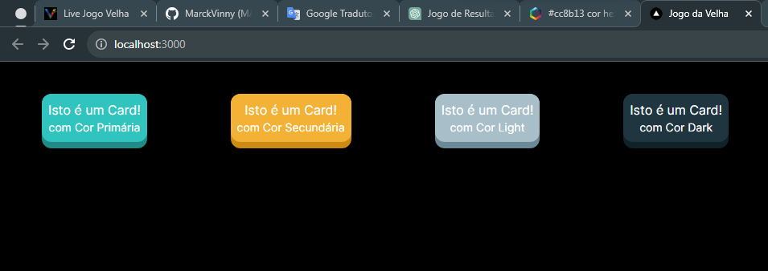
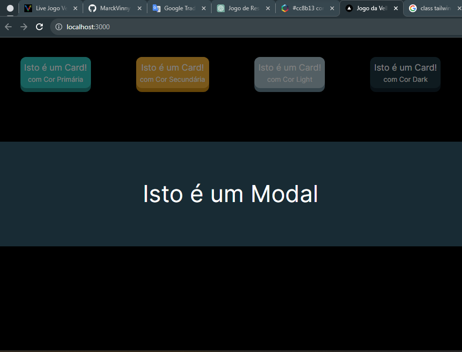
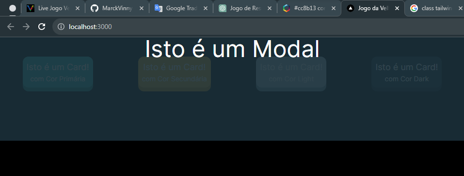
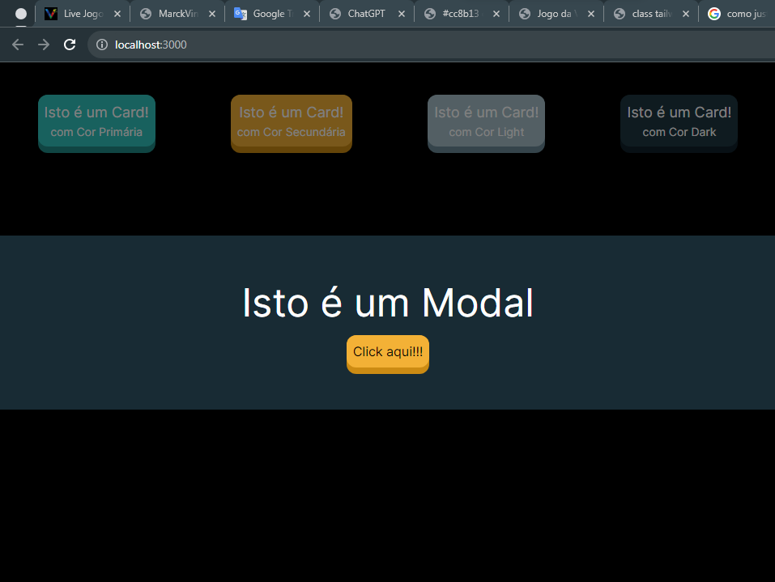
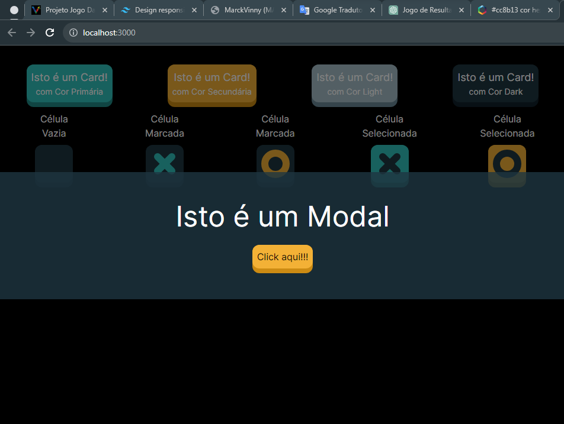
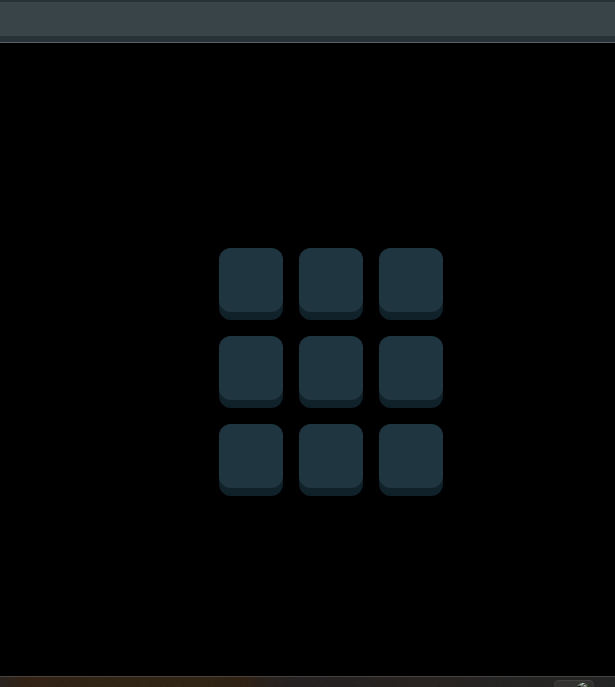

# JOGO DA VELHA

___

## Sumário

- [Visão Geral](#visão-geral)
- [Configuração do Projeto](#configuração-do-projeto)
- [Criando o Novo Projeto Front-end](#criando-o-novo-projeto-front-end)

### Modelagem do Projeto

- [Criando o Projeto Core](#criando-o-projeto-core)
- [Criando o Diretório Compartilhado](#criando-o-diretório-compartilhado)
- [Criando a Classe Player](#criando-a-classe-player)
- [Criando os Testes Unitários para o Player](#criando-os-testes-unitários-para-o-player)
- [Criando a Classe Cell](#criando-a-classe-cell)
- [Criando os Testes Unitários da Classe Cell](#criando-os-testes-unitários-da-classe-cell
)
- [Criando Testes Unitários da Classe Board](#criando-testes-unitários-da-classe-board)
- [Criando a Classe Game Result](#criando-a-classe-gameresult)
  - [Verificando se o "Jogador X" Venceu](#verificando-se-o-jogador-x-venceu)
  - [Verificando se o "Jogador O" Venceu](#verificando-se-o-jogador-o-venceu)
  - [Verificando se houve Empate](#verificando-se-houve-empate)
  - [Verificando se o Jogo está em progresso](#verificando-se-o-jogo-está-em-progresso)
  - [Verificando se a Célula tem a Jogada Vencedora](#verificando-se-a-célula-tem-a-jogada-vencedora)
- [Criando os Testes da Classe GameResult](#criando-os-testes-da-classe-gameresult)
- [Criando a Classe ResultChecker](#criando-a-classe-resultchecker)
- [Criando a Classe CellsChecker](#criando-a-classe-cellschecker)
- [Criando a Classe HorizontalChecker](#criando-a-classe-horizontalchecker)
- [Criando o Teste Unitário da Classe HorizontalChecker](#criando-o-teste-unitário-da-classe-horizontalchecker)
- [Criando a Classe VerticalChecker](#criando-a-classe-verticalchecker)
- [Criando o Teste Unitário da Classe VerticalChecker](#criando-o-teste-unitário-da-classe-verticalchecker)
- [Criando a Classe DiagonalChecker](#criando-a-classe-diagonalchecker)
- [Criando o Teste Unitário da Classe DiagonalChecker](#criando-o-teste-unitário-da-classe-diagonalchecker)
- [Criando a Classe TieChecker](#criando-a-classe-tiechecker)
- [Criando o Teste Unitário da Classe TieChecker](#criando-o-teste-unitário-da-classe-tiechecker)
- [Criando a Classe Game](#criando-a-classe-game)
  - [Método Estático Create](#método-estático-create)
  - [Método Estático NextRound](#método-estático-nextround)
  - [Método Público Clear](#método-público-clear)
  - [Método Público AddMove](#método-público-addmove)
  - [Método Privado CalculateResult](#método-privado-calculateresult)
  - [Método Privado Players](#método-privado-players)
  - [Método Privado SwitchPlayer](#método-privado-switchplayer)
- [Criando o Teste Unitário da Classe Game](#criando-o-teste-unitário-da-classe-game)

### Interface Gráfica - Front-end

- [Configurando o TurboRepo](#configurando-o-turborepo)
- [Configurando o TailwindCSS](#configurando-o-tailwindcss)
- [Componente `<Card>`](#componente-card)
- [Componente `<Modal>`](#componente-modal)
- [Componente `<Button>`](#componente-button)
- [Componente `<CellArea>`](#componente-cellarea)
- [Contexto `<GameContext>` - Gerenciamento de Estado](#contexto-gamecontext---gerenciamento-de-estado)
- [Componente `<BoardArea>` - Área do Tabuleiro](#componente-boardarea---área-do-tabuleiro)

___

## Visão Geral

Quando falamos de Modelagem de Domínio, estamos falando de uma área de atuação de uma empresa como por exemplo um hospital, ele possui um domínio de atender pacientes, outro refente ao plano de saúde, etc.  

Com isso, temos o Domínio relacionado ao problema e o Domínio relacionado a Solução do Problema que tentará resolver a partir da Modelagem, da Orientação a Objetos, da Herança do Polimorfismo, e das soluções técnicas para resolver os problemas existentes no mundo real.  

A modelagem é muito particular, podendo ir para qualquer caminho segundo o pensamento lógico de cada programador.  
O que veremos adiante, não é uma resposta única e correta para o problema, mas sim, uma abordagem de uma possível modelagem de um problema simples.  

Foram utilizados diversos Elementos que poderiam ser simplificados, mas que, facilmente poderiam ser retirados, pois, tudo vai depender do contexto do problema.  

> ***Pensamento:***  
*"Sempre que vamos aplicar um padrão de Projeto, se tem um problema recorrente e uma solução proposta, mas essa solução possui um padrão que será adaptado para a aplicação real"*  
>  
> ***Cristopher Alexander*** foi um arquiteto, matemático e urbanista austríaco. Era professor emérito da Universidade da Califórnia em Berkeley. Foi um dos críticos da arquitetura moderna apontando a desagregação social causada por ela.  
E foi escrito do livro ***A Pattern Language - Uma Linguagem de Padrões***, neste livro, Christopher Alexander propõe uma catalogação dos tipos de problemas *(ou desafios de projeto)* e analisa o que está por trás de cada situação.  

A Modelagem, não visa acrescentar complexidade chamada também de ***Complexidade Acidental***, existe uma ***Complexidade Intrínseca*** do problema.  

***Complexidade Intrínseca*** é quando existem problemas complexos como por exemplo, conceder um benefício do INSS, pois, existe um cálculo complexo por trás.  

***Complexidade Acidental*** é quando o problema está relacionado a uma escolha da equipe que está complicando algo que deveria ser simples.  

Em nosso Projeto, temos um problema simples *(um jogo da velha)*, mas, que iremos criar uma série de elementos para que possamos criar uma modelagem interessante, e é lógico que cada pessoa tem uma maneira de modelar este mesmo Projeto, esse será só um norte de como pode ser feito.  

[^ Sumário ^](#sumário)

## Configuração do Projeto

De início, iremos criar um Projeto de uma Aplicação Front-end simples mas utilizando Modelagem de Domínio para caso a aplicação precise crescer mais adiante, facilite o processo.  

Pois se não utilizarmos a Modelagem de Domínio logo no início, corre-se o risco de deixar o código totalmente acoplado dificultando o crescimento da aplicação.  

Será utilizado o [Turbo Build](https://turbo.build/), ele cria um Repositório Único e dentro ele gerencia uma série de projetos, por exemplo:  

- Uma aplicação de e-Commerce;
  - Tem o front-end da aplicação;
  - Tem o Módulo PDV;
  - Pode ter um Totem de Auto-Serviço;
  - Pode ter uma aplicação de Retaguarda (para os funcionários);

Todos esses Projetos, pode ser controlados a partir de um único repositório.  

A ideia do ***TurboRepo***, é trabalhar com o conceito de ***MonoRepo*** que seria um ***Repositório Único*** e dentro desse repositório existem todos os Projetos separados e Ele irá controlar o Build da Aplicação, as Dependências entre os Projetos, além de não existir mais a necessidade publicar um projeto no NPM para poder ser reutilizado em outros projetos, tudo pode ficar salvo em um único repositório sem a necessidade de se deixar salvo na internet.  

Agora iremos criar o Repositório Único da nossa Aplicação dentro da pasta `JOGO-DA-VELHA-v1`, através do Terminal com o comando `npx create-turbo@latest jogo-velha` que cria utilizando a última versão.  

Depois de executar o comando acima, ele pedirá a confirmação da instalação da versão, então, é só digitar "Y" e depois enter, ele irá instalar a versão do TurboRepo e depois irá perguntar ***"Which package manager do you want to use?"*** Qual gerenciador de pacotes você deseja usar? em nosso caso iremos utilizar o `> npm`.  

```zsh
// Terminal

apps
 - apps\docs
 - apps\web
packages
 - packages\eslint-config-custom
 - packages\tsconfig
 - packages\ui
```

Com isso, ele irá criar a pasta do Projeto `/jogo-velha` e dentro, irá criar toda a estrutura de pastas além de criar Dois projetos Front-end dentro da pasta `/apps`, um chamado `/docs` e outro chamado `/web`, os mesmos podem ser acessados pelo navegador em <http://localhost:3000> e <http://localhost:3001> respectivamente, mas antes *(no Terminal)*, precisamos entrar na pasta do Projeto, clicando com o botão direito do mouse na pasta `/jogo-velha` e escolhendo ***"Abrir no Terminal Integrado"*** e executar o comando `npm run dev` para poder rodar a Aplicação em Modo Desenvolvimento e poder acessar os endereços no navegador.  

Mas apesar dele ter criado os Projetos Front-end *(/docs e /web)*, não iremos utiliza-los, pois, ele criou fora da pasta `/src` que é onde iremos salvar nosso Projeto Front-end e que por sinal será simples de se fazer.  

O projeto será criado do ZERO, bastando criar dentro da pasta `/apps` que o TurboRepo procura o que tiver dentro e já disponibiliza o acesso, com a vantagem de se conseguir acessar outros Projetos e compartilhá-los.  

Por padrão ele cria uma pasta de Aplicações `/apps` e outra de Pacotes `/packages` onde ficariam as nossas Bibliotecas, no caso uma Dependência Interna do Projeto.  

Os dois Projetos Docs e Web que ele criou por padrão, dependem do Pacote/Biblioteca chamado `/ui` que são Elementos de Interface Gráfica, que se encontra dentro da pasta `/packages`.  

Esse é o projeto propriamente dito, dentro se encontram todos os arquivos referentes ao visual da Aplicação.

```zsh
// Terminal

/ui
|-- card.tsx
|-- index.tsx
|-- node_modules
|-- package.json
|-- tsconfig.json
`-- turbo
    `-- generators
        |-- config.ts
        `-- templates
            `-- component.hbs
```

Que possui um arquivo `index.tsx` como podemos ver acima e esse arquivo exporta um Componente `Card()` que é compartilhado pelo dois Projetos Front-end ***"Docs e Web"***.

```tsx
// index.tsx

...
// component exports
export { Card } from "./card";
...
```

***Componente Card:***

```tsx
// card.tsx

...
import * as React from "react";

export function Card({
  className,
  title,
  children,
  href,
}: {
  className?: string;
  title: string;
  children: React.ReactNode;
  href: string;
}): JSX.Element {
  return (
    <a
      className={className}
      href={`${href}?utm_source=create-turbo&utm_medium=basic&utm_campaign=create-turbo"`}
      rel="noopener noreferrer"
      target="_blank"
    >
      <h2>
        {title} <span>-&gt;</span>
      </h2>
      <p>{children}</p>
    </a>
  );
}
...
```

***Relembrando...***  
Executando no Terminal o comando `npm run dev` dentro do Projeto pasta `/jogo-velha` iremos rodar os Projetos no modo desenvolvimento e estarão acessíveis no navegador.  

Teremos os dois Projetos Front-end rodando, o ***web*** na ***porta 3000*** e o ***docs*** na ***porta 3001***, os dois compartilham o mesmo Componente que neste caso é o `Card()`, pois se consegue criar toda Biblioteca de Elementos e Componentes e reutilizar essa Biblioteca em todos os Projetos dentro do mesmo repositório, sem que seja preciso publicar na internet, colocar em um repositório privado e utilizar chaves de acesso para os pacotes privados no NPM, simplificando assim a configuração dentro do projeto.  

[^ Sumário ^](#sumário)

## Criando o Novo Projeto Front-end

Como não iremos utilizar os Projetos Front-end ***"web e docs"***, vamos excluí-los e criar nosso projeto do ZERO.  

Agora no Terminal e dentro da pasta `/apps` vamos executar o comando `npx create-next-app@latest frontend` confirmando com ***"Yes"*** para todas as perguntas.

```zsh
// Terminal

$ npx create-next-app@latest frontend

√ Would you like to use TypeScript? ... No / Yes
√ Would you like to use ESLint? ... No / Yes
√ Would you like to use Tailwind CSS? ... No / Yes
√ Would you like to use `src/` directory? ... No / Yes
√ Would you like to use App Router? (recommended) ... No / Yes
√ Would you like to customize the default import alias? ... No / Yes
√ What import alias would you like configured? ... @/*
```

Agora vamos sair da pasta `/apps` com o comando `cd ..` e estaremos na pasta do Projeto `/jogo-velha`, agora iremos executar o comando para rodar o Projeto e acessível pelo navegador `npm run dev` que poderemos acessar pelo endereço <http://localhost:3000>, no momento irá aparecer uma página com a logo do Next representando o Front-end da Aplicação.  

Agora, dentro da pasta `/frontend` iremos instalar uma Dependência chamada [Tabler](https://tabler.io/) que é uma Biblioteca de ícones, através do comando `npm i @tabler/icons-react`

[^ Sumário ^](#sumário)
___
___

## <center>MODELAGEM DO PROJETO</center>

___
___

## Criando o Projeto Core

Agora iremos criar o ***Core da Aplicação*** que irá representar as ***Regras da Aplicação***, então usando o terminal, supondo que estamos na raiz do Projeto `/jogo-velha`, execute o comando `cd packages` para entrar na pasta `/packages` e depois crie o Diretório/Pasta chamado `/core` com o comando `mkdir core`.  

```zsh
// Terminal

$ mkdir core  
```

Agora entre na pasta Core `cd core` e crie um arquivo `package.json` com o comando `npm init -y`.  

Criando assim a estrutura base do arquivo `package.json`.

```zsh
// Terminal

$ npm init -y  
```

> ***DICA:***  
*Para que a chave `author:` seja preenchida automaticamente através do comando acima, é preciso que o nome do mesmo seja adicionado nas configurações globais através do comando `npm config set init-author-name "SEU NOME AQUI"`, sendo preciso ser feito somente uma vez.*

```json
// package.json

...
{
  "name": "core",
  "version": "1.0.0",
  "description": "",
  "main": "index.js",
  "scripts": {
    "test": "echo \"Error: no test specified\" && exit 1"
  },
  "keywords": [],
  "author": "Marcos V R Pereira",
  "license": "ISC"
}
...
```

O próximo passo será entrar no Diretório/Pasta `/core` e criar os Diretórios/Pasta `/src` e `/test` e iremos adicionar ao `package.json` todas as Dependências que iremos utilizar no Projeto Core.  

Basicamente teremos o TypeScript e o Jest.  

> ***DICA:***  
Quando precisamos referenciar a Dependência `"dependencies:"` de um Projeto Interno, como por exemplo o Projeto UI que está dentro de `/packages`, dentro de seu arquivo `package.json`, ele irá depender de um Projeto chamado TSCONFIG `"tsconfig":` e que sua versão é `"*"`, isso significa que independente da versão, será pego o Projeto que contiver dentro do Diretório/Pasta.  
Isso vale tanto para as `"dependencies:"` quanto para as `"devDependencies:"`.  

E isso é o que iremos fazer com o Projeto Front-end, pois, ele irá depender do Projeto Core que estamos criando.  

Uma das vantagens de se separar o Core do Front-end, é que impossibilita de se misturar as Regras de Negócio `/core` com o código NextJs `/frontend`.  

Outro ponto, é que embora se consiga construir uma Aplicação organizada dentro de uma ***Única Pasta***, e do ponto de vista de códigos e de dependências está tudo perfeito, mas, quando se divide em Diretórios/Pastas, torna a Arquitetura mais explícita.  

> ***Referência:***  
Existe um capítulo do livro do ***Clean Architecture*** do escritor ***Robert Cecil Martin***, também conhecido como ***"Uncle Bob"***, que fala de uma arquitetura gritante, que deixa clara como os pacotes estão organizados.  

Então, quando separamos no núcleo a lógica da aplicação `/core` acabamos tendo uma série de vantagens.  

Dito isto, dentro da pasta `/core` iremos criar o arquivo de configuração `jest.config.js`:  

- `module.exports =` Exportando o Módulo;  
- `{` Abrindo o bloco do Objeto a ser exportado;
- `preset: 'ts-jest',` Seleciona o pacote que será usado, no caso, é o Jest para TypeScript;
- `testEnvironment: 'node',` Seleciona o Ambiente de Teste, no caso, é o Node;
- `testMatch: ['**/test/**/*.test.ts'],` Seleciona o local onde serão os testes, no caso, tudo que estiver dentro da pasta `/test`;
- `collectCoverage: true,` Coleta a cobertura do teste;
- `collectCoverageFrom: ['<rootDir>/src/**/*.ts']` Irá pegar a cobertura apenas da pasta `/src`;
- `}` Fechando o bloco do Objeto.

> ***DICA:***  
*Se não quiser que uma determinada pasta seja coberta, coloca-se uma ***exclamação "!"*** na frente. `collectCoverageFrom: [ '!<rootDir>/src/**/*.ts' ]`, assim podemos filtrar que o relatório de cobertura pegue somente o que precisamos.*

```js
// jest.config.js

...
module.exports = {
  preset: 'ts-jest',
  testEnvironment: 'node',
  testMatch: ['**/test/**/*.test.ts'],
  collectCoverage: true,
  collectCoverageFrom: ['<rootDir>/src/**/*.ts'],
}
...
```

E o arquivo de configuração `tsconfig.json` basicamente já irá usar como base, um arquivo chamado `base.json` que está dentro da pasta `/tsconfig` que se encontra dentro de `/packages` que contém todas as configurações básicas do Projeto, onde podemos criar uma relação de extensão/herança e aqui configuramos somente o que for necessário para este projeto.  

Ainda dentro da pasta `/core` iremos criar o arquivo de configuração `tsconfig.json`:  

- `{` Abre o Bloco do Objeto;
- `"extends": "../tsconfig/base.json",` Extensão/herança das configurações básicas do Projeto;
- `"include": [ "." ],` Inclui tudo que estiver dentro da pasta Core;
- `"exclude": [ "dist", "build", "node_modules" ],` Exclui as pastas e seus conteúdos;
- `"compilerOptions": { "target": "ES2015" }` Compila o Projeto para uma versão específica;
- `}` Fecha o Bloco do Objeto.

```json
// tsconfig.json

...
{
    "extends": "../tsconfig/base.json",
    "include": [
        "."
    ],
    "exclude": [
        "dist",
        "build",
        "node_modules"
    ],
    "compilerOptions": {
        "target": "ES2015"
    }
}
...
```

Com isso, precisamos definir as Dependências de Desenvolvimento `devDependencies:`.

- `"devDependencies":` Chave Dependências de Desenvolvimento;
- `{` Abertura do Bloco de Dependências;
- `"@types/jest": "^29.5.2",` Os tipos do Jest e sua versão;
- `"eslint": "^7.32.0",` ESlint e sua versão;
- `"eslint-config-custom": "*",` Projeto interno do ESlint;
- `"jest": "^29.5.0",` O Jest propriamente dito e sua versão;
- `"ts-jest": "^29.1.0",` Jest para TypeScript e sua versão;
- `"tsconfig": "*",` Projeto Base interno de configuração;
- `"typescript": "^4.5.2"` TypeScript e sua versão;
- `}` Fechamento do Bloco de Dependências.

```json
// package.json

...
{
  "name": "core",
  ...
  "devDependencies": {
    "@types/jest": "^29.5.2",
    "eslint": "^7.32.0",
    "eslint-config-custom": "*",
    "jest": "^29.5.0",
    "ts-jest": "^29.1.0",
    "tsconfig": "*",
    "typescript": "^4.5.2"
  }
}
...
```

Depois disso, precisamos fazer a instalação das dependências, então, dentro do Projeto Raiz `/jogo-velha` execute o comando `npm i`, com isso, serão feitas todas as instalações e o Projeto Core será criado.

```zsh
// Terminal

$ npm i

added 185 packages, and audited 872 packages in 53s

197 packages are looking for funding
  run `npm fund` for details

found 0 vulnerabilities
```

Para finalizar a configuração do Projeto, precisamos criar dois arquivos para que possamos efetuar um teste e verificar se tudo está correto.

Dentro do Diretório/Pasta `/src` crie um arquivo chamado `index.ts`.

```ts
// index.ts

export function somar(a: number, b: number){
    return a + b
}
```

E no Diretório/Pasta `/test` crie o arquivo chamado `index.test.ts`, onde devemos importar `import` utilizando destructuring a Função `{ somar }` de `from` `'../src'`, realizando o teste `test('Deve somar dois números',` utilizando a Arrow Function `() => {` crie uma constante `const` chamada `resultado` que recebe `=` a soma de 2 + 3 `somar(2,3)` e espera que o resultado `expect(resultado)` seja 5 `.toBe(5) })`.

```ts
// index.test.ts

import { somar } from '../src'

test('Deve somar dois números', () => {
  const resultado = somar(2, 3)
  expect(resultado).toBe(5)
})

```

Depois de tudo feito, podemos realizar os testes tanto dentro Projeto Raiz `/jogo-velha` quanto dentro do Projeto Core `/core` que será o local padrão onde executaremos os teste, pois, tem a saída no terminal colorida e fica melhor de ser visualizado.  

Mas antes precisamos fazer mais algumas configurações para que tudo ocorra perfeitamente sem erros.  

Pois, o TurboRepo precisa reconhecer os scripts que serão executados, dentro do Projeto Raiz `/jogo-velha` temos o arquivo `turbo.json` e nele existe uma `"pipeline":` onde se encontram todos os Scripts que serão executados de todos os Projetos.  

Então, agora iremos editar o arquivo `package.json` que se encontra dentro da pasta `/core` e modificaremos o Script do Test `"scripts": { "test": "jest --watchAll --collectCoverage" }`, este Script irá coletar a cobertura de Testes.

```json
// package.json

{
  ...
  "scripts": {
    "test": "jest --watchAll --collectCoverage"
  },
  ...
}
```

Mas para que esse Script de Teste possa funcionar, precisamos defini-lo na `"pipeline":` do arquivo `turbo.json` que se encontra no Projeto Raiz `/jogo-velha`, adicionando esta nova pipeline `"test": {}`.

```json
// turbo.json

{
  "$schema": "https://turbo.build/schema.json",
  "globalDependencies": ["**/.env.*local"],
  "pipeline": {
    "build": {
      "dependsOn": ["^build"],
      "outputs": [".next/**", "!.next/cache/**"]
    },
    "lint": {},
>>  "test": {},
    "dev": {
      "cache": false,
      "persistent": true
    }
  }
}
```

Agora precisamos realizar a definição do Script de Teste dentro do `package.json` que se encontra na raiz do Projeto Raiz `/jogo-velha`, adicionando o Script `"test": "turbo run test",`.

```json
// package.json

{
  ...
  "scripts": {
    ...
    "test": "turbo run test",
    ...
  },
  ...
}
```

Agora dentro da pasta `/core` e executando o comando `npm test` no Terminal, podemos obter o resultado positivo do teste ***"Deve somar dois números"*** na saída abaixo.

```zsh
// Terminal

$ npm test

 PASS  test/index.test.ts
  √ Deve somar dois números (9 ms)

----------|---------|----------|---------|---------|-------------------
File      | % Stmts | % Branch | % Funcs | % Lines | Uncovered Line #s 
----------|---------|----------|---------|---------|-------------------
All files |     100 |      100 |     100 |     100 |                   
 index.ts |     100 |      100 |     100 |     100 |                   
----------|---------|----------|---------|---------|-------------------
Test Suites: 1 passed, 1 total
Tests:       1 passed, 1 total
Snapshots:   0 total
Time:        4.201 s, estimated 7 s
Ran all test suites.
```

[^ Sumário ^](#sumário)

## Criando o Diretório Compartilhado

Agora iremos entrar na pasta `/src` dentro da pasta `/core` e vamos criar um novo Diretório/Pasta chamado `/shared` que significa Compartilhado, é aqui que iremos salvar todos os Elementos que serão utilizados em todo o Core.  

> O ***enum*** é um dos tipos do TypeScript que nos permite declarar um conjunto de ***valores/constantes*** pré-definidos.

Com isso, iremos criar a Classe que irá definir o Tipo do Jogador, se será "X" ou "O", então, crie um arquivo chamado `PlayerType.ts`, dentro iremos exportar `export` uma enumeração `enum` chamado `PlayerType {` contendo dois tipo de Jogadores "X" `X = 'X',` e "O" `O = 'O' }`.

```ts
// PlayerType.ts

export enum PlayerType {
    X = 'X',
    O = 'O'
}
```

***Elementos do Jogo da Velha***

- O elemento principal é a Classe Game, que conterá os outros elementos do Jogo como o Tabuleiro e o Jogador;
- A Classe Player, será responsável pelas ações do Jogador;
- A Classe Board, conterá os 9 elementos Cell para formar o Tabuleiro;
- A Classe Cell, é cada elemento do Tabuleiro;
- E outras diversas Classes para calcular os diferentes resultados em cada jogada;
- Cor primária representada pela cor do Jogador X;
- Cor secundária representada pela cor do Jogador O;
- Cor light representada pelo botão reiniciar e Card empate;
- Cor dark representada pelo fundo e as Células do Tabuleiro;
- Card que mostra o jogador atual;
- Botão que reinicia a jogada e troca a vez do jogador;
- Células do Tabuleiro;
- Card que mostra o Jogador e sua pontuação;
- Card que mostra a pontuação de empate.


***Representa quando uma Jogada é encerrada***


Então, teremos essas e outras Classes que não foram citadas no Projeto, essa lógica daria para fazer em um único arquivo, isso iria deixar um pouco mais complicado caso a aplicação precisasse crescer pois estaria muito amarrada para poder separar.  

A ideia principal fazer uma ***Modelagem Rica*** para facilitar a evolução da aplicação.  

[^ Sumário ^](#sumário)

## Criando a Classe Player

Dentro do Diretório/Pasta `/src` crie o Diretório/Pasta chamado `/player`, agora dentro desta pasta, crie o Classe chamada `Player.ts`.  

Usaremos a Modelagem Rica na construção da Classe Player, basicamente ele conterá o Nome do jogador, o Tipo do Jogador e a pontuação do Jogador.  

A principio não estamos deixando uma forma de digitar o nome do Jogador, mas poderia ter um campo de texto onde o usuário digitaria seu nome.  

Então começamos importando `import` a Classe `{ PayerType }` de `from '../shared/PlayerType'`, depois exportamos por padrão `export default` a Classe Player `class Player` contendo `{` um construtor `constructor(` com atributos imutáveis "somente leitura" `readonly name: string, readonly type: PlayerType, score: number = 0) {}`.  

```ts
// Player.ts

import { PlayerType } from '../../shared/PlayerType'

export default class Player {
  constructor(
    readonly name: string,
    readonly type: PlayerType,
    readonly score: number = 0
  ) {}
...
```

> ***Aqui, temos um Objeto Imutável, onde, não conseguimos mexer no Objeto Player, o único estado que temos quando o Jogo termina, é a pontuação do Jogador, o Score.***

Trabalhar com Objetos Imutáveis é um conceito da Programação Funcional que está sendo utilizado agora em uma Modelagem Orientada a Objetos, onde todos os Atributos são "somente leitura" e sempre que precisarmos mexer no Estado do Objeto, esse comportamento retornará uma nova instância.  

Ainda dentro da Classe Player, crie um Método chamado `addScore(` que recebe como parâmetro o Score `score: number)` que irá adicionar a Pontuação ao jogador `Player` então, `{` Se `if` o Score for estritamente igual a ZERO `(score === 0)` retorne este Jogador `return this` retorne um Novo Jogador `return new Player(` com o mesmo nome `this.name,` o mesmo tipo `this.type,` contendo sua pontuação + o que foi recebido por parâmetro pela variável Score `this.score + score) }`.

```ts
// Player.ts

...
  addScore(score: number){
    if(score === 0) return this
    return new Player(
        this.name,
        this.type,
        this.score + score
    )
  }
...
```

Outro comportamento Rico que teremos será quando quisermos Limpar a Pontuação, ainda dentro da Classe Player, crie um Método chamado `clear()` que retorna `:` uma instancia Jogador `Player` então `{` retorne `return` um Novo Jogador `new Player(` com o mesmo nome `this.name,` o mesmo tipo `this.type,` e com o Score ZERADO `0)} }`, que é o que acontecerá assim que terminar a partida, quando clicar no botão `zerar`.  

Com isso, temos um Objeto que já possui o comportamento de ZERAR a pontuação e podemos utilizar este comportamento.

```ts
// Player.ts

...
  clear(): Player {
    return new Player(this.name, this.type, 0)
  }
}
```

[^ Sumário ^](#sumário)

## Criando os Testes Unitários para o Player

Antes de qualquer coisa, precisamos abrir o arquivo `index.ts` que se encontra na Raiz da Pasta `/src` e importar as Classes Player e PlayerType e depois exporta-las para que possamos utiliza-las em nosso teste e posteriormente no Projeto Frontend.

```ts
// index.ts

import { PlayerType } from '../shared/PlayerType'
import Player from './player/Player'

export { PlayerType, Player }

```

Para que possamos executar os Testes Unitários para a Classe Player, antes precisamos entrar na Pasta `/test` que fica dentro da Pasta `/core` e criar o Diretório/Pasta chamado `/player`, depois, crie o arquivo chamado `player.test.ts` para que possamos definir os testes dentro dele.  

Agora importe o Player e o PlayerType que estão no Diretório/Pasta `/src`.

```ts
// player.test.ts

import { Player, PlayerType } from "../../src";
...
```

Agora iremos adicionar o primeiro Teste de Unidade refere ao nosso caso de uso `if (score === 0) return this`, crie o teste`test(` que `"Deve retornar a mesma instância quando quando adicionar 0 pontos.",` crie uma Arrow Function Anônima `() =>` então `{` defina uma constante `const` chamada `player` que receberá `=` um Novo jogador `new Player(` chamado `'P1',` recebendo o Tipo "O" `PlayerType.O)` esperando que o retorno seja a própria Instância `expect(player.addScore(0) === player)` seja verdadeiro `.toBeTruthy()})`, assim como foi dito acima.

```ts
// player.test.ts

...
test ('Deve retornar a mesma instância quando quando adicionar 0 pontos.', () => {
    const player = new Player('P1', PlayerType.O)
    expect(player.addScore(0) === player).toBeTruthy()
})
...
```

Executando o comando `npm test` no Terminal, iremo ter o seguinte resultado:

```zsh
// Terminal

$ npm test

 PASS  test/player/player.test.ts
  √ Deve retornar a mesma instância quando quando adicionar 0 pontos. (12 ms)

------------|---------|----------|---------|---------|-------------------
File        | % Stmts | % Branch | % Funcs | % Lines | Uncovered Line #s 
------------|---------|----------|---------|---------|-------------------
All files   |   83.33 |      100 |      75 |      80 |                   
 src        |     100 |      100 |     100 |     100 |                   
  index.ts  |     100 |      100 |     100 |     100 |                   
 src/player |      75 |      100 |   66.66 |   71.42 |                   
  Player.ts |      75 |      100 |   66.66 |   71.42 | 12-16             
------------|---------|----------|---------|---------|-------------------
Test Suites: 1 passed, 1 total
Tests:       1 passed, 1 total
Snapshots:   0 total
Time:        4.267 s
Ran all test suites.
```

Como podemos ver, o teste está passando mas a Classe Player não está totalmente coberta pelos testes, precisando realizar mais testes.

Agora iremos adicionar nosso segundo Teste Unitário (retorne uma Instancia Diferente), crie o teste`test(` que `"Deve mudar de Jogador quando adicionar ponto ao Jogador Atual.",` crie uma Arrow Function Anônima `() =>` então `{` defina uma constante `const` chamada `player` que receberá `=` um Novo jogador `new Player(` chamado `'P1',` recebendo o Tipo "O" `PlayerType.O)` esperando que o retorno seja a própria Instância `expect(player.addScore(1) === player)` seja falso `.toBeFalsy()})`.

```ts
// player.test.ts

...
test('Deve mudar de Jogador quando adicionar ponto ao Jogador Atual.', () => {
  const player = new Player('P1', PlayerType.O)
  expect(player.addScore(1) === player).toBeFalsy()
})
...
```

O próximo Teste Unitário, será para adicionar 10 pontos ao jogador, então, crie um teste `test(` adicione a mensagem do teste `'Deve adicionar 10 pontos ao jogador.',` defina uma Arrow Function onde conterá a lógica do teste `() => {` crie uma constante `const player` recebendo `=` uma instância de um Novo Jogador `new Player(` chamado `'P1',` do Tipo "O" `PlayerType.O)` recebendo 10 pontos `.addScore(10)` esperando que o Nome `expect(player.name)` seja "P1" `.toBe('P1')` esperando que o Tipo `expect(player.type)` seja "O" `.toBe(PlayerType.O)` esperando que a Pontuação `expect(player.score)` seja "10" `.toBe(10)})`.

```ts
// player.test.ts

...
test('Deve adicionar 10 pontos ao Jogador!', () => {
  const player = new Player('P1', PlayerType.O).addScore(10)
  expect(player.name).toBe('P1')
  expect(player.type).toBe(PlayerType.O)
  expect(player.score).toBe(10)
})
...
```

Agora iremos realizar o teste para limpar a pontuação do Jogador, crie um teste `test(` informe a mensagem sobre o teste `'Deve limpar a Pontuação existente dos Jogadores.',` defina uma Arrow Function onde conterá a lógica do teste `() => {` crie uma constante `const player` recebendo `=` uma instância de um Novo Jogador `new Player(` chamado `'P1',` do Tipo "O" `PlayerType.O,` que possui 100 pontos `100)` limpa a Pontuação `.clear()` espera que o Nome `expect(player.name)` seja "P1" `.toBe('P1')` espera que o Tipo `expect(player.type)` seja "O" `.toBe(PlayerType.O)` espera que a Pontuação `expect(player.score)` seja "0" `.toBe(0)})`.

```ts
// player.test.ts

...
test('Deve limpar a Pontuação existente dos Jogadores.', () => {
  const player = new Player('P1', PlayerType.O, 100).clear()
  expect(player.name).toBe('P1')
  expect(player.type).toBe(PlayerType.O)
  expect(player.score).toBe(0)
})
...
```

Com esse último teste, finalizamos a Classe Player com 100% de cobertura de testes.

```zsh
// Terminal

$ npm test

 PASS  test/player/player.test.ts
  √ Deve retornar a mesma instância quando quando adicionar 0 pontos. (9 ms)
  √ Deve mudar de Jogador quando adicionar ponto ao Jogador Atual.
  √ Deve adicionar 10 pontos ao Jogador!
  √ Deve limpar a Pontuação existente dos Jogadores.

------------|---------|----------|---------|---------|-------------------
File        | % Stmts | % Branch | % Funcs | % Lines | Uncovered Line #s
------------|---------|----------|---------|---------|-------------------
All files   |     100 |      100 |     100 |     100 |
 src        |     100 |      100 |     100 |     100 |
  index.ts  |     100 |      100 |     100 |     100 |
 src/player |     100 |      100 |     100 |     100 |
  Player.ts |     100 |      100 |     100 |     100 |
------------|---------|----------|---------|---------|-------------------
Test Suites: 1 passed, 1 total
Tests:       4 passed, 4 total
Snapshots:   0 total
Time:        4.782 s, estimated 5 s
Ran all test suites.
```

[^ Sumário ^](#sumário)

## Criando a Classe Cell

Quando pensamos em Jogo da Velha, a célula "Cell" é o Elemento Base do jogo.  
É o Elemento que possui diversos Estados podendo estar *(vazio, preenchido com 'X', preenchido com 'O')*, ela será usada não só no jogo como também na Interface, por esse motivo, esta Classe será criada no Diretório/Pasta Compartilhada `/shared`.  

Então, entre no Diretório/Pasta `/shared` e crie uma Classe chamada `Cell.ts` e dentro do arquivo iremos definir a Classe com Atributos Imutáveis (readonly - somente leitura), esporte por padrão `export default` a Classe Cell `class Cell {` defina o Construtor `constructor(` defina uma Linha `readonly row: number,` defina uma Coluna `readonly col: number,` e defina um Tipo de Jogador que marcou a Célula `readonly type: PlayerType` e pode estar NULO/vazio `| null = null){}`.  

```ts
// Cell.ts

import { PlayerType } from './PlayerType'

//? Classe Imutável "somente leitura - readonly"
export default class Cell {
  constructor(
    readonly row: number,
    readonly col: number,
    readonly type: PlayerType | null = null
  ) {}
...
```

Agora iremos criar Comportamentos Ricos, que irão ajudar a trabalhar com a Célula, o primeiro comportamento será um Método que irá marcar com um Tipo *("X" ou "O")* `markWith(` recebendo como parâmetro o Tipo `type: PlayerType)` que retorna `:` uma Instância da Célula `Cell` então `{` verifique Se `if(` a Célula tem um Tipo ou Não `this.type !== null)` Se já estiver marcada, retorne a mesma instancia *(Jogador Atual)* `return this` Se não estiver marcado, crie uma Nova Célula `return new Cell(` com a Linha Atual `this.row,` com a Coluna Atual `this.col,` e com o Tipo passado por parâmetro `type)} }`

```ts
// Cell.ts

...
  //? Marca com o Tipo do Jogador "X" ou "O"
  markWith(type: PlayerType): Cell {
    if (this.type !== null) return this //* Se estiver ocupado, retorne o Jogador Atual
    return new Cell( //* Retorna uma Nova Instância da Célula
      this.row, //* na mesma linha
      this.col, //* na mesma coluna
      type //* contendo o mesmo tipo recebido por parâmetro
    )
  }
...
```

Agora, iremos criar mais dois Métodos para verificar se a Célula está vazia ou não.  

Crie o Método chamado `isEmpty()` que retorna `:` Falso ou Verdadeiro `boolean` então `{` irá retornar `return` Verdadeiro se a Célula estiver Vazia `this.type === null}`.  

```ts
// Cell.ts

...
  //? Verdadeiro se a Célula estiver Vazia
  isEmpty(): boolean{
    return this.type === null
  }
...
```

Agora, para verificar se a Célula está ocupada, crie o Método `isNotEmpty()` que retorna `:` Falso ou Verdadeiro `boolean` então `{` retorne `return` e usar a Negação Lógica `!` neste `this` Método `.isEmpty()`.

```ts
// Cell.ts

...
  //? Verdadeiro se a Célula estiver Ocupada
  isNotEmpty(): boolean {
    return !this.isEmpty()
  }
...
```

[^ Sumário ^](#sumário)

## Criando os Testes Unitários da Classe Cell

Primeiro, precisamos entrar no Diretório/Pasta `/test` para que possamos executar os Testes Unitário para a Classe Cell, e precisamos criar um Diretório/Pasta chamado `/shared` e dentro dele, crie uma aquivo chamado `cell.test.ts` e dentro deste arquivo, vamos definir nosso Testes Unitários.  

Antes de tudo, precisamos atualizar o arquivo `index.ts` que se encontra dentro de `/src/shared` e importar a Classe Cell e depois exporta-la para que possamos utilizar no teste e em outras partes da aplicação.  

```ts
// index.ts

import { PlayerType } from './shared/PlayerType'
import Cell from './shared/Cell'
import Player from './player/Player'

export { Cell, PlayerType, Player }
```

Terenos quatro casos de teste:  

1. Defina um Teste que cria uma Célula preenchida.  

    - `test(` defina a mensagem `'Deve criar uma Célula preenchida.',` defina uma Arrow Function `() => {`
    - defina uma constante `const` chamada `cell` que recebe `=` uma Nova Instância da Célula `new Cell(` na Linha `0,` e na Coluna `2,` preenchida com o Jogador "X" `PlayerType.X)`
    - espera-se que `expect(` a Linha `cell.row)` seja o valor ZERO `.toBe(0)`
    - espera-se que `export(` a Coluna `cell.col)` seja o valor DOIS `.toBe(2)`
    - espera-se que `expect(` o Tipo `type)` seja `.toBe(PlayerType.X)`
    - espera-se que `expect(` que o Método `isEmpty())` seja FALSO `.toBeFalsy()`
    - espera-se `expect(` que o Método `isNotEmpty())` seja VERDADEIRO `.toBeTruthy()})`.  

      ```ts
      // cell.test.ts

      test('Deve criar uma Célula preenchida com o Jogador X.', () => {
          const cell = new Cell (0, 2, PlayerType.X) //* Cria uma Célula preenchida na Posição (0,2)
          expect(cell.row).toBe(0) //* verifica se é a Linha 0
          expect(cell.col).toBe(2) //* verifica se é a coluna 2
          expect(cell.type).toBe(PlayerType.X) //* verifica se é o Jogador X
          expect(cell.isEmpty()).toBeFalsy() //* verifica se está vazio FALSO
          expect(cell.isNotEmpty()).toBeTruthy() //* verifica se está preenchido VERDADEIRO
      })
      ...
      ```

2. Defina um Teste que cria uma Célula Vazia.

    - `test(` defina a mensagem `'Deve criar uma Célula Vazia.',` defina uma Arrow Function `() => {`
    - defina uma constante `const` chamada `cell` recebendo `=` uma Nova Instancia da Célula `new Cell(` na Linha `0,` na Coluna `2)`
    - espera-se que `expect(` a Linha `cell.row)` seja o valor ZERO `.toBe(0)`
    - espera-se que `expect(` a Coluna `cell.col)` seja o valor DOIS `.toBe(2)`
    - espera-se que `expect(` o Tipo `cell.type)` seja NULO `,toBeNull()`
    - espera-se que `expect(` que o Método `isEmpty())` seja VERDADEIRO `.toBeTruthy()`
    - espera-se que `expect(` que o Método `isNotEmpty())` seja FALSO `.toBeFalsy()})`.

      ```ts
      // cell.test.ts

      ...
      test('Deve criar uma Célula Vazia.', () => {
        const cell = new Cell(0, 2) //*Cria uma Célula Vazia na Posição (0,2)
        expect(cell.row).toBe(0) //* verifica se é a Linha 0
        expect(cell.col).toBe(2) //*verifica se é a coluna 2
        expect(cell.type).toBeNull() //* verifica se é um Jogador
        expect(cell.isEmpty()).toBeTruthy() //*verifica se está vazio "VERDADEIRO"
        expect(cell.isNotEmpty()).toBeFalsy() //* verifica se está preenchido "FALSO"
      })
      ...
      ```

3. Defina um Teste, que cria uma Célula Vazia e transformar em uma Célula Preenchida.

    - `test(` defina a mensagem `'Deve Criar uma Célula Vazia e transformar em uma Célula Preenchida.',` defina uma Arrow Function `() => {`
    - defina uma constante `const` chamada `emptyCell` recebendo `=` uma Nova Instância da Célula `new Cell(` na Linha `0,` na Coluna `2)`
    - espera-se que `expect(` o Tipo da Célula Vazia `emptyCell.type)` seja NULO `.toBeNull()`
    - defina uma constante `const` chamada `cell` recebendo `=` a constante `emptyCell` marque a Célula como Preenchida `.markWith(` com o Jogador X `PlayerType.X)})`.

      ```ts
      // cell.test.ts

      ...
      test('Deve criar uma Célula Vazia e transformar em uma Célula Preenchida.', () => {
        const emptyCell = new Cell(0, 2)
        expect(emptyCell.type).toBeNull()

        const cell = emptyCell.markWith(PlayerType.O)
        expect(cell.type).toBe(PlayerType.O)
      })
      ...
      ```

4. Defina um Teste, que ignore uma marcação em uma Célula Preenchida.

    - `teste(` defina a mensagem `'Deve ignorar uma marcação em uma Célula já Preenchida.', () => {`
    - defina uma constante `const` chamada `cell` recebendo `=` uma Nova Instância da Célula `new Cell(` na Linha `0,` na Coluna `2)` marque a Célula como Preenchida `.markWith(` com o Jogador X `PlayerType.O)`
    - defina uma constante `const` chamada `sameCell` recebendo `=` a marcação `cell.markWith(` com o Jogador X`PlayerType.X)`
    - espera-se que `expect(` a Célula Preenchida `cell` é estritamente igual `===` a Célula Preenchida `sameCell)` seja VERDADEIRO `.toBeTruthy()})`.

      ```ts
      // cell.test.ts

      ...
      test('Deve ignorar uma marcação em uma Célula já Preenchida.', () => {
        const cell = new Cell(0, 2).markWith(PlayerType.O) //* Marcar a Posição (0, 2) com Jogador O
        const sameCell = cell.markWith(PlayerType.X) //* Se tentar marcar a mesma Célula com o Jogador X
        expect(cell === sameCell).toBeTruthy() //* Se as Duas Células estão Preenchidas, não deve fazer nada.
      })
      ...
      ```

Com isso, temos 100% de cobertura nos Testes Unitários da Classe Cell, abaixo temos o resultado dos testes.  

```zsh
// Terminal

$ npm test

> core@1.0.0 test
> jest --watchAll --collectCoverage
 PASS  test/shared/cell.test.ts
 PASS  test/player/player.test.ts
----------------|---------|----------|---------|---------|-------------------
File            | % Stmts | % Branch | % Funcs | % Lines | Uncovered Line #s
----------------|---------|----------|---------|---------|-------------------
All files       |     100 |      100 |     100 |     100 |
 src            |     100 |      100 |     100 |     100 |
  index.ts      |     100 |      100 |     100 |     100 |
 src/player     |     100 |      100 |     100 |     100 |
  Player.ts     |     100 |      100 |     100 |     100 |
 src/shared     |     100 |      100 |     100 |     100 |
  Cell.ts       |     100 |      100 |     100 |     100 |
  PlayerType.ts |     100 |      100 |     100 |     100 |
----------------|---------|----------|---------|---------|-------------------

Test Suites: 2 passed, 2 total
Tests:       8 passed, 8 total
Snapshots:   0 total
Time:        4.869 s, estimated 6 s
```

[^ Sumário ^](#sumário)

## Criando a Classe Board

A Classe Board, será responsável gerar o Tabuleiro, ele depende da Célula e do Jogador.  

Então, dentro do Diretório/Pasta `/src`, crie um Diretório/Pasta chamado `/game` e dentro desta pasta, crie o arquivo chamado `Board.ts` que será nossa Classe do Tabuleiro.  

A Classe Board é uma Classe Rica que irá gerenciar uma Matriz de Células através de seu atributo interno.  

Estaremos definindo o Construtor de forma privada, para que somente possa ser criado uma Instância através do Método Estático `empty()`.  

Então, dentro do arquivo `Board.ts`, esporte por padrão `export default` a Classe `class` chamada `Board` então `{` defina um Construtor Privado `private constructor(` defina um Atributo somente leitura `readonly` chamado `state:` que será uma Matriz de Células `Cell [][]) {}`

```ts
// Board.ts

import Cell from '../shared/Cell'

export default class Board {
  private constructor(readonly state: Cell[][]) {}
  
  ...
```

Defina um Método Estático `static` Vazio `empty()` que retorna `:` uma Instância de Tabuleiro `Board` 3x3 Vazio, então, `{`  
retorne `return` um Novo Tabuleiro `new Board(`contendo uma Matriz de Células `[`  
defina a primeira Linha do Tabuleiro `[` crie uma Nova instância da Célula `new Cell(` na Linha `0,` na Coluna `0),` crie uma Nova Célula `new Cell(` na Linha `0,` na Coluna `1),` crie uma Nova Célula `new Cell(` na Linha `0,` na Coluna `2)],`  
defina a segunda Linha do Tabuleiro `[` crie uma Nova instância da Célula `new Cell(` na Linha `1,` na Coluna `0),` crie uma Nova Célula `new Cell(` na Linha `1,` na Coluna `1),` crie uma Nova Célula `new Cell(` na Linha `1,` na Coluna `2)],`  
defina a terceira Linha do Tabuleiro `[` crie uma Nova instância da Célula `new Cell(` na Linha `2,` na Coluna `0),` crie uma Nova Célula `new Cell(` na Linha `2,` na Coluna `1),` crie uma Nova Célula `new Cell(` na Linha `2,` na Coluna `2)], ]) }`

> ***Observação:***  
Como a Célula já é definida com o valor padrão Tipo `type` sendo Nulo `null = null` na Classe Cell, não será preciso definir seu tipo na criação das Células no Tabuleiro.

```ts
// Board.ts

  ...
  static empty(): Board {
    return new Board([
      [new Cell(0, 0), new Cell(0, 1), new Cell(0, 2)],
      [new Cell(1, 0), new Cell(1, 1), new Cell(1, 2)],
      [new Cell(2, 0), new Cell(2, 1), new Cell(2, 2)]
    ])
  }
...
```

Agora, iremos definir dois Comportamentos para que possamos saber, quantas Linhas `rows()` e quantas Colunas `cols()` tem dentro do Tabuleiro `Board([][])`, sendo que a quantidade de Linhas `this.state.length`, é primeiro Array `Board([]...)` e a quantidade de Colunas `this.state[0].length` é o Array mais externo `Board(...[])`.

Então, crie um Método que pega `get` a Linha `rows()` e retorna um número `: number` então`{` retorne o numero de Linhas deste Tabuleiro `return this.state.length} }`

```ts
// Board.ts

  ...
  //? Pega quantidade de Linhas do Tabuleiro
  get rows(): number {
    return this.state.length
  }
  ...
```

Então, crie um Método que pega `get` a Linha `cols()` e retorna um número `: number` então`{` retorne o numero de colunas deste Tabuleiro `return this.state[0].length}`

```ts
// Board.ts

  ...
  //? Pega quantidade de Colunas do Tabuleiro
  get cols(): number {
    return this.state[0].length
  }
  ...
```

Agora iremos criar um Método que irá pegar todos os Itens teste Array de Arrays, e de uma forma linear, colocar em um único Array para que possa ser percorrido através de um Laço For.  

Então, crie um Método que pega `get` os Itens `items()` que retorna `:` um Array de Células `Cell []` então, `{` retorne `return` o Estado interno Tabuleiro `this.state` chamando o Método `.flat() }` que irá retirar todos os elementos dos Arrays internos e transformará em um único Array.  

```ts
// Board.ts

  ...
  //? Pega todos os Itens do Array de Arrays
  //? e transforma em um único Array
  get items(): Cell[] {
    return this.state.flat()
  }
  ...
```

Também iremos definir Método `get()` que irá pegar um Elemento Célula `Cell()` a partir de uma posição Linha `row: number` e Coluna `col: number`, assim, se for passado uma posição (row, col) que não existe, ele não retornará nada `null`, mas, caso encontre irá retornar uma Célula `Cell()`.  

Então, crie o Método `get(` que recebe como parâmetro um Linha `row: number,` e uma Coluna `col: number)` que retorna `:` uma Célula `Cell` ou `|` um valor NULO `null` então, `{`  
retorne `return` o estado deste Tabuleiro `this.state`Se existir a posição `[row]?.[col]` no tabuleiro, Senão `??` retorne NULO `null }`  

```ts
// Board.ts

  ...
  //? Pega a posição de uma Célula
  get(row: number, col: number): Cell | null {
    return this.state[row]?.[col] ?? null
  }
  ...
```

Agora, iremos definir o Método `isEmpty()` que irá verificar a Célula que acabamos de pegar com o Método `get()` está ou não Vazia.  

Então, crie o Método chamado `isEmpty(` que recebe como parâmetro uma Linha `row: number,` e uma Colune `col: number)` que retorna `:` VERDADEIRO ou FALSO `boolean` então, `{`  
retorne `return` a posição desta Célula possivelmente NULA `this.get(row, col)` Se não for NULO `?`, chama o Método `.isEmpty()` Senão `??` retorne VERDADEIRO `true }`  

> ***DICA:***  
`?? true:` O operador `??` é o operador de ***coalescência nula*** *(nullish coalescing operator)*.  
Ele retorna o valor à esquerda se não for nulo ou indefinido, caso contrário, retorna o valor à direita.  
Neste caso, se a chamada `this.get(row, col)?.isEmpty()` retornar nulo *(ou indefinido)*, a expressão inteira será avaliada como `true`.
>
> Portanto, a função `isEmpty` faz o seguinte:
>
> Ela chama o método `get` com as coordenadas `row` e `col`.  
Se o objeto retornado por `get` não for nulo, ela tenta chamar o método `isEmpty` nesse objeto.
Se o objeto retornado por `get` for nulo ou o método `isEmpty` não existir, a função retorna `true` *(assumindo que a célula está vazia, pois não há informação contrária disponível)*.

```ts
// Board.ts

  ...
  //? Verifica se a Célula está Vazia
  isEmpty(row: number, col: number): boolean {
    return this.get(row, col)?.isEmpty() ?? true
  }
  ...
```

Agora, iremos fazer a verificação contrária `isNotEmpty()`, ou seja, verificar se a Célula está Preenchida.

Então, crie o Método chamado `isNotEmpty(` que recebe como parâmetro uma Linha `row: number,` e uma Colune `col: number)` que retorna `:` VERDADEIRO `boolean {`  
`return` Se a posição desta Célula Não `!` estiver Vazia `this.isEmpty(row, col)`  

```ts
// Board.ts

  ...
  //? Inverte a verificação de Vazio (está Preenchida)
  isNotEmpty(row: number, col: number): boolean {
    return !this.isEmpty(row, col)
  }
  ...
```

Agora, iremos definir o Método que irá verificar se o Tabuleiro está completo `isFull()`, com todas as Células preenchidas, pois, isso será importante para verificar se houve Empate, pois, se o Tabuleiro estiver completo e não houve um vencedor, significa que houve empate.

Então, crie um Método chamado `isFull()` retornando `:` VERDADEIRO `boolean {`
`return` Se todos os Itens desta `this.items.every((` Célula `cell)` tiver `=>` o Tipo da Célula `cell.type` estritamente diferente`!==` de NULO `null) }`

```ts
// Board.ts

  ...
  //? Verifica se o Tabuleiro está todo Preenchido
  isFull(): boolean {
    return this.items.every((cell) => cell.type !== null)
  }
  ...
```

Até aqui, nenhum Método criado muda o Estado do Tabuleiro, mas, o Método que irá efetivamente modificar o Estado do Tabuleiro, será o Método `set()`.  

Então, crie o Método chamado `set(` passando por parâmetro u número da Linha `row: number,` o número da Coluna `col: number,` e o Tipo do Jogador `type: PlayerType)` retornando `:` uma nova Instancia do Tabuleiro `Board` com o Estado alterado, então,`{`  
defina uma constante `const` chamada `cell` que recebe `=` esta posição `this.get(` da Linha `row,` e da Coluna `col)`  
Se `if(` a Célula Não existe `!cell` ou `||` a Célula Não está Vazia `cell.isNotEmpty())` retorne a própria Instância `return this`, ou seja, retorna o mesmo Tabuleiro

```ts
// Board.ts

  ...
  set(row: number, col: number, type: PlayerType): Board{
    const cell = this.get(row, col)
    if(!cell || cell.isNotEmpty()) return this

    ...
```

Mas, se Não está Vazia significa que irá pegar um Estado Clonado e a partir deste Estado, alteramos o Elemento que está sendo setado, para marcar com o Tipo recebido por parâmetro e no final gera um novo Tabuleiro com o Estado alterado.  

Então, crie uma constante `const` chamada `state` recebendo `=` o Estado Atual deste Tabuleiro `this.state` criando uma nova matriz com o Método `.map(`recebendo como parâmetro da Função Callback uma Linha `(row) =>`criando um clone da linha atual usando o operador de propagação (...)`[...row])`  

Isso é feito para garantir que não estamos modificando diretamente o estado atual, seguindo o princípio de imutabilidade.  
A partir do Estado Clonado `state` pegamos a posição da Célula `[row][coll]` recebendo `=` a posição Atualizada `state[row][col]` e marcando com o Tipo do Jogador `.markWith(type)`  
Para finalizar, retornamos `return` uma Nova Instância do Tabuleiro `new Board(` com o Estado Atualizado `state) } }`

```ts
// Board.ts

    ...
    const state = this.state.map((row) => [...row])
    state[row][col] = state[row][col].markWith(type)
    return new Board(state)
  }
}
```

Com isso finalizamos a Classe Board, onde criamos uma Classe com Atributos imutáveis e com diversos comportamentos onde somente o Método `set()` tem a possibilidade de realizar alterações na Célula, marcando ela com o Tipo do Jogador.

[^ Sumário ^](#sumário)

## Criando Testes Unitários da Classe Board

Então, dentro do Diretório/Pasta `/src/test`, crie uma pasta chamada `/game` e dentro, crie um arquivo chamado `Board.test.ts` e em seguida crie os seguintes testes:  

1. Crie um Teste que cria um Tabuleiro Vazio;  
`test(`mensagem do teste`'Deve criar um Tabuleiro Vazio.',` crie uma Arrow Function `() => {`  
crie uma constante `const` chamada `board` recebendo `=` um Tabuleiro Vazio `Board.empty()`  
espera-se `expect(`que a quantidade de Linhas `board.row)` seja 3`.toBe(3)`  
espera-se `expect(`que a quantidade de Colunas `board.col)`seja 3`.toBe(3)`  
espera-se `expect(`que o Tabuleiro Preenchido `board.isFull())`seja FALSO `.toBeFalsy()})`

    ```ts
    // Board.test.ts

    import { PlayerType } from '../../src'
    import Board from '../../src/game/Board'

    test('Deve criar um Tabuleiro Vazio.', () => {
      const board = Board.empty() //* Cria um Tabuleiro Vazio
      expect(board.rows).toBe(3) //* Verifica se tem 3 Linas
      expect(board.cols).toBe(3) //* Verifica se tem 3 Colunas
      expect(board.isFull()).toBeFalsy() //* Verifica se o Tabuleiro está Preenchido "FALSO"
    })
    ...
    ```

2. Crie um Teste contendo todos os Itens do Tabuleiro:  
`test(`mensagem do teste`'Deve retornar todas as Células do Tabuleiro.',` crie uma Arrow Function `() => {`  
crie uma constante `const` chamada `board` recebendo `=` um Tabuleiro Vazio `Board.empty()`  
espera-se `expect(`que a quantidade de Itens do Tabuleiro `board.items.length)` seja 9`.toBe(9) })`  

    ```ts
    // Board.test.ts

    ...
    test('Deve retornar todas a Células do Tabuleiro', () => {
      const board = Board.empty() //* Cria um Tabuleiro Vazio
      expect(board.items.length).toBe(9) //* Verifica a quantidade de Itens do Tabuleiro "9"
    })

    ...
    ```

3. Crie um Teste para marcar a Posição de uma Jogada:  
`test(`mensagem do teste`'Deve marcar a Posição de uma Jogada (linha, coluna), com o Jogador X.',` crie uma Arrow Function `() => {`  
crie uma constante `const` chamada `board` recebendo `=` um Tabuleiro Vazio `Board.empty()` marque a Jogada `.set(` na Posição Linha `1,` Coluna `1,` com o Jogador X `PlayerType.X)`  
espera-se `expect(`que o Tabuleiro Não esteja Vazio `board.isNotEmpty(`na Posição Linha`1,` Coluna `1,))`seja VERDADEIRO`.toBeTruthy()`  
espera-se `expect(`que o Tabuleiro esteja Vazio `board.isEmpty(`na Posição Linha`1,` Coluna `1,))`seja FALSO`.toBeFalsy() })`  

    ```ts
    // Board.test.ts

    ...
    test('Deve marcar a Posição de uma Jogada (linha, coluna), com o Jogador X', () => {
      const board = Board.empty().set(1, 1, PlayerType.X) //* Cria um Tabuleiro Vazio e marca a Jogada (1, 1) com o Jogador X
      expect(board.isNotEmpty(1, 1)).toBeTruthy() //* Verifica se a Célula na Posição (1, 1) está marcada "VERDADEIRO"
      expect(board.isEmpty(1, 1)).toBeFalsy() //* Verifica se a Célula na Posição (1, 1) está vazia "FALSO"
    })
    ...
    ```

4. Crie um Teste que verifique se a Posição da Célula existe no Tabuleiro:  
`test(`mensagem do teste`'Deve verificar se a Posição da Célula existe no Tabuleiro.',` crie uma Arrow Function `() => {`  
crie uma constante `const` chamada `board` recebendo `=` um Tabuleiro Vazio `Board.empty()`  
espera-se `expect(`que o Tabuleiro esteja Vazio `board.isEmpty(`na Posição Linha`10,` Coluna `1,))`seja VERDADEIRO`.toBeTruthy()`  
espera-se `expect(`que o Tabuleiro Não esteja Vazio `board.isNotEmpty(`na Posição Linha`10,` Coluna `1,))`seja FALSO`.toBeFalsy() })`

    ```ts
    // Board.test.ts

    ...
    test('Deve verificar se a Posição da Célula existe no Tabuleiro.', () => {
      const board = Board.empty() //* Cria um Tabuleiro Vazio
      expect(board.isEmpty(10, 1)).toBeTruthy() //* Verifica se a Célula na Posição (10, 1) está Vazia "VERDADEIRO", pois a Célula não existe no tabuleiro
      expect(board.isNotEmpty(10, 1)).toBeFalsy() //* Verifica se a Célula na Posição (10, 1) Não está vazia "FALSO", pois a Célula não existe no tabuleiro
    })
    ...
    ```

5. Crie um Teste que não marca a Jogada se a Posição da Célula existe no Tabuleiro:  
`test(`mensagem do teste`'Deve ignorar se a Posição da Célula Não existe no Tabuleiro.',` crie uma Arrow Function `() => {`  
crie uma constante `const` chamada `board` recebendo `=` um Tabuleiro Vazio `Board.empty()`  
crie uma constante `const` chamada Mesmo Tabuleiro `sameBoard` recebendo `=` uma Jogada Inexistente `Board.set(10, 1, PlayerType.X)`
espera-se `expect(`que o Tabuleiro esteja Vazio `board` e estritamente igual `===` a Jogada Inexistente `sameBoard)` seja VERDADEIRO`.toBeTruthy()`  

    ```ts
    // Board.test.ts

    ...
    test('Deve ignorar se a Posição da Célula Não existe no Tabuleiro', () => {
      const board = Board.empty() //* Cria um Tabuleiro Vazio
      const sameBoard = board.set(10, 1, PlayerType.X) //* Cria uma Jogada em uma Posição Inexistente
      expect(board === sameBoard).toBeTruthy() //* Verifica se o Tabuleiro Vazio e a Jogada Inexistente são estritamente iguais "VERDADEIRO"
    })
    ...
    ```

Com isso, temos 100% de cobertura nos Testes Unitários da Classe Board e podemos conferir na saída do Terminal logo abaixo, executando o comando `npm test` no Terminal, dentro da pasta `/packages/core`.  

```zsh
// Terminal

$ npm test

 PASS  test/player/player.test.ts
 PASS  test/shared/cell.test.ts
 PASS  test/game/Board.test.ts
----------------|---------|----------|---------|---------|-------------------
File            | % Stmts | % Branch | % Funcs | % Lines | Uncovered Line #s
----------------|---------|----------|---------|---------|-------------------
All files       |     100 |      100 |     100 |     100 |
 src            |     100 |      100 |     100 |     100 |
  index.ts      |     100 |      100 |     100 |     100 |
 src/game       |     100 |      100 |     100 |     100 |
  Board.ts      |     100 |      100 |     100 |     100 |
 src/player     |     100 |      100 |     100 |     100 |
  Player.ts     |     100 |      100 |     100 |     100 |
 src/shared     |     100 |      100 |     100 |     100 |
  Cell.ts       |     100 |      100 |     100 |     100 |
  PlayerType.ts |     100 |      100 |     100 |     100 |
----------------|---------|----------|---------|---------|-------------------

Test Suites: 3 passed, 3 total
Tests:       13 passed, 13 total
Snapshots:   0 total
Time:        5.835 s, estimated 6 s
```

[^ Sumário ^](#sumário)

## Criando a Classe GameResult

A Classe GameResult é responsável por gerenciar os Resultados do Jogo, é nela teremos algumas informações importantes, como: as Células que geraram o movimento vencedor, quem ganhou, se houve empate, etc.  

Então, entre no Diretório/Pasta `/packages/core/src` e crie um novo Diretório/Pasta chamado `/result`, dentro, crie um arquivo chamado `GameResult.ts`.  

Importe os Módulos que serão necessários:

```ts
// GameResult.ts

import Cell from '../shared/Cell'
import { PlayerType } from '../shared/PlayerType'
...
```

Então, exporte por padrão `export default` uma Classe chamada Resultado do Jogo `class GameResult{`  
Crie o Construtor da Classe `constructor(`  
Crie o Atributo somente leitura `readonly` chamado Jogada Vencedora `winningMove:` passando todas a Células que representam a Jogada `Cell[] = []`  
E caso esteja Vazio, será preciso saber se houve Empate, então, crie um Atributo Privado `private` chamado Empate `_tied:` com um valor padrão FALSO`boolean = false){}`

```ts
// GameResult.ts

...
export default class GameResult {
  constructor(
    readonly winningMove: Cell[] = [],
    private _tied: boolean = false
  ) {}
...
```

[^ Sumário ^](#sumário)

### Verificando se o "Jogador X" Venceu

Agora iremos verificar se o Jogador X foi o Vencedor, então, crie um Método Getter `get` chamado `xWins()` retornando `:` VERDADEIRO se o Jogador X Venceu `boolean` então,`{`  
retorne `return` verificando Se o Tipo da primeira Célula na Jogada Vencedora `this.winningMove[0]?.type` seja estritamente igual `===` ao Tipo do Jogador X `PlayerType.X}`

```ts
// GameResult.ts

...
  //? Verifica se o Jogador X Venceu
  get xWins(): boolean {
    return this.winningMove[0]?.type === PlayerType.X
  }}
...
```

Outra forma que podemos fazer essa verificação é verificando se todas as Células na Jogada Vencedora pertencem ao Jogador X, não apenas a primeira.  

Esta será a forma que iremos utilizar, verificando todas as Células.  

Então, crie um Método Getter `get` chamado `xWins()` retornando `:` VERDADEIRO se o Jogador X Venceu `boolean` então,`{`  
Verifique inicialmente Se `if(` o tamanho desta Jogada Vencedora `this.winningMove.length` é estritamente igual a ZERO `=== 0)`então,`{`
retorne FALSO `return false }` com isso, garantimos que há pelo menos uma Célula na Jogada Vencedora.  

```ts
// GameResult.ts

...
  //? Verifica se o Jogador X Venceu
  get xWins(): boolean {
    //* Verifica se há pelo menos uma Célula na Jogada Vencedora
    if (this.winningMove.length === 0) {
      return false
    }
    ...
```

Agora, crie uma constante `const` chamada `playerTypeX` recebendo `=` o Tipo do Jogador X `PlayerType.X`

```ts
// GameResult.ts

    ...
    //* Obtém o Tipo do Jogador X
    const playerTypeX = PlayerType.X
    ...
```

Por fim, retorne `return` esta Jogada Vencedora `this.winningMove` teste todos os Elementos do Array `.every(` Se para cada Célula da Jogada Vencedora `cell` verifique `=>` se o Tipo da Célula `cell.type` é estritamente igual `===` ao Tipo do Jogador X `playerTypeX) }`  

```ts
// GameResult.ts

    ...
    //* Verifica se todas as células na Jogada Vencedora são do Jogador X
    return this.winningMove.every((cell) => cell.type === playerTypeX)
  }
```

Então, o resultado do Método `.every()` é retornado. Isso significa que a expressão `cell.type === playerTypeX` deve ser VERDADEIRA para todas as Células em `winningMove` para que a expressão completa retorne `true`. Se pelo menos uma Célula tiver um Tipo diferente, a expressão retornará `false`.  

[^ Sumário ^](#sumário)

### Verificando se o "Jogador O" Venceu

Basicamente iremos repetir tudo que fizemos para o Jogador X, sendo que renomeando para Jogador O.  

Iremos verificar se o Jogador O foi o Vencedor, então, crie um Método Getter `get` chamado `oWins()` retornando `:` VERDADEIRO se o Jogador O Venceu `boolean` então,`{`  
retorne `return` verificando Se o Tipo da primeira Célula na Jogada Vencedora `this.winningMove[0]?.type` seja estritamente igual `===` ao Tipo do Jogador O `PlayerType.O}`

```ts
// GameResult.ts

...
  //? Verifica se o Jogador O Venceu
  get oWins(): boolean {
    return this.winningMove[0]?.type === PlayerType.O
  }}
...
```

Outra forma que podemos fazer essa verificação é verificando se todas as Células na Jogada Vencedora pertencem ao Jogador O, não apenas a primeira.  

Esta será a forma que iremos utilizar, verificando todas as Células.  

Então, crie um Método Getter `get` chamado `oWins()` retornando `:` VERDADEIRO se o Jogador O Venceu `boolean` então,`{`  
Verifique inicialmente Se `if(` o tamanho desta Jogada Vencedora `this.winningMove.length` é estritamente igual a ZERO `=== 0)`então,`{`
retorne FALSO `return false }` com isso, garantimos que há pelo menos uma Célula na Jogada Vencedora.  

```ts
// GameResult.ts

...
  //? Verifica se o Jogador O Venceu
  get oWins(): boolean {
    //* Verifica se há pelo menos uma Célula na Jogada Vencedora
    if (this.winningMove.length === 0) {
      return false
    }
    ...
```

Agora, crie uma constante `const` chamada `playerTypeO` recebendo `=` o Tipo do Jogador O `PlayerType.O`

```ts
// GameResult.ts

    ...
    //* Obtém o Tipo do Jogador O
    const playerTypeO = PlayerType.O
    ...
```

Por fim, retorne `return` esta Jogada Vencedora `this.winningMove` teste todos os Elementos do Array `.every(` Se para cada Célula da Jogada Vencedora `cell` verifique `=>` se o Tipo da Célula `cell.type` é estritamente igual `===` ao Tipo do Jogador O `playerTypeO) }`  

```ts
// GameResult.ts

    ...
    //* Verifica se todas as células na Jogada Vencedora são do Jogador O
    return this.winningMove.every((cell) => cell.type === playerTypeO)
  }
```

Então, o resultado do Método `.every()` é retornado. Isso significa que a expressão `cell.type === playerTypeO` deve ser VERDADEIRA para todas as Células em `winningMove` para que a expressão completa retorne `true`. Se pelo menos uma Célula tiver um Tipo diferente, a expressão retornará `false`.  

[^ Sumário ^](#sumário)

### Verificando se houve Empate

Iremos verifica se houve um empate quando: não houver vitória do Jogador X `xWins()` e `&&` não houver vitória do Jogador O `oWins()` e a variável empate `_tied` for verdadeiro `true`.  

Então, crie o Método Getter `get` chamado `tied()` retornando `:` VERDADEIRO ou FALSO `boolean` então, `{`  
retorne `return` Se este Jogador X Não Venceu`!this.xWins` e `&&`  este Jogador O Não Venceu `!this.oWins` e `&&` a variável Empate receber o valor VERDADEIRO `this._tied }`  

```ts
// GameResult.ts

    ...
  //? Verifica de Houve Empate
  get tied(): boolean {
    //* Retorna Verdadeiro "true" 
    //* se, xWins Não for Vencedor 
    //* E oWins Não for Vencedor 
    //* E _tied receber o valor Verdadeiro "true"
    return !this.xWins && !this.oWins && this._tied
  }
```

[^ Sumário ^](#sumário)

### Verificando se o Jogo está em progresso

Iremos verifica se o Jogo está em progresso quando: o tamanho da Jogada Vencedora for igual a ZERO e Não houver comunicação de Empate.  

Então, crie o Método Getter `get` chamado `inProgress()` retornando `:` VERDADEIRO ou FALSO `boolean` então, `{`  
retorne `return` Se o tamanho desta Jogada Vencedora `this.winningMove.length` for estritamente igual a ZERO `=== 0` e `&&` a variável Empate receber o valor FALSO `!this._tied }`, significa que o Jogo ainda está acontecendo.  

```ts
// GameResult.ts

  ...
  //? Verifica se o Jogo está em Progresso
  get inProgress(): boolean {
    //* Retorna Verdadeiro "true"
    //* Se o tamanho da Jogada Vencedora for igual a ZERO
    //* E Não houver comunicação de Empate 
    return this.winningMove.length === 0 && !this._tied
  }
```

[^ Sumário ^](#sumário)

### Verificando se o Jogo está Finalizado

Iremos verifica se o Jogo está Finalizado quando: simplesmente verificando se o o Jogo Não está em Progresso.  

Então, crie o Método Getter `get` chamado `finished()` retornando `:` VERDADEIRO ou FALSO `boolean` então, `{`  
retorne `return` Se o Jogo não está em Progresso `!this.inProgress }`

```ts
// GameResult.ts

  ...
  //? Verifica se o Jogo está Finalizado
  get finished(): boolean {
    //* O retorno é "true" se o Jogo estiver Finalizado
    //* e "false" se estiver em Progresso 
    return !this.inProgress
  }
  ...
```

A Função `finished()` retorna o resultado da expressão `!this.inProgress`.  
Portanto, se o Jogo estiver em progresso *(inProgress é true)* e a Função retornará `false`, indicando que o Jogo não está finalizado.  
Se o Jogo não estiver em progresso *(inProgress é false)* e a Função retornará `true`, indicando que o Jogo está finalizado.  
Em resumo, o retorno da Função `finished()` é `true` se o Jogo estiver finalizado e `false` se o Jogo estiver em progresso.

[^ Sumário ^](#sumário)

### Verificando se a Célula tem a Jogada Vencedora

Neste último Método, iremos verificar se uma determinada Posição (linha, coluna), faz parte da Jogada Vencedora, ou seja, se aquele resultado tem a Jogada que contempla aquela Célula.  

Isso será importante, quando tiver um resultado e quiser verificar se as Células serão ou não pintadas quando houver um vencedor.  

Então, crie o Método chamado `hasCell(` recebendo um numero como parâmetro da Linha `row: number,` e um numero como parâmetro da Coluna `col: number)` retornando `:` VERDADEIRO ou FALSO `boolean` então, `{`  
retorne `return` esta Jogada Vencedora `this.winningMove` procure todos os Elementos do Array`.find((` Se cada Célula da Jogada Vencedora `cell)` tiver `=>` a Linha da Célula `cell.row` estritamente igual `===` ao número da Linha passado por parâmetro `row)` e `&&` a Coluna da Célula `cell.col` estritamente igual `===` ao número da Coluna passado por parâmetro `col)`e for estritamente diferente `!==` de indefinido `undefined }`, isso  verifica se o resultado da busca não é `undefined`. Isso significa que a célula com as coordenadas especificadas foi encontrada na sequência de vitória.

```ts
// GameResult.ts

  ...
  hasCell(row: number, col: number): boolean {
    //* Verifica se uma Célula com as coordenadas fornecidas está presente na Sequência de Células Vencedoras
    return this.winningMove.find((cell) => cell.row === row && cell.col === col) !== undefined
  }
```

Em resumo, o Método `hasCell()` verifica se uma célula com as coordenadas fornecidas está presente na sequência de Células Vencedoras *(winningMove)* e retorna `true` se estiver, ou `false` se não estiver.  

[^ Sumário ^](#sumário)

## Criando os Testes da Classe GameResult

Então, dentro do Diretório/Pasta `packages/core/src/test`, crie uma pasta chamada `/result` e dentro, crie um arquivo chamado `GameResult.test.ts` e em seguida crie os seguintes testes:  

Antes de tudo, precisamos adicionar a Classe GameResult no arquivo `index.ts` que se encontra em `packages/core/src`, para que possamos fazer o import do Módulo do local correto.

```ts
// index.ts

...
import GameResult from './result/GameResult'

export { Cell, GameResult, PlayerType, Player }
...
```

1. Crie um Teste que cria um Resultado Empatado:  
`test(`mensagem do teste`'Deve criar um Resultado em Progresso.',` crie uma Arrow Function `() => {`  
crie uma constante `const` chamada `gameResult` recebendo `=` uma Nova Instância Vazia de `GameResult()`  
espera-se `expect(`que Finalizou `gameResult.finished)` seja FALSO`.toBeFalsy()`  
espera-se `expect(`que está Empatado `gameResult.tied)`seja FALSO`.toBeFalsy()`  
espera-se `expect(`que em Progresso `gameResult.inProgress)`seja VERDADEIRO `.toBeTruthy()})`  

    ```ts
    // GameResult.test.ts

    import { Cell, GameResult, PlayerType } from '../../src'

    test('Deve criar um Resultado em Progresso.', () => {
      const gameResult = new GameResult() //* Cria um Resultado do Jogo Vazio
      expect(gameResult.finished).toBeFalsy() //* O Resultado do Jogo finalizou? FALSO
      expect(gameResult.tied).toBeFalsy() //* O Resultado do Jogo é um Empate? FALSO
      expect(gameResult.inProgress).toBeTruthy() //* O Resultado do Jogo está em progresso? VERDADEIRO
    })
    ...
    ```

2. Crie um Teste que cria um Resultado Empatado:  
`test(`mensagem do teste`'Deve criar um Resultado Empatado.',` crie uma Arrow Function `() => {`  
crie uma constante `const` chamada `empatado` recebendo `=` uma Nova Instância de `GameResult(` que não possui uma Jogada Vencedora `[],` e o Empatado "tied" foi VERDADEIRO `true)`  
espera-se `expect(`que Finalizou `empatado.finished)` seja VERDADEIRO`.toBeTruthy()`  
espera-se `expect(`que está Empatado `empatado.tied)`seja VERDADEIRO`.toBeTruthy()`  
espera-se `expect(`que em Progresso `empatado.inProgress)`seja FALSO `.toBeFalsy()})`  

    ```ts
    // GameResult.test.ts

    ...
    test('Deve criar um Resultado Empatado.', () => {
      const empatado = new GameResult([], true) //* Cria um Resultado do Jogo sem uma Jogada Vencedora e um Empate "true"
      expect(empatado.finished).toBeTruthy() //* O Resultado do Jogo finalizou? VERDADEIRO
      expect(empatado.tied).toBeTruthy() //* O Resultado do Jogo é um Empate? VERDADEIRO
      expect(empatado.inProgress).toBeFalsy() //* O Resultado do Jogo está em progresso? FALSO
    })
    ...
    ```

3. Crie um Teste que cria um Resultado com vitória do "Jogador X":  
`test(`mensagem do teste`'Deve criar um Resultado com vitória do "Jogador X".',` crie uma Arrow Function `() => {`  
crie uma constante `const` chamada `c1` recebendo `=` uma Nova Instância de `new Cell(` que possui uma Jogada na Linha `0,` e na Coluna `0,` do Tipo X `PlayerType.X)`  
crie uma constante `const` chamada `c2` recebendo `=` uma Nova Instância de `new Cell(` que possui uma Jogada na Linha `0,` e na Coluna `1,` do Tipo X `PlayerType.X)`  
crie uma constante `const` chamada `c3` recebendo `=` uma Nova Instância de `new Cell(` que possui uma Jogada na Linha `0,` e na Coluna `2,` do Tipo X `PlayerType.X)`  
crie uma constante `const` chamada `victory` recebendo `=` uma Nova Instância de `new GameResult(` que possui as Jogadas `[c1, c2, c3])`  
espera-se `expect(`que Finalizou `victory.finished)` seja VERDADEIRO`.toBeTruthy()`  
espera-se `expect(`que está Empatado `victory.tied)`seja VERDADEIRO`.toBeFalsy()`  
espera-se `expect(`que em Progresso `victory.inProgress)`seja FALSO `.toBeFalsy()`  
espera-se `expect(` que tem a Célula `.hasCell(` na posição `0, 0)` seja VERDADEIRO `.toBeTruthy()`  
espera-se `expect(` que tem a Célula `.hasCell(` na posição `1, 1)` seja FALSO `.toBeFalsy() })`  

    ```ts
    // GameResult.test.ts

    ...
    test('Deve criar um Resultado com vitória do "Jogador X"', () => {
      const c1 = new Cell(0, 0, PlayerType.X) //* Faz uma Jogada na Posição (0,0) com o Jogador X
      const c2 = new Cell(0, 1, PlayerType.X) //* Faz uma Jogada na Posição (0,1) com o Jogador X
      const c3 = new Cell(0, 2, PlayerType.X) //* Faz uma Jogada na Posição (0,2) com o Jogador X
      const victory = new GameResult([c1, c2, c3]) //* A Jogada Vencedora

      expect(victory.finished).toBeTruthy() //* O Resultado do Jogo finalizou? VERDADEIRO
      expect(victory.tied).toBeFalsy() //* O Resultado do Jogo é um Empate? FALSO
      expect(victory.inProgress).toBeFalsy() //* O Resultado do Jogo está em progresso? FALSO
      expect(victory.hasCell(0, 0)).toBeTruthy() //* Tem uma Jogada na posição (0,0)? VERDADEIRO
      expect(victory.hasCell(1, 1)).toBeFalsy() //* Tem uma Jogada na posição (1,1)? FALSO
    })
    ...
    ```

4. Crie um Teste que cria um Resultado com vitória do "Jogador O":  
`test(`mensagem do teste`'Deve criar um Resultado com vitória do "Jogador O".',` crie uma Arrow Function `() => {`  
crie uma constante `const` chamada `c1` recebendo `=` uma Nova Instância de `new Cell(` que possui uma Jogada na Linha `0,` e na Coluna `0,` do Tipo X `PlayerType.O)`  
crie uma constante `const` chamada `c2` recebendo `=` uma Nova Instância de `new Cell(` que possui uma Jogada na Linha `0,` e na Coluna `1,` do Tipo X `PlayerType.O)`  
crie uma constante `const` chamada `c3` recebendo `=` uma Nova Instância de `new Cell(` que possui uma Jogada na Linha `0,` e na Coluna `2,` do Tipo X `PlayerType.O)`  
crie uma constante `const` chamada `victory` recebendo `=` uma Nova Instância de `new GameResult(` que possui as Jogadas `[c1, c2, c3])`  
espera-se `expect(`que Finalizou `victory.finished)` seja VERDADEIRO`.toBeTruthy()`  
espera-se `expect(`que está Empatado `victory.tied)`seja VERDADEIRO`.toBeFalsy()`  
espera-se `expect(`que em Progresso `victory.inProgress)`seja FALSO `.toBeFalsy()`  
espera-se `expect(` que tem a Célula `.hasCell(` na posição `0, 0)` seja VERDADEIRO `.toBeTruthy()`  
espera-se `expect(` que tem a Célula `.hasCell(` na posição `1, 1)` seja FALSO `.toBeFalsy() })`  

    ```ts
    // GameResult.test.ts

    ...
    test('Deve criar um Resultado com vitória do "Jogador O"', () => {
      const c1 = new Cell(0, 0, PlayerType.O) //* Faz uma Jogada na Posição (0,0) com o Jogador O
      const c2 = new Cell(1, 1, PlayerType.O) //* Faz uma Jogada na Posição (0,1) com o Jogador O
      const c3 = new Cell(2, 2, PlayerType.O) //* Faz uma Jogada na Posição (0,2) com o Jogador O
      const victory = new GameResult([c1, c2, c3]) //* A Jogada Vencedora

      expect(victory.finished).toBeTruthy() //* O Resultado do Jogo finalizou? VERDADEIRO
      expect(victory.tied).toBeFalsy() //* O Resultado do Jogo é um Empate? FALSO
      expect(victory.inProgress).toBeFalsy() //* O Resultado do Jogo está em progresso? FALSO
      expect(victory.hasCell(0, 0)).toBeTruthy() //* Tem uma Jogada na posição (0,0)? VERDADEIRO
      expect(victory.hasCell(0, 1)).toBeFalsy() //* Tem uma Jogada na posição (0,1)? FALSO
    })
    ...
    ```

Com isso, temos 100% de cobertura nos Testes Unitários na Classe GameResult, como podemos conferir na saída do Terminal executando o comando `npm test` no caminho `/packages/core`.  

```zsh
// Terminal

$ npm test

> core@1.0.0 test
> jest --watchAll --collectCoverage
 PASS  test/game/Board.test.ts (6.082 s)
 PASS  test/shared/cell.test.ts (6.121 s)
 PASS  test/player/player.test.ts (6.134 s)
 PASS  test/result/GameResult.test.ts (6.375 s)
----------------|---------|----------|---------|---------|-------------------
File            | % Stmts | % Branch | % Funcs | % Lines | Uncovered Line #s
----------------|---------|----------|---------|---------|-------------------
All files       |     100 |      100 |     100 |     100 |
 src            |     100 |      100 |     100 |     100 |
  index.ts      |     100 |      100 |     100 |     100 |
 src/game       |     100 |      100 |     100 |     100 |
  Board.ts      |     100 |      100 |     100 |     100 |
 src/player     |     100 |      100 |     100 |     100 |
  Player.ts     |     100 |      100 |     100 |     100 |
 src/result     |     100 |      100 |     100 |     100 |
  GameResult.ts |     100 |      100 |     100 |     100 |
 src/shared     |     100 |      100 |     100 |     100 |
  Cell.ts       |     100 |      100 |     100 |     100 |
  PlayerType.ts |     100 |      100 |     100 |     100 |
----------------|---------|----------|---------|---------|-------------------

Test Suites: 4 passed, 4 total
Tests:       17 passed, 17 total
Snapshots:   0 total
Time:        7.376 s
```

[^ Sumário ^](#sumário)

## Criando a Classe ResultChecker

Esta Classe será responsável por realizar as verificações dos resultados em cada uma das Células.  

Basicamente, um Verificador de Resultados `ResultChecker()` é uma Interface `interface` que vai receber um Tabuleiro `Board()` como entrada vai nos retornar um Resultado do Jogo `GameResult`.  

***Exemplo:***  
Se for verificado um resultado horizontal (nas linhas), pode ser que seja informado que o Jogo está em progresso, pois, não foi encontrado nenhuma Jogada Vencedora, mas, pode ser que quando verificar na vertical, identifique que houve uma Jogada Vencedora.  

Então, na hora de juntar esses resultados, será passado para várias lógicas diferentes e no final vai verificar se de fato teve algum resultado que ganhou.  

Agora, iremos definir nossa Classe, dentro de `/packages/core/src/result` crie um arquivo chamado `ResultChecker.ts`, este arquivo é a nossa Classe Verificador de Resultados.  

Dentro, exporte por padrão `export default` a Interface `interface` chamada `ResultChecker` então, `{`  
crie uma Função chamada `check(` recebendo um Tabuleiro com o parâmetro de entrada `board: Board)` retornando `:` o Resultado do Jogo `GameResult }`

```ts
// ResultChecker.ts

import Board from "../game/Board";
import GameResult from "./GameResult";


export default interface ResultChecker {
    check(board: Board): GameResult
}
...
```

> ***Observação:***  
*Basicamente, todas as verificações de resultado envolviam pegar um conjunto de Células e verificar se estavam preenchidas com o mesmo Jogador.*

[^ Sumário ^](#sumário)

## Criando a Classe CellsChecker

A Classe `CellsChecker` irá ajudar na verificação das Células se estavam preenchidas com o mesmo Jogador, essa Classe, implementa `implements` a Classe `ResultChecker` passando via Construtor `constructor` um conjunto de Números `cells:` sendo o Array contendo a posição de cada Célula (linha, coluna).  

Fazendo uma verificação logo em seguida, se todos os Elementos são do mesmo Tipo, sendo do mesmo Tipo, teremos um resultado com as Células ganhadoras.  

Então, entre no Diretório/Pasta `/packages/core/src/result`, dentro, crie um arquivo chamado `CellsChecker.ts`.

Importe os Módulos que serão utilizados:

```ts
// CellsChecker.ts

import Board from '../game/Board'
import Cell from '../shared/Cell'
import GameResult from './GameResult'
import ResultChecker from './ResultChecker'

...
```

Então, exporte por padrão `export default` uma Classe `class` chamada `CellsChecker` que Implementa `implements` a Classe `ResultChecker` então, `{`  
defina um Construtor `constructor(` defina um atributo privado `private` somente leitura `readonly` chamado `cells:` recebendo um Array de números `[number, number][]){}` que será a posição da Célula (linha, coluna).  

```ts
// CellsChecker.ts

...
export default class CellsChecker implements ResultChecker {
  constructor(private readonly cells: [number, number][]) {}

...
```

Implemente o Método `check(` recebendo um parâmetro `board:` do Tipo `Board)` retornando `:` um Objeto do Tipo `GameResult` então, `{`  
defina uma constante `const` chamada `cells` recebendo `=` uma Lista de posição no Jogo `this.cells` usando o Método `.map(` para percorrer `(`cada posição `[row, col])` utilize uma Arrow Function `=>` para pegar as Células correspondentes no Tabuleiro `board.get(row, col))`  
defina uma constante `const` chamada `type` recebendo `=` uma nova Lista de Células `cells.map((`para cada Célula `cell)`utilize uma Arrow Function `=>` para extrair o Tipo de cada Célula Não NULA "!" `cell!.type)`  
retorne `return` verifique se todos os Tipos do Array `types.every((type)` são diferentes `!=` de NULO `null` e `&&` são estritamente iguais `===` ao primeiro Tipo `types[0])`, isso verifica se todas as Células são do mesmo Tipo.  
Se for do mesmo Tipo `?` retorna um Novo Resultado do Jogo `new ResultGame(`contendo uma Jogada Vencedora `cells as Cell[])`  
Senão `:` retorna um Novo Resultado Vazio `new ResultGame() } }` que é um resultado em progresso.

```ts
// CellsChecker.ts

  ...
  check(board: Board): GameResult {
    const cells = this.cells.map(([row, col]) => board.get(row, col))
    const types = cells.map((cell) => cell!.type)
    return types.every((type) => type != null && type === types[0])
      ? new GameResult(cells as Cell[])
      : new GameResult()
  }
}
```

Essa Classe irá nos auxiliar na construção de diversos outras Classes de Resultados como: horizontal, vertical e diagonal por exemplo.  

[^ Sumário ^](#sumário)

## Criando a Classe HorizontalChecker

A Classe `HorizontalChecker` irá ajudar na verificação das Células se estavam preenchidas em cada Linha (1, 2 e 3) com o mesmo Jogador, essa Classe, implementa `implements` a Classe `ResultChecker` passando via Construtor `constructor` um conjunto de Números `cells:` sendo o Array contendo a posição de cada Célula (linha, coluna).  

Em seguida, procurar algum resultado que finalizou o Jogo ele retorna o Resultado Final, caso contrário retorna um Resultado Vazio.  

Então, entre no Diretório/Pasta `/packages/core/src/result`, dentro, crie um arquivo chamado `HorizontalChecker.ts`.

Importe os Módulos que serão utilizados:

```ts
// HorizontalChecker.ts

import Board from '../game/Board'
import Cell from '../shared/Cell'
import GameResult from './GameResult'
import ResultChecker from './ResultChecker'

...
```

Então, exporte por padrão `export default` uma Classe `class` chamada `HorizontalChecker` que Implementa `implements` a Classe `ResultChecker` então, `{`  
Implemente o Método `check(` recebendo um parâmetro `board:` do Tipo `Board)` retornando `:` um Objeto do Tipo `GameResult` então, `{`  
defina uma constante `const` chamada `linha0:` do Tipo `[number, number][]` recebendo `=` um Array de Posições `[[0, 0], [0, 1], [0, 2]]`  
defina uma constante `const` chamada `linha1:` do Tipo `[number, number][]` recebendo `=` um Array de Posições `[[1, 0], [1, 1], [1, 2]]`  
defina uma constante `const` chamada `linha2:` do Tipo `[number, number][]` recebendo `=` um Array de Posições `[[2, 0], [2, 1], [2, 2]]`  
defina uma constante `const` chamada `finalResult` recebendo `=` um Array de Posições `[`  
verifique as Células `new CellsChecker(` da Linha `linha0` se todas estão preenchidas com o mesmo Jogador`)` verifica se houve Vencedor nesta Linha`.check(board),`  
verifique as Células `new CellsChecker(` da Linha `linha1` se todas estão preenchidas com o mesmo Jogador`)` verifica se houve Vencedor nesta Linha`.check(board),`  
verifique as Células `new CellsChecker(` da Linha `linha2` se todas estão preenchidas com o mesmo Jogador`)` verifica se houve Vencedor nesta Linha`.check(board)`  
`]` procure `.find((` o resultado `result)` utilizando uma Arrow Function `=>` para extrair o resultado finalizado `result.finished)`  
retorne `return` o resultado final `finalResult` senão `??` retorne um resultado vazio `new GameResult()`

```ts
// HorizontalChecker.ts

...
export default class HorizontalChecker implements ResultChecker {
  check(board: Board): GameResult {
    const linha0: [number, number][] = [[0, 0], [0, 1], [0, 2]] //* posições da Linha0
    const linha1: [number, number][] = [[1, 0], [1, 1], [1, 2]] //* posições da Linha1
    const linha2: [number, number][] = [[2, 0], [2, 1], [2, 2]] //* posições da Linha2
    const finalResult = [
      //* Verifica se todas as Células da Linha estão preenchidas com o mesmo Jogador
      //* depois o board verifica se houve alguma Jogada Vencedora na Linha
      new CellsChecker(linha0).check(board),
      new CellsChecker(linha1).check(board),
      new CellsChecker(linha2).check(board),
      //* Procura nos resultados se está finalizado
    ].find((result) => result.finished)
    return finalResult ?? new GameResult()
  }
}
```

Essa abordagem é a modelagem que foi escolhida pra esse projeto, poderia ter sido adotada outro tipo de abordagem, como criar uma matriz e fazer toda lógica através de interface.  

Mas através desta abordagem podemos ver que é possível ter uma Modelagem Rica, possuindo divisões (Classes) e não só tendo uma Matriz e fazer tudo na interface.  

Se fosse fazer somente um exemplo de Jogo da Velha, só para mostrar a Interface Gráfica, não me preocuparia em criar uma Modelagem Rica com vários elementos.  

Mas quando olhamos para o Modelo, faz sentido pois o Jogo possui uma Célula, um Tabuleiro, formas diferentes de verificar e tudo isso está presente no Jogo.  

Se pegamos o domínio do problema e trazemos para o domínio da solução, começamos perceber os Elementos e sua Iterações, boa parte do que será verificado, será passado um conjunto de Células *(Linhas)* para serem verificadas, por isso foi criado o Checador de Células ***CellChecker()*** para verificar se todas as Células tem o mesmo Jogador e se tiver, tem que retornar que ali teve uma Vitória.  

***Resumindo:***  
Dos três possíveis resultados `finalResult`, ele vai procurar `find((result) =>` algum que finalizou o Jogo `result.finished)`.  
Se encontrou algum que finalizou o Jogo ele retorna o Resultado Final `return finalResult` Caso contrário retorna uma Nova Instância do Resultado do Jogo Vazio `?? new GameResult()`.

[^ Sumário ^](#sumário)

## Criando o Teste Unitário da Classe HorizontalChecker

Primeiro entre no Diretório/Pasta `/packages/core/test/result` e crie o arquivo de Teste `HorizontalChecker.test.ts` e dentro defina os Testes Unitários:

1. Crie um Teste que deve finalizar com a vitória do "Jogador X".  

    - Defina uma Função de `test(`mensagem do Teste `'Deve finalizar com a Vitória do "Jogador X".',` defina uma Arrow Function Anônima `() =>` então, `{`  
      - defina uma constante `const` chamada `board` recebendo `=` um Tabuleiro Vazio `Board.empty()`  
        - marque a Célula `.set(` na posição `0, 0,` com o Jogador X `PlayerType.X)`  
        - marque a Célula `.set(` na posição `0, 1,` com o Jogador X `PlayerType.X)`  
        - marque a Célula `.set(` na posição `0, 2,` com o Jogador X `PlayerType.X)`  
      - defina uma constante `const` chamada `result` recebendo `=` uma Nova Instância de `HorizontalChecker()` verificando se houve Vencedor no Tabuleiro `.checker(board)`  
      - espera-se `expect(` que o Resultado Finalizado `result.finished)` seja VERDADEIRO `.toBeTruthy()`  
      - espera-se `expect(` que a vitória do Jogador X `result.xWins)` seja VERDADEIRA `.toBeTruthy()`  
      - espera-se `expect(` que a vitória do Jogador O`result.oWins)` seja FALSA `.toBeFalsy() })`

    ```ts
    // HorizontalChecker.test.ts

    import { PlayerType } from '../../src'
    import Board from '../../src/game/Board'
    import HorizontalChecker from '../../src/result/HorizontalChecker'

    test('Deve finalizar a Jogada com a Vitória do "Jogador X."', () => {
      const board = Board.empty() //* Cria um Tabuleiro Vazio
        .set(0, 0, PlayerType.X) //* Marca a Célula na posição 0,0 com o "Jogador X"
        .set(0, 1, PlayerType.X) //* Marca a Célula na posição 0,1 com o "Jogador X"
        .set(0, 2, PlayerType.X) //* Marca a Célula na posição 0,2 com o "Jogador X"
      //* Cria uma Instância do Verificador Horizontal e verifica se houve vencedor no Tabuleiro.
      const result = new HorizontalChecker().check(board)
      expect(result.finished).toBeTruthy() //* Espera-se que o Resultado Finalizado seja "VERDADEIRA"
      expect(result.xWins).toBeTruthy() //* Espera-se que a Vitória do "Jogador X" seja "VERDADEIRA"
      expect(result.oWins).toBeFalsy() //* Espera-se que a Vitória do "Jogador o" seja "FALSA"
    })
    ...
    ```

2. Crie um Teste que deve continuar em progresso:

    - Defina uma Função `test(` mensagem do Teste`'Deve continuar em Progresso.',` defina uma Arrow Function Anônima `() =>` então, `{`  
      - defina uma constante `const` chamada `board` recebendo `=` um Tabuleiro Vazio `Board.empty()`  
        - marque a Célula `.set(` na posição `0,0,` com o "Jogador X" `PlayerType.X)`  
        - marque a Célula `.set(` na posição `0,1,` com o "Jogador X" `PlayerType.X)`  
        - marque a Célula `.set(` na posição `0,2,` com o "Jogador O" `PlayerType.O)`  
      - defina uma constante `const` chamada `result` recebendo `=` uma Nova Instância `new HorizontalChecker()` verificando se houve Vencedor no Tabuleiro`.check(board)`  
      - espera-se `expect` que o Resultado em Progresso`result.inProgress` seja VERDADEIRO `.toBeTruthy()`  
      - espera-se `expect` que o Resultado "Jogador X" Venceu `result.xWins` seja FALSO `.toBeFalsy()`  
      - espera-se `expect` que o Resultado "Jogador O" Venceu `result.oWins` seja FALSO `.toBeFalsy() })`  

    ```ts
    // HorizontalChecker.test.ts

    ...
    test('Deve continuar em Progresso.', () => {
      const board = Board.empty()
        .set(0, 0, PlayerType.X)
        .set(0, 1, PlayerType.X)
        .set(0, 2, PlayerType.O)
      const result = new HorizontalChecker().check(board)
      expect(result.inProgress).toBeTruthy()
      expect(result.xWins).toBeFalsy()
      expect(result.oWins).toBeFalsy()
    })
    ...
    ```

Com isso, temos 100% de cobertura dos Testes Unitários da Classe HorizontalChecker.

[^ Sumário ^](#sumário)

## Criando a Classe VerticalChecker

A Classe `VerticalChecker` irá ajudar na verificação das Células se estavam preenchidas em cada Coluna (1, 2 e 3) com o mesmo Jogador, essa Classe, implementa `implements` a Classe `ResultChecker` passando via Construtor `constructor` um conjunto de Números `cells:` sendo o Array contendo a posição de cada Célula (linha, coluna).  

Em seguida, procurar algum resultado que finalizou o Jogo ele retorna o Resultado Final, caso contrário retorna um Resultado Vazio.  

Então, entre no Diretório/Pasta `/packages/core/src/result`, dentro, crie um arquivo chamado `VerticalChecker.ts`.

Importe os Módulos que serão utilizados:

```ts
// VerticalChecker.ts

import Board from '../game/Board'
import Cell from '../shared/Cell'
import GameResult from './GameResult'
import ResultChecker from './ResultChecker'

...
```

Então, exporte por padrão `export default` uma Classe `class` chamada `VerticalChecker` que Implementa `implements` a Classe `ResultChecker` então, `{`  
Implemente o Método `check(` recebendo um parâmetro `board:` do Tipo `Board)` retornando `:` um Objeto do Tipo `GameResult` então, `{`  
defina uma constante `const` chamada `coluna0:` do Tipo `[number, number][]` recebendo `=` um Array de Posições `[[0, 0], [1, 0], [2, 0]]`  
defina uma constante `const` chamada `coluna1:` do Tipo `[number, number][]` recebendo `=` um Array de Posições `[[0, 1], [1, 1], [2, 1]]`  
defina uma constante `const` chamada `coluna2:` do Tipo `[number, number][]` recebendo `=` um Array de Posições `[[0, 2], [1, 2], [2, 2]]`  
defina uma constante `const` chamada `finalResult` recebendo `=` um Array de Posições `[`  
verifique as Células `new CellsChecker(` da Coluna `coluna0` se todas estão preenchidas com o mesmo Jogador`)` verifica se houve Vencedor nesta Coluna`.check(board),`  
verifique as Células `new CellsChecker(` da Coluna `coluna1` se todas estão preenchidas com o mesmo Jogador`)` verifica se houve Vencedor nesta Coluna`.check(board),`  
verifique as Células `new CellsChecker(` da Coluna `coluna2` se todas estão preenchidas com o mesmo Jogador`)` verifica se houve Vencedor nesta Coluna`.check(board)`  
`]` procure `.find((` o resultado `result)` utilizando uma Arrow Function `=>` para extrair o resultado finalizado `result.finished)`  
retorne `return` o resultado final `finalResult` senão `??` retorne um resultado vazio `new GameResult()`

```ts
// VerticalChecker.ts

...
export default class VerticalChecker implements ResultChecker {
  check(board: Board): GameResult {
    const coluna0: [number, number][] = [[0, 0], [1, 0], [2, 0]] //* posições da Coluna0
    const coluna1: [number, number][] = [[0, 1], [1, 1], [2, 1]] //* posições da Coluna1
    const coluna2: [number, number][] = [[0, 2], [1, 2], [2, 2]] //* posições da Coluna2
    const finalResult = [
      //* Verifica se todas as Células da Coluna estão preenchidas com o mesmo Jogador
      //* depois o board verifica se houve alguma Jogada Vencedora na Coluna
      new CellsChecker(coluna0).check(board),
      new CellsChecker(coluna1).check(board),
      new CellsChecker(coluna2).check(board),
      //* Procura nos resultados se está finalizado
    ].find((result) => result.finished)
    return finalResult ?? new GameResult()
  }
}
```

***Resumindo:***  
Dos três possíveis resultados `finalResult`, ele vai procurar `find((result) =>` algum que finalizou o Jogo `result.finished)`.  
Se encontrou algum que finalizou o Jogo ele retorna o Resultado Final `return finalResult` Caso contrário retorna uma Nova Instância do Resultado do Jogo Vazio `?? new GameResult()`.

[^ Sumário ^](#sumário)

## Criando o Teste Unitário da Classe VerticalChecker

Primeiro entre no Diretório/Pasta `/packages/core/test/result` e crie o arquivo de Teste `VerticalChecker.test.ts` e dentro defina os Testes Unitários:

1. Crie um Teste que deve finalizar com a vitória do "Jogador X".  

    - Defina uma Função de `test(`mensagem do Teste `'Deve finalizar com a Vitória do "Jogador X".',` defina uma Arrow Function Anônima `() =>` então, `{`  
      - defina uma constante `const` chamada `board` recebendo `=` um Tabuleiro Vazio `Board.empty()`  
        - marque a Célula `.set(` na posição `0, 0,` com o Jogador X `PlayerType.X)`  
        - marque a Célula `.set(` na posição `1, 0,` com o Jogador X `PlayerType.X)`  
        - marque a Célula `.set(` na posição `2, 0,` com o Jogador X `PlayerType.X)`  
      - defina uma constante `const` chamada `result` recebendo `=` uma Nova Instância de `VerticalChecker()` verificando se houve Vencedor no Tabuleiro `.checker(board)`  
      - espera-se `expect(` que o Resultado Finalizado `result.finished)` seja VERDADEIRO `.toBeTruthy()`  
      - espera-se `expect(` que a vitória do Jogador X `result.xWins)` seja VERDADEIRA `.toBeTruthy()`  
      - espera-se `expect(` que a vitória do Jogador O`result.oWins)` seja FALSA `.toBeFalsy() })`

    ```ts
    // VerticalChecker.test.ts

    import { PlayerType } from '../../src'
    import Board from '../../src/game/Board'
    import VerticalChecker from '../../src/result/VerticalChecker'

    test('Deve finalizar a Jogada com a Vitória do "Jogador X."', () => {
      const board = Board.empty() //* Cria um Tabuleiro Vazio
        .set(0, 0, PlayerType.X) //* Marca a Célula na posição 0,0 com o "Jogador X"
        .set(1, 0, PlayerType.X) //* Marca a Célula na posição 1,0 com o "Jogador X"
        .set(2, 0, PlayerType.X) //* Marca a Célula na posição 2,0 com o "Jogador X"
      //* Cria uma Instância do Verificador Horizontal e verifica se houve vencedor no Tabuleiro.
      const result = new VerticalChecker().check(board)
      expect(result.finished).toBeTruthy() //* Espera-se que o Resultado Finalizado seja "VERDADEIRA"
      expect(result.xWins).toBeTruthy() //* Espera-se que a Vitória do "Jogador X" seja "VERDADEIRA"
      expect(result.oWins).toBeFalsy() //* Espera-se que a Vitória do "Jogador o" seja "FALSA"
    })
    ...
    ```

2. Crie um Teste que deve continuar em progresso:

    - Defina uma Função `test(` mensagem do Teste`'Deve continuar em Progresso.',` defina uma Arrow Function Anônima `() =>` então, `{`  
      - defina uma constante `const` chamada `board` recebendo `=` um Tabuleiro Vazio `Board.empty()`  
        - marque a Célula `.set(` na posição `0,0,` com o "Jogador X" `PlayerType.X)`  
        - marque a Célula `.set(` na posição `1,0,` com o "Jogador X" `PlayerType.X)`  
        - marque a Célula `.set(` na posição `2,0,` com o "Jogador O" `PlayerType.O)`  
      - defina uma constante `const` chamada `result` recebendo `=` uma Nova Instância `new VerticalChecker()` verificando se houve Vencedor no Tabuleiro`.check(board)`  
      - espera-se `expect` que o Resultado em Progresso`result.inProgress` seja VERDADEIRO `.toBeTruthy()`  
      - espera-se `expect` que o Resultado "Jogador X" Venceu `result.xWins` seja FALSO `.toBeFalsy()`  
      - espera-se `expect` que o Resultado "Jogador O" Venceu `result.oWins` seja FALSO `.toBeFalsy() })`  

    ```ts
    // VerticalChecker.test.ts

    ...
    test('Deve continuar em Progresso.', () => {
      const board = Board.empty()
        .set(0, 0, PlayerType.X)
        .set(1, 0, PlayerType.X)
        .set(2, 0, PlayerType.O)
      const result = new VerticalChecker().check(board)
      expect(result.inProgress).toBeTruthy()
      expect(result.xWins).toBeFalsy()
      expect(result.oWins).toBeFalsy()
    })
    ...
    ```

Com isso, temos 100% de cobertura dos Testes Unitários da Classe VerticalChecker.

[^ Sumário ^](#sumário)

## Criando a Classe DiagonalChecker

A Classe `DiagonalChecker` irá ajudar na verificação das Células se estavam preenchidas em cada Diagonal *(d1 e d2)* com o mesmo Jogador, essa Classe, implementa `implements` a Classe `ResultChecker` passando duas diagonais d1 e d2.  

Em seguida, a Diagonal `d1` finalizou o Jogo ele retorna o `d1`, caso contrário retorna o `d2`.  

Então, entre no Diretório/Pasta `/packages/core/src/result`, dentro, crie um arquivo chamado `DiagonalChecker.ts`.

Importe os Módulos que serão utilizados:

```ts
// DiagonalChecker.ts

import Board from "../game/Board"
import CellsChecker from "./CellsChecker"
import GameResult from "./GameResult"
import ResultChecker from "./ResultChecker"
...
```

Então, exporte por padrão `export default` uma Classe `class` chamada `DiagonalChecker` que Implementa `implements` a Classe `ResultChecker` então, `{`  
Implemente o Método `check(` recebendo um parâmetro `board:` do Tipo `Board)` retornando `:` um Objeto do Tipo `GameResult` então, `{`  
defina uma constante `const` chamada `d1:` do Tipo `[number, number][]` recebendo `=` um Array de Posições `[[0, 0], [1, 1], [2, 2]]`  
defina uma constante `const` chamada `d2:` do Tipo `[number, number][]` recebendo `=` um Array de Posições `[[0, 2], [1, 1], [2, 0]]`  
defina uma constante `const` chamada `resultD1` que recebe `=` uma Nova Instancia do Verificador de Células `new CellsChecker(` da Diagonal `d1` se todas estão preenchidas com o mesmo Jogador`)` verifica se houve Vencedor nesta Diagonal`.check(board),`  
defina uma constante `const` chamada `resultD2` que recebe `=` uma Nova Instancia do Verificador de Células `new CellsChecker(` da Diagonal `d2` se todas estão preenchidas com o mesmo Jogador`)` verifica se houve Vencedor nesta Diagonal`.check(board),`  
retorne `return` Se o Resultado da Diagonal 1 Finalizou `resultD1.finished` então `?` retorne `resultD1` Senão `:` retorne `resultD2`.

```ts
// DiagonalChecker.ts

...

export default class DiagonalChecker implements ResultChecker{
  check(board: Board): GameResult {
    const d1: [number, number][] = [[0, 0], [1, 1], [2, 2]]
    const d2: [number, number][] = [[0, 2], [1, 1], [2, 0]]
    const resultD1 = new CellsChecker(d1).check(board)
    const resultD2 = new CellsChecker(d2).check(board)
    return resultD1.finished ? resultD1 : resultD2
  }
}
```

[^ Sumário ^](#sumário)

## Criando o Teste Unitário da Classe DiagonalChecker

Primeiro entre no Diretório/Pasta `/packages/core/test/result` e crie o arquivo de Teste `DiagonalChecker.test.ts` e dentro defina os Testes Unitários:

1. Crie um Teste que deve finalizar com a vitória do "Jogador X".  

    - Defina uma Função de `test(`mensagem do Teste `'Deve finalizar com a Vitória do "Jogador X".',` defina uma Arrow Function Anônima `() =>` então, `{`  
      - defina uma constante `const` chamada `board` recebendo `=` um Tabuleiro Vazio `Board.empty()`  
        - marque a Célula `.set(` na posição `0, 0,` com o Jogador X `PlayerType.X)`  
        - marque a Célula `.set(` na posição `1, 1,` com o Jogador X `PlayerType.X)`  
        - marque a Célula `.set(` na posição `2, 2,` com o Jogador X `PlayerType.X)`  
      - defina uma constante `const` chamada `result` recebendo `=` uma Nova Instância de `DiagonalChecker()` verificando se houve Vencedor no Tabuleiro `.checker(board)`  
      - espera-se `expect(` que o Resultado Finalizado `result.finished)` seja VERDADEIRO `.toBeTruthy()`  
      - espera-se `expect(` que a vitória do Jogador X `result.xWins)` seja VERDADEIRA `.toBeTruthy()`  
      - espera-se `expect(` que a vitória do Jogador O`result.oWins)` seja FALSA `.toBeFalsy() })`

    ```ts
    // DiagonalChecker.test.ts

    import { PlayerType } from '../../src'
    import Board from '../../src/game/Board'
    import DiagonalChecker from '../../src/result/DiagonalChecker'

    test('Deve finalizar a Jogada com a Vitória do "Jogador X."', () => {
      const board = Board.empty() //* Cria um Tabuleiro Vazio
        .set(0, 0, PlayerType.X) //* Marca a Célula na posição 0,0 com o "Jogador X"
        .set(1, 1, PlayerType.X) //* Marca a Célula na posição 1,1 com o "Jogador X"
        .set(2, 2, PlayerType.X) //* Marca a Célula na posição 2,2 com o "Jogador X"
      //* Cria uma Instância do Verificador Horizontal e verifica se houve vencedor no Tabuleiro.
      const result = new DiagonalChecker().check(board)
      expect(result.finished).toBeTruthy() //* Espera-se que o Resultado Finalizado seja "VERDADEIRA"
      expect(result.xWins).toBeTruthy() //* Espera-se que a Vitória do "Jogador X" seja "VERDADEIRA"
      expect(result.oWins).toBeFalsy() //* Espera-se que a Vitória do "Jogador o" seja "FALSA"
    })
    ...
    ```

2. Crie um Teste que deve finalizar com a vitória do "Jogador O".  

    - Defina uma Função de `test(`mensagem do Teste `'Deve finalizar com a Vitória do "Jogador O".',` defina uma Arrow Function Anônima `() =>` então, `{`  
      - defina uma constante `const` chamada `board` recebendo `=` um Tabuleiro Vazio `Board.empty()`  
        - marque a Célula `.set(` na posição `0, 2,` com o Jogador O `PlayerType.O)`  
        - marque a Célula `.set(` na posição `1, 1,` com o Jogador O `PlayerType.O)`  
        - marque a Célula `.set(` na posição `2, 0,` com o Jogador O `PlayerType.O)`  
      - defina uma constante `const` chamada `result` recebendo `=` uma Nova Instância de `DiagonalChecker()` verificando se houve Vencedor no Tabuleiro `.checker(board)`  
      - espera-se `expect(` que o Resultado Finalizado `result.finished)` seja VERDADEIRO `.toBeTruthy()`  
      - espera-se `expect(` que a vitória do Jogador X `result.xWins)` seja FALSA `.toBeFalsy()`  
      - espera-se `expect(` que a vitória do Jogador O`result.oWins)` seja VERDADEIRA `.toBeTruthy() })`

      ```ts
      // DiagonalChecker.test.ts

      ...
      test('Deve finalizar a Jogada com a Vitória do "Jogador O."', () => {
        const board = Board.empty() 
          .set(0, 2, PlayerType.O) 
          .set(1, 1, PlayerType.O) 
          .set(2, 0, PlayerType.O) 
        const result = new DiagonalChecker().check(board)
        expect(result.finished).toBeTruthy() 
        expect(result.xWins).toBeFalsy() 
        expect(result.oWins).toBeTruthy() 
      })
      ...
      ```

3. Crie um Teste que deve continuar em progresso:

    - Defina uma Função `test(` mensagem do Teste`'Deve continuar em Progresso.',` defina uma Arrow Function Anônima `() =>` então, `{`  
      - defina uma constante `const` chamada `board` recebendo `=` um Tabuleiro Vazio `Board.empty()`  
        - marque a Célula `.set(` na posição `0, 0,` com o "Jogador X" `PlayerType.X)`  
        - marque a Célula `.set(` na posição `1, 1,` com o "Jogador X" `PlayerType.X)`  
        - marque a Célula `.set(` na posição `2, 2,` com o "Jogador O" `PlayerType.O)`  
      - defina uma constante `const` chamada `result` recebendo `=` uma Nova Instância `new DiagonalChecker()` verificando se houve Vencedor no Tabuleiro`.check(board)`  
      - espera-se `expect` que o Resultado em Progresso`result.inProgress` seja VERDADEIRO `.toBeTruthy()`  
      - espera-se `expect` que o Resultado "Jogador X" Venceu `result.xWins` seja FALSO `.toBeFalsy()`  
      - espera-se `expect` que o Resultado "Jogador O" Venceu `result.oWins` seja FALSO `.toBeFalsy() })`  

    ```ts
    // DiagonalChecker.test.ts

    ...
    test('Deve continuar em Progresso.', () => {
      const board = Board.empty()
        .set(0, 0, PlayerType.X)
        .set(1, 1, PlayerType.X)
        .set(2, 2, PlayerType.O)
      const result = new DiagonalChecker().check(board)
      expect(result.inProgress).toBeTruthy()
      expect(result.xWins).toBeFalsy()
      expect(result.oWins).toBeFalsy()
    })
    ...
    ```

Com isso, temos 100% de cobertura dos Testes Unitários da Classe DiagonalChecker.

[^ Sumário ^](#sumário)

## Criando a Classe TieChecker

A Classe `TieChecker` irá verificar se houve Empate, essa Classe, implementa `implements` a Classe `ResultChecker`.  

Em seguida, verifica se o Tabuleiro está todo preenchido `board.isFull()` (só faz essa verificação pois na Classe GameResult existe a prioridade para verificar se o "X" ou o "O" venceram) Se estiver cheio `?` retorna o Empate `new GameResult([], true)` Senão `:` retorna o Resultado do Jogo Vazio `new GameResult()`.  

Então, entre no Diretório/Pasta `/packages/core/src/result`, dentro, crie um arquivo chamado `TieChecker.ts`.

Importe os Módulos que serão utilizados:

```ts
// TieChecker.ts

import Board from '../game/Board'
import GameResult from './GameResult'
import ResultChecker from './ResultChecker'
...
```

Então, exporte por padrão `export default` uma Classe `class` chamada `TieChecker` que Implementa `implements` a Classe `ResultChecker` então, `{`  
Implemente o Método `check(` recebendo um parâmetro `board:` do Tipo `Board)` retornando `:` um Objeto do Tipo `GameResult` então, `{`  
retorne `return board.isFull()` Se estiver cheio `?` retorna o Empate `new GameResult([], true)` Senão `:` retorna o Resultado do Jogo Vazio `new GameResult()`

```ts
// TieChecker.ts

...

export default class TieChecker implements ResultChecker {
  check(board: Board): GameResult {
    return board.isFull() //* Verifica se o Tabuleiro está Preenchido
    ? new GameResult([], true) //* Se estiver, retorna o Empate
    : new GameResult() //* Senão, retorna o Resultado do Jogo Vazio
  }
}
```

Essa foi uma abordagem simples para se verificar se houve o empate, sem ter a necessidade desta lógica ir em todos os Elementos verificando se houve ou não vencedor.

[^ Sumário ^](#sumário)

## Criando o Teste Unitário da Classe TieChecker

Primeiro entre no Diretório/Pasta `/packages/core/test/result` e crie o arquivo de Teste `DiagonalChecker.test.ts` e dentro defina os Testes Unitários:

1. Crie um Teste que deve continuar em progresso:

    - Defina uma Função `test(` mensagem do Teste`'Deve continuar em Progresso.',` defina uma Arrow Function Anônima `() =>` então, `{`  
      - defina uma constante `const` chamada `board` recebendo `=` um Tabuleiro Vazio `Board.empty()`  
        - marque a Célula `.set(` na posição `0, 0,` com o "Jogador O" `PlayerType.O)`  
        - marque a Célula `.set(` na posição `1, 1,` com o "Jogador O" `PlayerType.O)`  
        - marque a Célula `.set(` na posição `2, 2,` com o "Jogador O" `PlayerType.O)`  
      - defina uma constante `const` chamada `result` recebendo `=` uma Nova Instância `new TieChecker()` verificando se houve Vencedor no Tabuleiro`.check(board)`  
      - espera-se `expect` que o Resultado em Finalizado `result.finished` seja FALSO `.toBeFalsy()`  
      - espera-se `expect` que o Resultado em Empatado `result.tied` seja FALSO `.toBeFalsy()`  
      - espera-se `expect` que o Resultado "Jogador X" Venceu `result.xWins` seja FALSO `.toBeFalsy()`  
      - espera-se `expect` que o Resultado "Jogador O" Venceu `result.oWins` seja FALSO `.toBeFalsy() })`  

      ```ts
      // TieChecker.test.ts

      import { Board, PlayerType, TieChecker } from '../../src'

      test('Deve retornar jogo em progresso', () => {
          const board = Board.empty()
              .set(0, 0, PlayerType.O)
              .set(1, 1, PlayerType.O)
              .set(2, 2, PlayerType.O)
          const result = new TieChecker().check(board)
          expect(result.finished).toBeFalsy()
          expect(result.tied).toBeFalsy()
          expect(result.xWins).toBeFalsy()
          expect(result.oWins).toBeFalsy()
      })
      ...
      ```

2. Crie um Teste que deve retornar jogo como empatado.  

    - Defina uma Função de `test(`mensagem do Teste `'Deve retornar jogo como empatado.',` defina uma Arrow Function Anônima `() =>` então, `{`  
      - defina uma constante `const` chamada `board` recebendo `=` um Tabuleiro Vazio `Board.empty()`  
        - marque a Célula `.set(` na posição `0, 0,` com o Jogador X `PlayerType.O)`  
        - marque a Célula `.set(` na posição `0, 1,` com o Jogador X `PlayerType.X)`  
        - marque a Célula `.set(` na posição `0, 2,` com o Jogador X `PlayerType.O)`  
        - marque a Célula `.set(` na posição `1, 0,` com o Jogador X `PlayerType.O)`  
        - marque a Célula `.set(` na posição `1, 1,` com o Jogador X `PlayerType.X)`  
        - marque a Célula `.set(` na posição `1, 2,` com o Jogador X `PlayerType.O)`  
        - marque a Célula `.set(` na posição `2, 0,` com o Jogador X `PlayerType.O)`  
        - marque a Célula `.set(` na posição `2, 1,` com o Jogador X `PlayerType.X)`  
        - marque a Célula `.set(` na posição `2, 2,` com o Jogador X `PlayerType.O)`  
      - defina uma constante `const` chamada `result` recebendo `=` uma Nova Instância de `TieChecker()` verificando se houve Vencedor no Tabuleiro `.checker(board)`  
      - espera-se `expect(` que o Resultado Finalizado `result.finished)` seja FALSO `.toBeTruthy()`  
      - espera-se `expect(` que o Resultado Empatado `result.tied)` seja VERDADEIRO `.toBeTruthy()`  
      - espera-se `expect(` que a vitória do Jogador X `result.xWins)` seja FALSO `.toBeFalsy()`  
      - espera-se `expect(` que a vitória do Jogador O`result.oWins)` seja FALSO `.toBeFalsy() })`

```ts
// DiagonalChecker.test.ts

...
test('Deve retornar jogo como empatado', () => {
    const board = Board.empty()
        .set(0, 0, PlayerType.O)
        .set(0, 1, PlayerType.X)
        .set(0, 2, PlayerType.O)
        .set(1, 0, PlayerType.O)
        .set(1, 1, PlayerType.X)
        .set(1, 2, PlayerType.O)
        .set(2, 0, PlayerType.X)
        .set(2, 1, PlayerType.O)
        .set(2, 2, PlayerType.X)
    const result = new TieChecker().check(board)
    expect(result.finished).toBeTruthy()
    expect(result.tied).toBeTruthy()
    expect(result.xWins).toBeFalsy()
    expect(result.oWins).toBeFalsy()
})
```

Com isso, temos 100% de cobertura dos Testes Unitários da Classe TieChecker.

[^ Sumário ^](#sumário)

## Criando a Classe Game

É na Classe Game que tudo acontece é onde todos os processos do Jogo são controlados e ela não é tão grande assim, pois, a maior parte de sua lógica está nas outras Classes que criamos anteriormente.  

Então, vamos para a criação de nossa última Classe de nossa ***Modelagem de Domínio***, entre no Diretório/Pasta `packages/core/src/game` e crie um arquivo chamado `Game.ts` e dentro dele:

Importe os Módulos que serão utilizados.

```ts
// Game.ts

import Player from '../player/Player'
import DiagonalChecker from '../result/DiagonalChecker'
import GameResult from '../result/GameResult'
import HorizontalChecker from '../result/HorizontalChecker'
import TieChecker from '../result/TieChecker'
import VerticalChecker from '../result/VerticalChecker'
import { PlayerType } from '../shared/PlayerType'
import Board from './Board'
...
```

Então, exporte por padrão `export default` uma Classe `class` chamada `Game` então, `{`  
crie um Construtor Privado `private constructor(` recebendo alguns parâmetros Somente Leitura:  

> ***DICA<sup>1:***  
  *Quando criamos um Construtor Privado, significa que iremos implementar **Métodos Estáticos** para acessar os **Atributos/Parâmetros** do Construtor.*  

como, o Jogador 1 `readonly player1:` recebendo como valor um `Player,`  
o Jogador 2 `readonly player2:` recebendo como valor um `Player,`  
o Tabuleiro do Jogo `readonly board:` recebendo como valor um `Board,`  
o Primeiro Jogador `readonly first:` recebendo como valor um `Player,`  
o Jogador Atual `readonly currentPlayer:` recebendo como valor um `Player,`  
> ***DICA<sup>2:***  
  *Sempre que o Jogo é reiniciado (uma nova rodada), o **Jogador Atual** `currentPlayer` é alterado.*  

o Empate `readonly ties:` recebendo como valor padrão `number = 0,`  

> ***DICA<SUP>3:***  
  *O Estado das Vitórias ficam na Classe Player, mas, o **Estado do Empate fica salvo na Classe Game** ou seja, o cálculo é feito dentro do Jogo.*  

e por último temos o Resultado `readonly result:` recebendo o Resultado do Jogo `GameResult` que recebe `=` uma Nova Instância com Resultado Vazio `new GameResult() ){}`  

```ts
// Game.ts

...

export default class Game{
  private constructor(
    readonly player1: Player,        //* Jogador 1
    readonly player2: Player,        //* Jogador 2
    readonly board: Board,           //* Tabuleiro
    readonly first: Player,          //* Primeiro Jogador
    readonly currentPlayer: Player,  //* Jogador Atual
    readonly ties: number = 0,       //* Empate
    readonly result: GameResult = new GameResult()  //* Resultado Vazio
  ){}
  ...
```

[^ Sumário ^](#sumário)

### Método Estático Create()

Agora iremos começar a definir os Métodos Estáticos que serão chamados no Jogo, pois, não estamos criando o jogo pelo Construtor para poder simplificar.  

Então, defina um Método Estático `static` que cria um Jogo, chamado `create(` recebendo como parâmetro o Jogador 1 `player1: Player,` e o Jogador 2 `player2: Player)` retornando `:` um Jogo `Game {`  
então, retorne `return` uma Nova Instância do Jogo `new Game(`recebendo por Parâmetro o Jogador 1 `player1,` e o Jogador 2 `player2,` com um Tabuleiro Vazio `Board.empty(),` o Primeiro Jogador será `player1,` e o Jogador Atual será `player1)}`  

```ts
// Game.ts

  ...

  //? Método Estático que cria um Jogo passando por parâmetro o Jogador 1 e o Jogador 2
  static create(player1: Player, player2: Player) : Game {
    
    //* Cria uma Nova Instancia do Jogo recebendo por parâmetro:
    return new Game(
      player1,                //* Jogador 1,
      player2,                //* Jogador 2,
      Board.empty(),          //* Tabuleiro Vazio,
      player1,                //* Primeiro Jogador
      player1                 //* Jogador Atual.
    )
  }
  ...
```

[^ Sumário ^](#sumário)

### Método Estático NextRound

O Próximo Método é referente ao botão que para a Jogada e reinicia a partida, quando se está no meio de uma partida e que ir para a Próxima Rodada `nextRound()`.  
Este Método irá criar um Novo Jogo com os mesmos jogadores e suas pontuações com um Tabuleiro Vazio e mantendo os valores de Empate, mas antes disso, irá verificar Se o Tipo do Novo Primeiro Jogador é igual ao Tipo do Jogador 1, Se for igual, então, o Novo Primeiro Jogador será o Jogador 2, Senão, será o Jogador 1. Ficando nessa troca até o final da partida.  

Então, defina uma Método que vai para a Próxima Rodada `nextRound()` retornando `:` um Objeto Jogo `Game` então, `{`  
defina uma Constante `const` chamada Novo Primeiro Jogador `newFirst` verificando `=` se o Tipo deste Primeiro Jogador `this.first.type` é estritamente igual `===` ao Tipo deste do Jogador 1 `this.player1.type` Se for igual, então, `?` o Novo Primeiro Jogador será este Jogador 2 `this.player2` Senão, `:` será este Jogador 1 `this.player1`  
Agora retorne `return` uma Nova Instância do Jogo `new Game(` passando os mesmos Jogadores com suas Pontuações `this.player1, this.player2,` com um Tabuleiro Vazio `Board.empty(),` passando o Novo Primeiro Jogador `newFirst,` passando a mesma Pontuação de Empate `this.ties)}`  

```ts
// Game.ts

  ...

  //? Método que reinicia a partida
  nextRound() : Game {
    
    //* newFirst, verifica se o Tipo deste Primeiro Jogador 
    //* é igual ao Tipo do Jogador 1
    const newFirst = this.first.type === this.player1.type 
        ? this.player2        //* Se for igual, retorna o Jogador 2
        : this.player1        //* Senão, retorna o Jogador 1

    //* retorna um Novo Jogo recebendo os mesmos Jogadores
    return new Game(
      this.player1,           //* Jogador 1 com suas pontuações
      this.player2,           //* Jogador 2 com suas pontuações
      Board.empty(),          //* um Tabuleiro Vazio
      newFirst,               //* como Primeiro Jogador, recebe o Novo Primeiro Jogador
      newFirst,               //* como Jogador Atual, recebe o Novo Primeiro Jogador
      this.ties               //* e por fim mantém a quantidade de Empates
    )
  }
  ...
```

[^ Sumário ^](#sumário)

### Método Público Clear

O próximo Método a ser definido, será o Método que irá Limpar o Jogo `clear()`, ele primeiramente irá fazer a mesma verificação que o Método anterior, se o Tipo do Primeiro Jogador é igual ao Tipo do Jogador 1, se for igual ele retorna o Jogador 2, senão, ele retorna o Jogador 1 e vice versa.  

Então, defina o Método que Limpa um Jogo, chamado `clear()` que retorna `:` um Objeto Jogo `Game` então, `{`  
defina uma Constante `const` chamada Novo Primeiro Jogador `newFirst` verificando `=` se o Tipo deste Primeiro Jogador `this.first.type` é estritamente igual `===` ao Tipo deste do Jogador 1 `this.player1.type` Se for igual, então, `?` o Novo Primeiro Jogador será este Jogador 2 `this.player2` Senão, `:` será este Jogador 1 `this.player1`  
retorne `return` uma Nova Instância do Jogo `new Game(` contendo os seguintes parâmetros  
limpar este Jogador 1 `this.player1.clear(),`  
limpar este Jogador 2 `this.player2.clear(),`  
limpar o Tabuleiro `Board.empty(),`  
pega o Novo Primeiro Jogador `newFirst,`  
pega o Novo Primeiro Jogador Atual `newFirst,`  
zera o valor de Empate `0)}`  

```ts
// Game.ts

  ...

  //? Método que Limpa o Jogo
  clear() : Game {

    //* newFirst, verifica se o Tipo deste Primeiro Jogador 
    //* é igual ao Tipo do Jogador 1
    const newFirst = this.first.type === this.player1.type 
        ? this.player2        //* Se for igual, retorna o Jogador 2
        : this.player1        //* Senão, retorna o Jogador 1

    //* retorna uma Nova Instância do Jogo e:
    return new Game(
      this.player1.clear(),   //* limpa o Jogador 1
      this.player2.clear(),   //* limpa o Jogador 2
      Board.empty(),          //* limpa o Tabuleiro
      newFirst,               //* altera o Primeiro Jogador
      newFirst,               //* altera o Jogador Atual
      0                       //* zera a pontuação de Empate
    )
  }
  ...
```

[^ Sumário ^](#sumário)

### Método Público AddMove

O próximo Comportamento Rico será o Método que irá Adicionar um Movimento no Jogo.  

Então, defina o Método que Adiciona um Movimento, chamado `addMove(` recebendo como parâmetro número de uma posição, Linha `row: number,` Coluna `col: number)` que retorna `:` um Objeto Jogo `Game {`  
verifique Se `if(` esta posição no Tabuleiro está preenchida `this.board.isNotEmpty(row, col))` se estiver, retorne `return` esta instância do Jogo `this`  
verifique Se `if(` o este resultado NÃO está em progresso `!this.result.inProgress)` se NÃO estiver, retorne `return` esta instância do Jogo `this` pois, se pode adicionar uma Jogada em um Jogo que não está em progresso.  

Então, passando por essas verificações é que iremos definir uma Constante `const` chamada `board` que receberá `=` setando a posição neste Tabuleiro `this.board.set(row, col,` com o Tipo deste Jogador Atual `this.currentPlayer.type)`  
defina uma Constante `const` chamada `result` que recebe `=` cálculo deste resultado `this.resultCalculate(` do Tabuleiro `board)`  
defina uma Constante `const` contendo os Jogadores `[player1, player2]` recebendo `=` o resultado destes Jogadores `this.players(result)`  

Então, retorne `return` uma Nova Instância do Jogo `new Game(` contendo os parâmetros:  
Jogador 1 `player1,`  
Jogador 2 `player2,`  
Tabuleiro `board,`  
este Primeiro Jogador `this.first,`  
este Jogador Atual `this.currentPlayer,`  
se o resultado for Empatado `result.tied` então `?` acrescente 1 ponto ao Empate `this.ties + 1` senão, `:` não acrescente `this.ties,`  
resultado `result)` troque o Jogador `.switchPlayer()}`  

```ts
// Game.ts

  ...
  
  //? Método que adiciona um movimento, recebendo como parâmetro uma posição
  addMove(row: number, col: number) : Game {
    //* Verifica Se esta posição no Tabuleiro está preenchida
    //* Se estiver, retorna a mesma Instância
    if (this.board.isNotEmpty(row, col)) return this

    //* Verifica Se o resultado NÃO está em progresso
    //* Se NÃO estiver, retorna a mesma Instância
    if (!this.result.inProgress) return this

    //* Seta o Tipo do Jogador Atual nesta posição do Tabuleiro
    const board = this.board.set(row, col, this.currentPlayer.type)

    //* Calcula o Resultado neste Tabuleiro
    const result = this.calculateResult(board)

    //*
    const [player1, player2] = this.players(result)

    //* retorna uma Nova Instância do Jogo
    return new Game(
      player1,              //* Jogador 1
      player2,              //* Jogador 2
      board,                //* Tabuleiro
      this.first,           //* Primeiro Jogador
      this.currentPlayer,   //* Jogador Atual
      result.tied           //* Se o resultado for Empatado
        ? this.ties + 1     //* acrescenta 1 ponto ao Empates
        : this.ties,        //* Senão, retorna o valor atual
      result                //* resultado
    ).switchPlayer()        //* troca o Jogador
  }
  ...
```

[^ Sumário ^](#sumário)

### Método Privado CalculateResult

Agora iremos definir o Método Privado que Calcula o Resultado do Tabuleiro.  

Então, defina um Método Privado `private` chamado `calculateResult(` recebendo como parâmetro um Tabuleiro `board: Board)` retornado `:` um Objeto Resultado do Jogo `GameResult{`  
defina uma Constante `const` chamada `results` que verifica os resultados `=` no Array `[`  
na Vertical `new VerticalChecker().check(board),`
na Horizontal `new HorizontalChecker().check(board),`
na Diagonal `new DiagonalChecker().check(board)]`  

retorne `return` os resultados `results` procurando em todos os Elementos do Array`.find((` Se cada resultado do Tabuleiro `result)` tiver `=>` o resultado finalizado `result.finished)` se for verdadeiro retorna Vitória, Senão `??` retorna Empate `nes TieChecker().check(board)}`  

```ts
// Game.ts

  ...

  //? Método Privado Calculo do Resultado do Tabuleiro
  private calculateResult(board: Board) : GameResult {
    const results = [
      new VerticalChecker().check(board),             //* Verifica se houve Vencedor na Vertical
      new HorizontalChecker().check(board),           //* Verifica se houve Vencedor na Horizontal
      new DiagonalChecker().check(board)              //* Verifica se houve Vencedor na Diagonal
    ]

    return results.find((result) => result.finished)  //* Procura se houve Vencedor nos resultados acima,
    ?? new TieChecker().check(board)                  //* Senão, retorna Empate.
  }
  ...
```

[^ Sumário ^](#sumário)

### Método Privado Players

Agora iremos definir o Método Privado que irá retornar o Jogador com sua Pontuação.  

Então, defina um Método Privado `private` chamado `players(` recebendo como parâmetro um resultado `result: GameResult)` retornando `:` um Array de Jogadores `Player[]` então, `{`  
Se `if(` o "Jogador X" Vencer `result.xWins)` então,`{`  
retorne `return` verifique Se o Tipo deste Jogador 1 `this.player1.type` é estritamente igual `===` ao Tipo do "Jogador X" `PlayerType.X`  
Se for `?` retorna um Array com os dois Jogadores `[` acrescenta 1 ponto a este Jogador 1 `this.player1.addScore(1),` e este Jogador 2 sem alteração `this.player2]`  
Senão, `:` retorna um Array com os dois Jogadores `[` com este Jogador 1 sem alteração `this.player1,` e acrescenta 1 ponto a este Jogador 2`this.player2.addScore(1)]}`  

Se `if(` o "Jogador O" Vencer `result.oWins)` então, `{`  
retorne `return` verifique se o Tipo deste Jogador 1 `this.player1.type` é estritamente igual `===` ao Tipo do "Jogador O" `PlayerType.O`  
Se for `?` retorne um Array com os dois Jogadores `[` acrescente 1 ponto a este Jogador 1 `this.player1.addScore(1),` e este Jogador 2 sem alteração `this.player2]`  
Senão, `:` retorne um Array com os dois Jogadores `[`este Jogador 1 sem alterações `this.player1,` e acrescente 1 ponto a este Jogador 2 `this.player2.addScore(1)]}`  

Se não houver vencedor, retorne um Array com estes dois Jogadores sem alterações.  
`return [this.player1, this.player2]}`  

```ts
// Game.ts

  ...


  //? Método Privado que retorna o Jogador com a Pontuação
  private players(result: GameResult): Player[] {
    //* Se o "Jogador X" Venceu
    if (result.xWins) {
      //* Verifique o Tipo deste Jogador 1
      //* é estritamente igual ao Tipo do "Jogador X"
      return this.player1.type === PlayerType.X
        ? //* Se for, retorne um Array acrescentando 1 ponto a este Jogador 1 e sem alteração no Jogador 2
          [this.player1.addScore(1), this.player2]
        : //* Senão, retorne um Array sem alteração no Jogador 1 e acrescentando 1 ponto a este Jogador 2
          [this.player1, this.player2.addScore(1)]
    }

    //* Se o "Jogador O" Venceu
    if (result.oWins) {
      return this.player1.type === PlayerType.O
        ? [this.player1.addScore(1), this.player2]
        : [this.player1, this.player2.addScore(1)]
    }

    //* Se não houver Vencedor, retorne um Array com estes Jogadores sem alterações
    return [this.player1, this.player2]
  }
  ...
```

[^ Sumário ^](#sumário)

### Método Privado SwitchPlayer

Por fim, vamos definir o Método Privado que irá Trocar/Inverter o Tipo do Jogador toda vez que o Jogo for reiniciado.  

Então, defina um Método Privado `private` chamado `switchPlayer()` retornando `:` um Objeto Jogo `Game{`  
Verifique Se `if(` o resultado dest Jogo NÃO está em progresso `!this.result.inProgress)` se NÃO estiver retorne `return` a mesma Instância `this`  
defina uma Constante `const` chamada Novo Jogador Atual `newCurrentPlayer` verificando `=` se o Tipo deste Jogador Atual `this.currentPlayer.type` é estritamente igual `===` ao Tipo deste do Jogador 1 `this.player1.type` Se for igual, então, `?` o Novo Jogador Atual será este Jogador 2 `this.player2` Senão, `:` será este Jogador 1 `this.player1`  
retorne `return` uma Nova Instância do Jogo `new Game(` contendo os seguintes parâmetros:  
este Jogador 1 `this.player1,`  
este Jogador 2 `this.player2,`  
este Tabuleiro `this.board,`  
este Primeiro Jogador `this.first,`  
Novo Jogador Atual `newCurrentPlayer,`  
este Empate `this.ties,`  
este Resultado `this.result)} }`

```ts
// Game.ts

  ...

  //? Método Privado que Troca/Inverte o Tipo do Jogador
  private switchPlayer(): Game {
    //* Verifica se o Resultado deste Jogo NÃO está em progresso
    //* Se NÃO estiver, retorna a mesma Instância
    if (!this.result.inProgress) return this

    const newCurrentPlayer =
      //* Verifica se o Tipo deste Jogador Atual 
      //* é estritamente igual ao Tipo do Jogador 1
      this.currentPlayer.type === this.player1.type
        ? this.player2          //* Se for, retorna o Jogador 2
        : this.player1          //* Senão, retorna o Jogador 1
    
    //* Retorna uma Nova Instância do Jogo
    return new Game(
      this.player1,         //* este Jogador 1
      this.player2,         //* este Jogador 2
      this.board,           //* este Tabuleiro
      this.first,           //* este Primeiro Jogador
      newCurrentPlayer,     //* Novo Jogador Atual
      this.ties,            //* este Empate
      this.result           //* este Resultado
    )
  }
}
```

[^ Sumário ^](#sumário)

## Criando o Teste Unitário da Classe Game

Assim como nas outras Classes, a Classe Game não poderia ficar sem testes, então vamos criar os Testes Unitários dos Métodos vistos anteriormente.  

Então, dentro do Diretório/Pasta `packages/core/src/test/game` e dentro, crie um arquivo chamado `Game.test.ts` e em seguida crie os seguintes testes:  

Antes de tudo, precisamos adicionar a Classe Game no arquivo `index.ts` que se encontra em `packages/core/src`, para que possamos fazer o import do Módulo do local correto.

```ts
// index.ts

...
import Game from './game/Game'

export { Board, Cell, Game, GameResult, PlayerType, Player, TieChecker }
...
```

1. Defina um Teste, que cria um Jogo contendo os Jogadores "P1" representado pelo "Tipo O" e "P2" representado pelo "Tipo X", mudando o Tipo do Jogador quando a Partida é reiniciada:  

    - Defina a Função de Teste, `test(`mensagem do teste`'Deve reiniciar o Jogo mudando o próximo Jogador',` crie uma Arrow Function `() => {`  
      - crie uma constante `const` chamada `game` recebendo `=` uma Instância que cria um Jogo `Game.create(` crie uma Nova Instância do Jogador `new Player(` como o nome de `'P1',` do "Tipo O" `PlayerType.O),` crie uma Nova Instância do Jogador `new Player(` com o nome de `'P2',` do "Tipo X" `PlayerType.X))`  
      - espera-se `expect(` que o Tipo do Jogador Atual `game.currentPlayer.type)`
      - Seja do "Tipo O"`.toBe(PlayerType.O)`  
      - espera-se `expect(`que está Empatado `gameResult.tied)`seja FALSO`.toBeFalsy()`  
      - espera-se `expect(`que o Tipo do Jogador Atual na Próxima Rodada `game.nextRound().currentPlayer.type)`
      - Seja "do Tipo X" `.toBe(PlayerType.X)})`

        ```ts
        // Game.test.ts

        import { Game, Player, PlayerType } from '../../src'

        //* Teste #01
        test('Deve reiniciar o Jogo mudando o próximo Jogador.', () => {
          
          //*Cria uma Instância do Jogo
          const game = Game.create(
            new Player('P1', PlayerType.O),     //* com o Jogador "P1" do "Tipo O"
            new Player('P2', PlayerType.X)      //*e com o Jogador "P2" do "Tipo X"
          )
          expect(game.currentPlayer.type)
          .toBe(PlayerType.O)                   //* Jogador Atual é do "Tipo O"
          expect(game.nextRound().currentPlayer.type)
          .toBe(PlayerType.X)                   //* O próximo Jogador Atual é do "Tipo X"
        })
        ...
        ```

2. Defina um Teste, que deve finalizar o Jogo com a Vitória do Jogador "P1":  

    - Defina o Teste, `test(` mensagem `'Deve finalizar o Jogo com a Vitória do Jogador "P1".', () => {`
      - Crie uma Constante `const` chamada `game` que recebe `=` uma Instância que cria um Jogo `new Game.create(` crie uma Nova Instância do Jogador 1 `new Player(` de nome `'P1',` do "Tipo O" `PlayerType.O),` crie uma Nova Instância do Jogador `new Player(` de nome `'P2',` do "Tipo X" `PlayerType.X))`
        - Adicione o Movimento "P1" (0,0) `.addMove(0, 0),`
        - Adicione o Movimento "P2" (1,1) `.addMove(1, 1),`
        - Adicione o Movimento "P1" (0,1) `.addMove(0, 1),`
        - Adicione o Movimento "P2" (1,2) `.addMove(1, 2),`
        - Adicione o Movimento "P1" (0,2) `.addMove(0, 2),`
      - Espera-se `expect(` que o Resultado do Jogo Finalizado `game.result.finished)`
      - Seja VERDADEIRO `.toBeTruthy()`
      - Espera-se `expect(` que a Resultado de Vitória do Jogador "P1" `game.result.oWins)`
      - Seja VERDADEIRA `.toBeTruthy()`
      - Espera-se `expect(` que o Resultado de Vitória do Jogador "P2" `game.result.xWins)`
      - Seja FALSO `.toBeFalsy()`
      - Espera-se `expect(` que a Pontuação do Jogador "P1" `game.player1.score)`seja acrescentado 1 ponto `.toBe(1)`
      - Espera-se `expect(` que a Pontuação do Jogador "P2" `game.player2.score)`
      - Seja ZERO `.toBe(0)})`  

        ```ts
        // Game.test.ts

        ...
        //* Teste #02
        test('Deve finalizar o Jogo com a Vitória do Jogador "P1".', () => {
          
          //* Cria uma Instância do Jogo
          const game = Game.create(
            new Player('P1', PlayerType.O),     //* com o Jogador "P1" do "Tipo O"
            new Player('P2', PlayerType.X)      //* e com o Jogador "P2" do "Tipo X"
          )
            .addMove(0, 0)      //* Jogada "P1"
            .addMove(1, 1)      //* Jogada "P2"
            .addMove(0, 1)      //* Jogada "P1"
            .addMove(1, 2)      //* Jogada "P2"
            .addMove(0, 2)      //* Jogada "P1"
          
          console.log(game.player1.score)
          expect(game.result.finished).toBeTruthy()   //* Espera-se que o Jogo esteja Finalizado
          expect(game.result.oWins).toBeTruthy()      //* Espera-se a Vitória do Jogador "P1"
          expect(game.result.xWins).toBeFalsy()       //* Espera-se a Derrota do Jogador "P2"
          expect(game.player1.score).toBe(1)          //* Espera-se que Acrescente 1 Ponto ao Jogador "P1"
          expect(game.player2.score).toBe(0)          //* Espeta-se que o Jogador "P2" receba 0 Pontos
        })
        ...
        ```

3. Defina um Teste, que deve finalizar o Jogo com a Vitória do Jogador "P2":  

    - Defina o Teste, `test(` mensagem `'Deve finalizar o Jogo com a Vitória do Jogador "P2".', () => {`
      - Crie uma Constante `const` chamada `game` que recebe `=` uma Instância que cria o Jogo `Game.create(`
        - Crie uma Nova Instância do Jogador `new Player(` com o nome `'P1',` do "Tipo O" `PlayerType.O),`
        - Crie uma Nova Instância do Jogador `new Player(` com o nome `'P2',` do "Tipo X"`))`
          - Adicione o Movimento "P1" (1, 0) `.addMove(1, 1)`
          - Adicione o Movimento "P2" (0, 0) `.addMove(0, 0)`
          - Adicione o Movimento "P1" (1, 2) `.addMove(1, 2)`
          - Adicione o Movimento "P2" (0, 1) `.addMove(0, 1)`
          - Adicione o Movimento "P1" (2, 2) `.addMove(2, 2)`
          - Adicione o Movimento "P2" (0, 2) `.addMove(0, 2)`
          - Adicione o Movimento "P1" (2, 0) `.addMove(2, 0)`
      - Espera-se `expect(` que o Resultado do Jogo Finalizado `game.result.finished)`
      - Seja VERDADEIRO `.toBeTruthy()`
      - Espera-se `expect(` que o Resultado do Jogo, "Jogador O" Venceu `game.result.oWins)`
      - Seja FALSO `.toBeFalsy()`
      - Espera-se `expect(` que o Resultado do Jogo, "Jogador X" Venceu `game.result.xWins)`
      - Seja VERDADEIRO `.toBeTruthy()`
      - Espera-se `expect(` que Acrescente a Pontuação do Jogador "P1" `game.player1.addScore)` ZERO `.toBe(0)`
      - Espera-se `expect(` que Acrescente a Pontuação do Jogador "P2" `game.player2.addScore)` 1 ponto `.toBe(1)})`  

        ```ts
        // Game.test.ts
        
        ...
        //* Teste #03
        test('Deve finalizar o Jogo com a Vitória do Jogador "P2".', () => {

          const game = Game.create(
            new Player('P1', PlayerType.O),
            new Player('P2', PlayerType.X)
          )
            .addMove(1, 1)
            .addMove(0, 0)
            .addMove(1, 2)
            .addMove(0, 1)
            .addMove(2, 2)
            .addMove(0, 2)
            .addMove(2, 0)

          expect(game.result.finished).toBeTruthy()
          expect(game.result.oWins).toBeFalsy()
          expect(game.result.xWins).toBeTruthy()
          expect(game.player1.score).toBe(0)
          expect(game.player2.score).toBe(1)
        })
        ...
        ```

4. Defina um Teste, que Deve limpar o Jogo depois de uma Vitória.  

    - Defina uma Função de Teste, `test(` mensagem `'Deve limpar o Jogo depois de uma Vitória', () => {`
      - Crie uma Constante `const` chamada `game` que recebe `=` uma Instância que cria o Jogo `Game.create(`
        - Crie uma Nova Instância do Jogador `new Player(` com o nome `'P1',` do "Tipo X" `PlayerType.X),`
        - Crie uma Nova Instância do Jogador `new Player(` com nome `'P2,'` do "Tipo O" `PlayerType.O))`
          - Adicione um Movimento "P1" (0, 0) `.addMove(0, 0)`
          - Adicione um Movimento "P2" (1, 1) `.addMove(1, 1)`
          - Adicione um Movimento "P1" (0, 1) `.addMove(0, 1)`
          - Adicione um Movimento "P2" (1, 2) `.addMove(1, 2)`
          - Adicione um Movimento "P1" (0, 2) `.addMove(0, 2)`
          - Limpe o Jogo `.clear()`
      - Espera-se `expect(` que o Resultado do Jogo em Progresso `game.result.inProgress)`
      - Seja VERDADEIRO `.toBeTruthy()`
      - Espera-se `expect(` que Acrescente 1 ponto ao Jogador "P1" `game.player.score).toBe(1)`
      - Espera-se `expect(` que Acrescente 0 ponto ao Jogador "P2" `game.player2.score).toBe(0)})`

        ```ts
        // Game.test.ts

        ...
        //* Teste #04
        test('Deve limpar o Jogo depois de uma Vitória.', () => {
          const game = Game.create(
            new Player('P1', PlayerType.X),
            new Player('P2', PlayerType.O)
          )
            .addMove(0, 0)    //* "P1"
            .addMove(1, 1)    //* "P2"
            .addMove(0, 1)    //* "P1"
            .addMove(1, 2)    //* "P2"
            .addMove(0, 2)    //* "P1"
            .clear()          //* Limpa o Jogo

          expect(game.result.inProgress).toBeTruthy()
          expect(game.player1.score).toBe(0)
          expect(game.player2.score).toBe(0)
        })
        ...
        ```

5. Defina um Teste, que deve ir para Próxima Rodada do Jogo depois de uma Vitória.

    - Defina uma Função de Teste, `test(` mensagem `'Deve ir para Próxima Rodada do Jogo depois de uma Vitória.', () => {`
      - Crie uma Constante `const` chamada `game` que recebe `=` uma Instância que cria um Jogo `Game.create(`
        - Crie uma Nova Instância do Jogador `new Player(` com o nome `'P1',` do "Tipo X"`PlayerType.X),`
        - Crie uma Nova Instância do Jogador `new Player(` com o nome `'P2',` do "Tipo O"`PlayerType.O))`
          - Adicione um Movimento "P1" (0, 0) `.addMove(0, 0)`
          - Adicione um Movimento "P2" (1, 1) `.addMove(1, 1)`
          - Adicione um Movimento "P1" (0, 1) `.addMove(0, 1)`
          - Adicione um Movimento "P2" (1, 2) `.addMove(1, 2)`
          - Adicione um Movimento "P1" (0, 2) `.addMove(0, 2)`
          - Vá para a Próxima Rodada `.nextRound()`
      - Espera-se `expect(` que o Resultado do Jogo em Progresso `game.result.inProgress)`
      - Seja VERDADEIRO `.toBeTruthy()`
      - Espera-se `expect(` que a Pontuação do Jogador "P1"`game.player1.score)`
      - Seja acrescentado 1 Ponto`.toBe(1)`
      - Espera-se `expect(` que a Pontuação do Jogador "P2"`game.player2.score)`
      - Seja acrescentado ZERO Ponto`.toBe(0)`
      - Espera-se `expect(` que o Tipo do Jogador Atual`game.currentPlayer.type)`
      - Seja `.toBe(` do Tipo do Jogador "P2"`game.player2.type)})`

        ```ts
        // Game.test.ts

        ...
        //* Teste #05
        test('Deve ir para Próxima Rodada do Jogo depois de uma Vitória.', () => {
          const game = Game.create(
            new Player('P1', PlayerType.X),
            new Player('P2', PlayerType.O)
          )
            .addMove(0, 0)    //* "P1"
            .addMove(1, 1)    //* "P2"
            .addMove(0, 1)    //* "P1"
            .addMove(1, 2)    //* "P2"
            .addMove(0, 2)    //* "P1"
            .nextRound()      //* Próxima Rodada
          
          expect(game.result.inProgress).toBeTruthy()
          expect(game.player1.score).toBe(1)
          expect(game.player2.score).toBe(0)
          expect(game.currentPlayer.type)     //* Espera-se que o Tipo do Jogador Atual
            .toBe(game.player2.type)          //* Seja do Tipo do Jogador "P2"
        })
        ...
        ```

6. Defina um Teste, que deve alternar Jogador ao Limpar o Jogo.  

    - Defina uma Função de Teste, `test(` mensagem `'Deve alternar Jogador ao Limpar o Jogo.', () => {`
      - Crie uma Constante `const` chamada `game` que recebe `=` uma Instância que cria um Jogo `Game.create(`
        - Crie uma Nova Instância do Jogador `new Player(` com o nome `'P1',` do "Tipo X"`PlayerType.X),`
        - Crie uma Nova Instância do Jogador `new Player(` com o nome `'P1',` do "Tipo O"`PlayerType.O))`
      - Espera-se `expect(` que o Tipo do Jogador Atual `game.currentPlayer.type)`
        - Seja `.toBe(` do Tipo do Jogador "P2"`game.player2.type)`
      - Crie uma Constante `const` chamada `newGame` que recebe `=` um Jogo Limpo `game.clear()`
      - Espera-se `expect(` que o Tipo do Jogador Atual no Novo Jogo Limpo `newGame.currentPlayer.type)`
        - Seja `.toBe(` o Tipo do Jogador "P1"`game.player1.type)})`

        ```ts
        // Game.test.ts

        ...
        //* Teste #06
        test('Deve alternar Jogador ao Limpar o Jogo.', () => {
          const game = Game.create(
            new Player('P1', PlayerType.X),
            new Player('P2', PlayerType.O)
          )
            .clear()                          //* Limpa o Jogo

          expect(game.currentPlayer.type)     //* Espera-se que o Tipo do Jogador Atual
            .toBe(game.player2.type)          //* Seja do Tipo do Jogador "P2"
          
          const newGame = game.clear()        //* Cria uma Instancia Limpa do Jogo
          
          expect(newGame.currentPlayer.type)  //* Espera-se que o Tipo do Jogador Atual no Novo Jogo Limpo
            .toBe(game.player1.type)          //* Seja do Tipo do Jogador "P1"
        })
        ...
        ```

7. Defina um Teste que deve alternar Jogador ao ir para Próxima Rodada.

    - Defina uma Função de Teste, `test(` mensagem `'Deve alternar Jogador ao ir para Próxima Rodada.', () => {`
      - Crie uma Constante `const` chamada `game` que recebe `=` uma Instância que cria um Jogo `Game.create(`
        - Crie uma Nova Instância do Jogador `new Player(`com o nome`'P1',`do "Tipo X"`PlayerType.X),`
        - Crie uma Nova Instância do Jogador `new Player(`com o nome`'P1',`do "Tipo O"`PlayerType.O))`
        - Próxima Rodada`.nextRound()`
      - Espera-se `expect(`que o Tipo do Jogador Atual`game.currentPlayer.type)`
      - Seja`.toBe(`do Tipo do Jogador "P2"`game.player2.type)`
      - Crie uma Constante `const` chamada `newGame` que recebe `=` a Próxima Rodada `game.nextRound()`
      - Espera-se `expect(` que o Tipo do Jogador Atual na Próxima Rodada `newGame.currentPlayer.type)`
      - Seja `.toBe(` o Tipo do Jogador "P1" `game.player1.type)})`

        ```ts
        // Game.test.ts

        ...
        //* Teste #06
        test('Deve alternar Jogador ao ir para Próxima Rodada.', () => {
          const game = Game.create(
            new Player('P1', PlayerType.X),
            new Player('P2', PlayerType.O)
          )
            .nextRound()                      //* Avança para a Próxima Rodada

          expect(game.currentPlayer.type)     //* Espera-se que o Tipo do Jogador Atual
          .toBe(game.player2.type)            //* Seja do Tipo do Jogador "P1"

          const newGame = game.nextRound()    //* Cria um Novo Jogo na Próxima Rodada

          expect(newGame.currentPlayer.type)  //* Verifica se o Tipo do Jogador Atual na Próxima Rodada
          .toBe(game.player1.type)            //* É o mesmo Tipo do Jogador "P1"
        })
        ...
        ```

8. Defina um Teste que deve ignorar Jogada repetida.

    - Defina uma Função de Teste, `test(`mensagem`'Deve ignorar Jogada repetida.', (){`
      - Crie uma Constante `const` chamada `game` que recebe `=` uma Instância que cria um Jogo `Game.create(`
        - Crie uma Nova Instância do Jogador `new Player(`com o nome`'P1',`do "Tipo X"`PlayerType.X),`
        - Crie uma Nova Instância do Jogador `new Player(`com o nome`'P1',`do "Tipo O"`PlayerType.O))` adicione o Movimento (0, 0)`.addMove(0, 0)`
        - Crie uma Constante `const` chamada `newGame` que recebe `=` o mesmo Movimento no Novo Jogo `game.addMove(0, 0)`
        - Espera-se `expect(` que verifique Se o Movimento do Jogo `game` é estritamente igual `===` ao Movimento do Novo Jogo`newGame)` seja VERDADEIRO `.toBeTruthy()})`

          ```ts
          // Game.test.ts

          ...
          //* Teste #08
          test('Deve ignorar Jogada repetida.', () => {
            const game = Game.create(
              new Player('P1', PlayerType.X),
              new Player('P2', PlayerType.O)
            ).addMove(0, 0)                       //* Adiciona um Movimento
            
            const newGame = game.addMove(0, 0)    //* Cria um Novo Jogo com o mesmo Movimento

            expect(game === newGame).toBeTruthy() //* Verifica se o Movimento do Jogo é igual ao Movimento do Novo Jogo
          })
          ...
          ```

9. Defina um Teste que deve ignorar Movimento de Jogo ganho.  

    - Defina uma Função de Teste, `test(`mensagem`'Deve ignorar Movimento de Jogo ganho.', () => {`
      - Crie uma Constante `const` chamada `game` que recebe `=` uma Instância que cria um Jogo `Game.create(`
        - Crie um Nova Instancia do Jogador `new Player(`com o nome`'P1',`do "Tipo X"`PlayerType.X),`
        - Crie um Nova Instancia do Jogador `new Player(`com o nome`'P2',`do "Tipo O"`PlayerType.O))`
          - Adicione um Movimento "P1" (1, 1)`.addMove(1, 1)`
          - Adicione um Movimento "P2" (0, 0)`.addMove(0, 0)`
          - Adicione um Movimento "P1" (1, 2)`.addMove(1, 2)`
          - Adicione um Movimento "P2" (0, 1)`.addMove(0, 1)`
          - Adicione um Movimento "P1" (2, 2)`.addMove(2, 2)`
          - Adicione um Movimento "P2" (0, 2)`.addMove(0, 2)`
          - Adicione um Movimento "P1" (2, 0)`.addMove(2, 0)`
      - Crie uma Constante `const` chamada `newGame` que recebe `=` um Novo Jogo com um Movimento inválido `game.addMove(2, 2)`
      - Espera-se `expect(` verifica se o Movimento do Jogo `game` é estritamente igual `===` ao Movimento do Novo Jogo `newGame)` seja VERDADEIRO `.toBeTruthy()})`

        ```ts
        // Game.test.ts

        ...
        //* Teste #09
        test('Deve ignorar Movimento de Jogo ganho.', () => {
          const game = Game.create(
            new Player('P1', PlayerType.X),
            new Player('P2', PlayerType.O)
            )
            .addMove(1, 1)
            .addMove(0, 0)
            .addMove(1, 2)
            .addMove(0, 1)
            .addMove(2, 2)
            .addMove(0, 2)
            .addMove(2, 0)
            
          const newGame = game.addMove(2, 2)
          expect(game === newGame).toBeTruthy()
        })
        ...
        ```

10. Defina um Teste que deve gerar um Jogo Empatado.

    - Defina uma Função de Teste, `test(`mensagem`'Deve gerar um Jogo Empatado.', () => {`
      - Crie uma Constante `const` chamada `game` que recebe `=` uma Instância que cria um Jogo `Game.create(`
        - Crie um Nova Instancia do Jogador `new Player(`com o nome`'P1',`do "Tipo X"`PlayerType.X),`
        - Crie um Nova Instancia do Jogador `new Player(`com o nome`'P2',`do "Tipo O"`PlayerType.O))`
          - Adicione um Movimento "P1" (0, 0)`.addMove(0, 0)`
          - Adicione um Movimento "P2" (0, 1)`.addMove(0, 1)`
          - Adicione um Movimento "P1" (0, 2)`.addMove(0, 2)`
          - Adicione um Movimento "P2" (1, 0)`.addMove(1, 0)`
          - Adicione um Movimento "P1" (1, 1)`.addMove(1, 1)`
          - Adicione um Movimento "P2" (1, 2)`.addMove(1, 2)`
          - Adicione um Movimento "P1" (2, 0)`.addMove(2, 0)`
          - Adicione um Movimento "P2" (2, 1)`.addMove(2, 1)`
          - Adicione um Movimento "P1" (2, 2)`.addMove(2, 2)`
      - Espera-se `expect(` que o Resultado do Jogo Finalizado `game.result.finished)` seja VERDADEIRO `.toBeTruthy()})`
      - Espera-se `expect(` que o Resultado Empatado `game.result.finished)` seja VERDADEIRO `.toBeTruthy()})`

        ```ts
        // Game.test.ts

        ...
        //* Teste #10
        test('Deve gerar um Jogo Empatado.', () => {
          const game = Game.create(
            new Player('P1', PlayerType.X),
            new Player('P2', PlayerType.O)
          )
            .addMove(0, 0)
            .addMove(0, 1)
            .addMove(0, 2)
            .addMove(1, 1)
            .addMove(1, 0)
            .addMove(1, 2)
            .addMove(2, 1)
            .addMove(2, 0)
            .addMove(2, 2)
          
          expect(game.result.finished).toBeTruthy()
          expect(game.result.tied).toBeTruthy()
        })
        ...
        ```

***Considerações Finais:***  

A Modelagem Rica, vai deixar pronto para poder extender o Projeto (Jogo), dando mais possibilidades para se mexer na Lógica.  
Pois, se coloca tudo em uma lugar só, só irá funcionar para aquele cenário, não sendo possível utilizar em um Terminal usando linha de comando, não conseguindo reutilizar em outros frameworks (Angular, VUEjs, etc.) pois estará tudo misturado dentro do React, Componentes, etc.  

Então, quando se separa utilizando uma Modelagem Rica, se consegue testar, tendo a tranquilidade de testar as partes realizando os Testes Unitários, pois, o todo irá funcionar ou grande parte vai, se as partes estiverem funcionando.

> ***Observação:***  
*Tudo está interligado, que se começa a entender uma Modelagem mais Rica colocando o Comportamento certo no lugar certo, não é para adicionar complexidade, é para colocar complexidade em um **Local Único** não precisando ficar se repetindo em outros lugares da Aplicação.*  
>
> *Este é um **Projeto Simples**, mas ao mesmo tempo tem suas complexidades, pois, muda a forma como enxergamos o desenvolvimento onde muitas vezes é misturado e quando a aplicação começa a crescer, vai se deparara com uma dificuldade para evoluir.*  
>
> ***Observação²:***  
***Sistemas Empresariais,** tem sempre a necessidade de ir para coisas mais complexas.  
Uma coisa que é preciso ter em mente quando se vai para **Sistemas Complexos**, que é impossível se modelar um Sistema Empresarial grande, em um único domínio (deixando todo o modelo dentro de um único local).*  
>
> *Mas para se resolver isso, se criam **Contextos Delimitados** (Vendas, Logística, Suprimentos, etc.), vai separando esses contextos para que se tenham modelagens menores, de áreas específicas da empresa.*

Utilizando esta abordagem, estaremos escrevendo um código que irá entregar valor para a empresa, pois, está expressando o negócio que pode durar décadas, pois, foi escrito separado de tecnologia.  
E depois, se mudar o framework, a biblioteca ou a tecnologia, se consegue ajustar o código, pois a Regra de Negócio foi implementada, é independente, tá fora de detalhes de Banco de Dados e é possível utilizar essas Regras de Negócio em outro contexto e isso é muito enriquecedor.  

Com isso, terminados de criar toda a Lógica do Jogo da Velha e ainda temos 100% de cobertura nos Teste Unitários, como podemos conferir logo abaixo na saída do Terminal.  

O Próximo passo será a criação da Interface do Jogo.  

```zsh
// Terminal

$ npm test

> core@1.0.0 test
> jest --watchAll --collectCoverage

 PASS  test/game/Board.test.ts (5.48 s)
 PASS  test/result/DiagonalChecker.test.ts (5.56 s)
 PASS  test/result/GameResult.test.ts (5.592 s)
 PASS  test/shared/cell.test.ts
 PASS  test/result/TieChecker.test.ts
 PASS  test/result/HorizontalChecker.test.ts
 PASS  test/player/player.test.ts
 PASS  test/result/VerticalChecker.test.ts
 PASS  test/game/Game.test.ts (6.185 s)
-----------------------|---------|----------|---------|---------|-------------------
File                   | % Stmts | % Branch | % Funcs | % Lines | Uncovered Line #s
-----------------------|---------|----------|---------|---------|-------------------
All files              |     100 |      100 |     100 |     100 |
 src                   |     100 |      100 |     100 |     100 |
  index.ts             |     100 |      100 |     100 |     100 |
 src/game              |     100 |      100 |     100 |     100 |
  Board.ts             |     100 |      100 |     100 |     100 |
  Game.ts              |     100 |      100 |     100 |     100 |
 src/player            |     100 |      100 |     100 |     100 |
  Player.ts            |     100 |      100 |     100 |     100 |
 src/result            |     100 |      100 |     100 |     100 |
  CellsChecker.ts      |     100 |      100 |     100 |     100 |
  DiagonalChecker.ts   |     100 |      100 |     100 |     100 |
  GameResult.ts        |     100 |      100 |     100 |     100 |
  HorizontalChecker.ts |     100 |      100 |     100 |     100 |
  TieChecker.ts        |     100 |      100 |     100 |     100 |
  VerticalChecker.ts   |     100 |      100 |     100 |     100 |
 src/shared            |     100 |      100 |     100 |     100 |
  Cell.ts              |     100 |      100 |     100 |     100 |
  PlayerType.ts        |     100 |      100 |     100 |     100 |
-----------------------|---------|----------|---------|---------|-------------------

Test Suites: 9 passed, 9 total
Tests:       36 passed, 36 total
Snapshots:   0 total
Time:        10.767 s
```

[^ Sumário ^](#interface-gráfica---front-end)

___
___

## <center>INTERFACE GRÁFICA - FRONT-END</center>

___
___

## Configurando o TurboRepo

Entrando no Diretório/Pasta principal do Projeto *(na raiz `/`)*, `jogo-velha/` e rodar o comando `npm run dev` iremos iniciar o Projeto na porta 3000 do navegador e poderemos ver a página padrão, pois ainda não desenvolvemos nosso front-end.  
Rodando o comando, teremos a seguinte saída no terminal.

```zsh
// Terminal

$ $ npm run dev

> dev
> turbo run dev

• Packages in scope: core, eslint-config-custom, frontend, tsconfig, ui
• Running dev in 5 packages
• Remote caching disabled
frontend:dev: cache bypass, force executing da08193f875147f8
frontend:dev: 
frontend:dev: > frontend@0.1.0 dev
frontend:dev: > next dev
frontend:dev:
frontend:dev: - ready started server on [::]:3000, url: http://localhost:3000
frontend:dev: - event compiled client and server successfully in 723 ms (20 modules)
frontend:dev: - wait compiling...
frontend:dev: - event compiled client and server successfully in 401 ms (20 modules)
```

E como podemos ver na saída do Terminal, podemos acessar nossa página no navegador através do endereço <http://localhost:3000>, que será apresentado a página padrão quando criamos o Projeto lá no inicio.


Agora precisamos estabelecer uma relação de dependência entre o Projeto Font-end e o pacote Core que foi criado nos processos anteriores, onde foram criadas as Regras de Negócio e as Modelagens Ricas.  

A primeira coisa a se prestar atenção, é se o arquivo package.json que se encontra na raiz do Core `packages/core/package.json` tem o atributo `"main": "index.js"` apontando para o arquivo correto que no nosso caso precisa apontar para o arquivo `index.ts` que se encontra no caminho relativo `./src/`, devendo ficar da seguinte forma `"main": "./src/index.ts"` prestando atenção para a extensão correta pois estamos codificando em Typescript.  

```json
// package.json

{
  "name": "core",
  "version": "1.0.0",
  "main": "./src/index.ts",
  ...
```

A partir deste arquivo, é importado tudo que precisamo e exportamos todas as Classes, Interfaces e Tipos do Projeto Core.  

> ***DICA:***  
Se houver uma quantidade muito grande de arquivos para serem importados, podemos utilizar do artifício de se criar um arquivo index em cada pasta exportando os arquivos referentes e depois importando no index principal.  
>
> Exemplo:
>
> ```ts
> // index.ts
>
> export * from './core'     // Exporta tudo que estiver na pasta Core.
> export * from './facade'   // Exporta tudo que estiver na pasta Facade.
> ```
>
> ```ts
> // ./core/index.ts
>
> export * from './arquivo'
> export * from './bot'
> export * from './certificado'
> ...
> ```
>
> ```ts
> // ./core/arquivo/index.ts
>
> import teste1 from './core/arquivo1'
> import teste2 from './core/arquivo2'
> import teste3 from './core/arquivo3'
> 
> export { teste1, teste2, teste3 }
> ...
> ```

Voltando ao arquivo `package.json`, uma informação muito importante é o nome do Pacote que em nosso caso e core `"name": "core"`, pois precisaremos dele mais adiante.  

Agora, iremos declarar uma Dependência da Aplicação Font-end com o Pacote Core que criamos anteriormente e estamos configurando agora no `package.json`.  

Então, no caminho `/apps/frontend` abra o arquivo `package.json` e no Atributo de `"dependencies": {}` iremos adicionar o nosso Pacote Core, onde vai constar o nome do Pacote `"core":` e a sua versão `*`, ela está representada por um asterisco, pois, irá pegar a versão atual local que está dentro dos Pacotes `/packages/core`, assim, se efetuarmos alguma alteração no Pacote, não será preciso fazer nenhuma alteração no `package.json`.  

```json
// package.json

{
  "name": "frontend",
  "version": "0.1.0",
  "private": true,
  "scripts": {
    "dev": "next dev",
    "build": "next build",
    "start": "next start",
    "lint": "next lint"
  },
  "dependencies": {
    "@tabler/icons-react": "^2.34.0",
    "@types/node": "20.6.0",
    "@types/react": "18.2.21",
    "@types/react-dom": "18.2.7",
    "autoprefixer": "10.4.15",
>>  "core": "*",
    ...
```

Mas isso ainda não é suficiente para poder estabelecer a Dependência, para isso, será preciso instalar os Pacotes, então, no Terminal e dentro da raiz do Projeto `/jogo-velha/`, execute o comando `npm i` para poder instalar os pacotes.  

```zsh
// Terminal

$ npm i

changed 5 packages, and audited 872 packages in 8s

197 packages are looking for funding
  run `npm fund` for details
```

Ele instala normalmente como se fosse um pacote do Node.js verificando as Dependências internamente e as resolvendo, pois, a única forma que teríamos para fazer essa separação entre Projetos diferentes, seria publicando o Projeto Core no NPM, sendo que publicar e colocar em um projeto privado seria preciso ter uma chave de acesso para o Projeto e isso se torna mais chato, pois, se é feito uma alteração no Projeto Core, será preciso publicá-lo novamente e passar por toda a burocracia.

E a ideia do TurboRepo é ter vários Projetos separados, tendo a possibilidade de organizar da forma que preferir se ter a necessidade de envolver um repositório como o NPM para o publicar os Pacotes.  

Tendo inserido a Dependência do Core, lá no código por exemplo no caminho `./apps/frontend/src/app/page.tsx` teremos a possibilidade de importar por exemplo a Classe `PlayerType.X` diretamente do Pacote Core `import { PlayerType } from 'core'`, com isso, temos acesso ao que foi definido no Core da Aplicação.

> ***Observação:***  
*Dificilmente na vida real, o processo de criação será estritamente como estamos abordando aqui, definindo primeiramente toda a Modelagem Rica, e depois definindo a Interface Gráfica.  
O que geralmente ocorre, é que se cria uma parte da modelagem, se testa e faz a interface, e vai seguindo assim até o término da Aplicação.*

Quando se criam as Interfaces e fazendo esse trabalho de forma incremental, fica mais fácil de visualizar de como o Modelo Rico vai se desenvolver para atender a Aplicação como um todo, para atender o negócio.  

Mas existe uma diferença entre implementar um Modelo Rico que irá atender a Interface Gráfica, sendo um espelho da Interface Gráfica ou um espelho do Banco de Dados, e ter um Modelo Rico que irá refletir como o negócio funciona.  

***Conclusão:***  
Não queremos que o Modelo se pareça com o Front-end e nem com o Banco de Dados.  
Queremos que o Modelo represente o negócio da melhor forma possível e como isso será convertido para o Banco de Dados, tem a ver com a Camada de Adaptação e no decorrer iremos adaptar nosso Modelo para os diversos dispositivos externos.

[^ Sumário ^](#interface-gráfica---front-end)

## Configurando o TailwindCSS

De início, existem algumas configurações do TailwindCSS que podemos usar, que ao invés de ficarmos monitorando diversas pastas como *(app, components, etc.)*, podemos monitorar somente a pasta raiz que seria a pasta `/src`, assim, todas as pastas criadas dentro dela já estariam sendo monitoradas.

Então no caminho `./apps/frontend/` abra o arquivo `tailwind.config.ts` e edite o Atributo `content: []` deixando somente a pasta `'./src/**/*.{js,ts,jsx,tsx,mdx}',` sendo monitorada como mostrado abaixo.  

```ts
// tailwind.config.ts

import type { Config } from 'tailwindcss'

const config: Config = {
  content: [
    './src/**/*.{js,ts,jsx,tsx,mdx}',
  ],
  ...
```

Isso faz com que o TailwindCSS resolva as Classes CSS, ele faz um processo chamado ***PURGE*** eliminando todas as Classes TailwindCSS que não foram utilizadas no Projeto.  
Pois existem milhares de Classes TailwindCSS, mas, somente 200 foram utilizada no Projeto, então, ele cria uma compilação constando somente as Classes que estão efetivamente sendo utilizadas, gerando um arquivo mais compacto.  
E justamente em cima deste caminho que ele irá fazer a busca das Classes utilizadas.  

***Configurando o Tema `theme:`:***  

Ainda dentro do arquivo `tailwind.config.ts` iremos definir as cores utilizadas no Tema, então:  

- Dentro do Atributo `theme: {`
  - Estenda o Tema `extend: (`
    - E dentro definas as Cores que serão utilizadas dentro do Projeto `colors: {`
      - Crie a cor Primária `primary: {`
        - `400: '#65E9E4',` Que terá 3 Tons
        - `500: '#31C3BD',`
        - `600: '#218C87',`
      - `},`
      - Crie a cor Secundária `secondary: {`
        - `400: '#FCC860',`
        - `500: '#F3B136',`
        - `600: '#CC8B13',`
      - `},`
      - Crie a cor Light `light: {`
        - `400: '#DBE8ED',`
        - `500: '#A8BFC9',`
        - `600: '#6B8997',`
      - `},`
      - Crie a cor Dark `Dark: {`
        - `400: '#1F3641',`
        - `500: '#1F3641',`
        - `600: '#10212A',`
      - `},`
    - `},`
  - `},`

    ```ts
    // tailwind.config.ts

    ...
    theme: {
      extend: {
        colors: {
          primary: {
            400: '#65E9E4',
            500: '#31C3BD',
            600: '#218C87',
          },
          secondary: {
            400: '#FCC860',
            500: '#F3B136',
            600: '#CC8B13',
          },
          light: {
            400: '#DBE8ED',
            500: '#A8BFC9',
            600: '#6B8997',
          },
          dark: {
            400: '#1F3641',
            500: '#1F3641',
            600: '#10212A',
          },
        },
      },
    },
    ...
    ```

Com essas configurações de cores, iremos poder utilizar Fundo Dark, Light, Texto Dark, Light, Primary e Secondary.

Com isso, podemos utilizar essas variações de cores, e ter nossas cores personalizadas dentro do TailwindCSS.  

***Configurando o SafeList `safelist:`:***  

O Safelist é importante, pois, sempre fomos fazer alguma ***Verificação Dinâmica*** dentro das Classes do TailwindCSS, precisamo informar para o TailwindCSS que essas Classes, deverão sempre estar no arquivo compilado final.  
Ou seja, mesmo que não estejamos utilizando diretamente a Classe `bg-primary:`, ela deverá estar na compilação final, pois é a Classe responsável pelo Tema personalizado `primary:` que configuramos acima.  

Então, ainda dentro do arquivo `tailwind.config.ts` vamos adicionar o Atributo `safelist: []` logo após a definição do Tema.  

- ...
  - `safelist: [` Atributo que garante que determinadas Classes sejam adicionadas ao arquivo compilado final.  
    - `{ pattern: '/^bg-primary/', variants: [ 'hover' ] },`
    - `{ pattern: '/^bg-secondary/', variants: [ 'hover' ] },`
    - `{ pattern: '/^bg-light/', variants: [ 'hover' ] },`
    - `{ pattern: '/^bg-dark/', variants: [ 'hover' ] },`
  - `],`
  - `plugins: [],`  
- `}`  
`export default config` Por fim, exporta a configuração por padrão.

```ts
// tailwind.config.ts

  ...
  safelist: [
    { pattern: /^bg-primary/, variants: [ 'hover' ] },
    { pattern: /^bg-secondary/, variants: [ 'hover' ] },
    { pattern: /^bg-light/, variants: [ 'hover' ] },
    { pattern: /^bg-dark/, variants: [ 'hover' ] },
  ],
  plugins: [],
}
export default config
```

[^ Sumário ^](#interface-gráfica---front-end)

## Componente `<Card>`

Agora iremos iniciar propriamente nas definições da Interface Gráfica, e o primeiro Componente que iremos definir é o Card.  
Este Componente, será responsável por grande parte da Interface, pois, praticamente todos os Elementos utilizam este Componente *(Células, Botões, Placar)*, ou seja, todo jogo vai girar em torno deste Componente.  

Então, acesse o caminho `./apps/frontend/src` a crie um novo Diretório/Pasta chamado `/components` e dentro, crie outro Diretório/Pasta chamada `/shared` que irá conter todos os Componentes Compartilhados da Aplicação.  

Agora crie o arquivo chamado `Card.tsx` que será a Classe que contém as definições do ***Componente Card***.

> ***DICA:***  
*Essa Interface ***CardProps*** é utilizada para definir as propriedades que podem ser passadas para um Componente chamado ***Card***.*  
*Ao usar essa Interface, você está especificando quais propriedades o ***Componente Card*** pode receber, seus tipos e quais são opcionais `?`.*

- `export interface CardPros {` Exporta uma Interface chamada CardPros que irá conter as Propriedades do Card.  

  - `children?: React.ReactNode` ***"children:"*** é uma Propriedade opcional ***"?"*** que recebe qualquer tipo de nó *(elemento React, texto, etc.)* como conteúdo.
  - `color?: 'primary' | 'secondary' | 'light' | 'black'`  ***"color:"*** é uma Propriedade opcional ***"?"*** que pode ter um dos quatro valores de cor específicos.
  - `noBorder?: boolean` ***noBorder:*** é uma Propriedade opcional ***"?"*** booleana *(verdadeira/falsa)*. Se estiver presente e for true, significa que o componente não terá borda.
  - `hover?: boolean`
- `}`

  ```tsx
  // ./frontend/src/components/Card.tsx

  export interface CardProps {
    children?: React.ReactNode
    color?: 'primary' | 'secondary' | 'light' | 'black'
    noBorder?: boolean
    hover?: boolean
  }
  ...
  ```

Agora iremos criar o Componente propriamente dito:

- Exporte por padrão `export default` uma Função `function` chamada `Card(` recebendo como parâmetro a Propriedade `props:` do Tipo `CardProps) {`
  - Então, retorne o Componente `return (`
    - Defina o ***Container da Linha*** `<div` com Classes do Tailwind CSS `className="` organize os filhos da Div em uma linha `flex` centralizando-os na horizontal `justify-center` e na vertical `itens-center ">`
      - Defina o ***Container da Cor*** `<div` com Classes dinâmicas do Tailwind CSS ``className={` `` a Classe `rounded-xl` adiciona cantos arredondados, e a Classe `classe` define a cor de fundo `bg-` com base na propriedade ***"color"*** fornecida`${props.color`, Se não houver cor especificada,`??` usa ***"light"*** como padrão.`'light'}` com a intensidade da cor em ``-600`}>``
        - Defina o ***Container da Borda*** `<div` com Classes dinâmicas do Tailwind CSS ``className={` `` com cantos arredondados `rounded-xl`, verificando `${props.noBorder` Se `?` ***"noBorder"*** for verdadeira, essa Classe não é aplicada `''` Senão, `:`  adiciona uma margem ``'mb-2'}` `` na parte inferior. `}>`
          - Defina o ***Container do Conteúdo*** `<div` com Classes dinâmicas do Tailwind CSS ``className={` `` a Classe `rounded-xl` adiciona cantos arredondados, e a Classe `classe` define a cor de fundo `bg-` com base na propriedade ***"color"*** fornecida `${props.color`, Se não houver cor especificada,`??` aplica ***"light"*** como cor padrão.`'light'}` com a intensidade da cor em `-500` com Padding de 2 unidades `p-2` escondendo qualquer conteúdo que ultrapasse as bordas do contêiner`overflow-hidden` defina o efeito ***"Hover"*** com base na Propriedade `${props.hover` Se, `?` o cursor pairar sobre o Card `hover:` define a cor de fundo `bg-` com base na propriedade ***"color"*** fornecida `${props.color`, Se não houver cor especificada, `??` aplica ***"light"*** como cor padrão.`'light'}` com a intensidade da cor em `-400` Senão, `:` não aplica nada ``''}`}>``
            - `{props.children}` Isso renderiza o conteúdo interno do card, que é passado como filhos ***"children"*** do ***Componente Card***.
          - `</div>` Feche o Container do Conteúdo.
        - `</div>` Feche o Container da Borda.
      - `</div>` Feche o Container da Cor.
    - `</div>` Feche o Container da Linha.
  - `)` Feche o escopo do Retorno.
- `}` Feche o escopo da Classe.

```ts
// Card.ts

...
export default function Card(props: CardProps) {
  return (
    <div className='flex justify-center items-center'>
      <div className={`rounded-xl bg-${props.color ?? 'light'}-600`}>
        <div className={`rounded-xl ${props.noBorder ? '' : 'mb-2'}`}>
          <div
            className={`rounded-xl bg-${props.color ?? 'light'}-500 p-2 overflow-hidden ${
              props.hover ? `hover:bg-${props.color ?? 'light'}-400` : ''
            }`}
          >
            {props.children}
          </div>
        </div>
      </div>
    </div>
  )
}
```

E para que possamos ver o Componente Card em ação, podemos editar o arquivo `page.tsx` que se encontra no caminho `./frontend/src/app/`.  

Importe `import` o Componente `Card` do `from` caminho `"@/components/shared/Card"`.

- Exporte por padrão `export default` a Função `function` chamada `Home() {`
  - Então retorne os Componente da Página `return (`
    - Defina um Container `<div` contendo as Classes TailwindCSS `className='` organiza em linha`flex` justifica com espaços iguais`justify-around` centraliza o texto `text-center` margem top 10`mt-10'>`
      - Defina o Componente Card `<Card` defina a cor `color=` defina o Valor personalizado `'primary'>`
        - Defina a Tag do Título `<h2` contendo as Classes TailwindCSS `className='` que formata o tamanho do texto em 18px`text-lg'>` defina o Texto `Isto é um Card` feche a Tag `</h2>`
        - Defina a Tag Paragrafo `<p` contendo a Classe `className='` que formata o tamanho do texto em 14px `text-sm'>` defina o Texto `com Cor Primária` feche a Tag `</p>`
      - Repita o processo para os outros Cards.
    - `</div>` Feche o Container da Linha.
  - `)`
- `}`

```tsx
// page.tsx

import Card from "@/components/shared/Card"

export default function Home() {
  return (
    <div className='flex justify-around text-center mt-10'>
      <Card color='primary'>
        <h2 className='text-lg'>Isto é um Card!</h2>
        <p className='text-sm'>com Cor Primária</p>
      </Card>
      <Card color='secondary'>
        <h2 className='text-lg'>Isto é um Card!</h2>
        <p className='text-sm'>com Cor Secundária</p>
      </Card>
      <Card color='light'>
        <h2 className='text-lg'>Isto é um Card!</h2>
        <p className='text-sm'>com Cor Light</p>
      </Card>
      <Card color='dark'>
        <h2 className='text-lg'>Isto é um Card!</h2>
        <p className='text-sm'>com Cor Dark</p>
      </Card>
    </div>
  )
}
...
```

***Componente Card***



[^ Sumário ^](#interface-gráfica---front-end)

## Componente `<Modal>`

O próximo Elemento que iremos definir, será uma ára que representa o Componente Modal.  

Basicamente o Modal pode ou não estar visível `visible`, se a Propriedade estiver setada como visível ele será mostrado senão, não mostrará nada.  

Então, no caminho `./apps/frontend/src/components/shared/` crie um arquivo chamado `Modal.tsx` e dentro:  

- `export interface ModalProps {` Exporte uma Interface chamada ModalProps
  - `visible: boolean`  
  ***"visible:"*** propriedade que aceita valores Verdadeiro ou Falso.
  - `children: React.ReactNode`  
  ***"children:"*** é uma Propriedade que recebe qualquer tipo de nó *(elemento React, texto, etc.)* como conteúdo.
  - `className?: string`  
  ***"className"*** é de uso opcional e aplica as Classes de Estilo do TailwindCSS.
- `}`

```tsx
// Modal.tsx

export interface ModalProps {
  visible: boolean
  children: React.ReactNode
  className?: string
}
...
```

Em resumo, a ***Interface ModalProps*** define um conjunto de propriedades que podem ser usadas ao criar um ***Componente Modal em React***.  
O Componente Modal pode receber uma propriedade ***visible*** para controlar sua visibilidade, a propriedade ***children*** para renderizar qualquer conteúdo aninhado e opcionalmente uma propriedade ***className*** para aplicar classes de estilo.

Agora vamos definir o ***Componente Modal***:  

- Exporte por padrão `export default` uma Função `function` chamada `Modal(` recebendo como parâmetro uma Propriedade `props:` do Tipo `ModalProps) {`  
  - Então, retorne `return` Se a Propriedade Visível `props.visible` for verdadeira `?` então, `(`
    - Mostre o Container do Modal:  
      - Crie uma Tela de Sobreposição com Preto 50% e centralizada vertical e horizontalmente.  
      `<div className="flex flex-col justify-center items-center absolute w-screen h-screen top-0 left-0 bg-black/50">`  
        - `<div` Container da Sobreposição  
        - `className="` contendo as Classes TailwindCSS  
        - `flex` Adiciona a propriedade ***"display: flex"*** ao elemento, permitindo que seus filhos se comportem como flex containers.  
        Organizando em linha.  
        - `flex-col` Estabelece a orientação das DIVs flexíveis como coluna, o que significa que os filhos do elemento serão empilhados verticalmente.  
        Centraliza na Vertical.  
        - `justify-center` Centraliza os itens ao longo do eixo principal ***(vertical, neste caso)***.  
        Ele alinha os itens ao centro vertical dentro do container flexível.  
        - `itens-center` Centraliza os itens ao longo do eixo transversal ***(horizontal, neste caso)***.  
        Ele alinha os itens ao centro horizontal dentro do container flexível.
        - `absolute` Remove o elemento do fluxo normal do documento e posiciona-o em relação ao elemento pai mais próximo que possui uma posição diferente de ***"static"***.
        - `w-screen` Define a largura do elemento como 100% da largura da tela ***"viewport"***.
        - `h-screen` Define a altura do elemento como 100% da altura da tela ***"viewport"***.
        - `top-0` Define a posição ***"superior"*** do elemento como ***"0"*** em relação ao seu contêiner pai ou, no caso de ***"absolute"***, em relação ao ***"viewport"***.
        - `left-0` Define a posição ***"à esquerda"*** do elemento como ***"0"*** em relação ao seu contêiner pai ou, no caso de ***"absolute"***, em relação ao ***"viewport"***.
        - `bg-black/50">` Define o plano de fundo ***"background"*** como preto ***"bg-black"*** e utiliza a variante ***"bg-opacity-50"*** para aplicar uma opacidade de 50%.  
        Isso cria um fundo preto semitransparente.
      - Crie a Faixa que conterá as informações do Modal.  
      ``<div className={`flex flex-col justify-center items-center w-full h-1/3 bg-dark-500/80 ${props.className ?? ''}`}>``
        - `<div` Container do Modal;  
        - ``className={` `` contendo as Classes TailwindCSS em Template String.  
        - `flex` Adiciona a propriedade ***"display: flex"*** ao elemento, permitindo que seus filhos se comportem como flex containers.  
        Organizando em linha.  
        - `flex-col` Estabelece a orientação das DIVs flexíveis como coluna, o que significa que os filhos do elemento serão empilhados verticalmente.  
        Centraliza na Vertical.  
        - `justify-center` Centraliza os itens ao longo do eixo principal ***(vertical, neste caso)***.  
        Ele alinha os itens ao centro vertical dentro do container flexível.  
        - `itens-center` Centraliza os itens ao longo do eixo transversal ***(horizontal, neste caso)***.  
        Ele alinha os itens ao centro horizontal dentro do container flexível.
        - `w-full` Define a largura do elemento como 100% da largura do contêiner pai.
        - `h-1/3` Define a altura do elemento como 1/3 da altura do contêiner pai.  
        O uso de frações ***1/3*** é uma conveniente forma de especificar tamanhos relativos.
        - `bg-dark-500/80` Define o plano de fundo ***"background"*** usando a cor ***"dark-500"*** *(definida no arquivo de configuração do Tailwind)* e aplica uma opacidade de 80%.  
        O número após a barra ***"/"*** representa a opacidade, onde ***"0"*** é completamente transparente e ***"100"*** é completamente opaco.
        - ``${props.className ?? ''}`}>`` Incorpora a classe adicional fornecida como ***"props.className"***. O operador ***"??"*** é o operador de ***fusão nula*** *(nullish coalescing)*, que usa o valor à direita se o valor à esquerda for nulo ***"null"*** ou indefinido ***"undefined"***.  
        A Classe Adicional ***"props.className"*** pode ser fornecida para personalizar ainda mais o estilo do Modal.
          - `{props.children}` Renderiza os elementos ou componentes filhos dentro do Modal.
        - `</div>` Fecha o container interno do modal.
      - `</div>` Fecha o container de Sobreposição do Modal.
    - `) : null` Finaliza a expressão condicional.  
    Se ***"props.visible"*** for ***"false"***, retorna ***"null"***, indicando que o Modal não deve ser renderizado.
  - `}` Fecha a Função do Modal.

```tsx
// Modal.tsx

...

export default function Modal(props: ModalProps) {
  return props.visible ? (
    // * Cria uma Tela de Sobreposição centralizada com preto 50%
    <div className='flex flex-col justify-center items-center absolute w-screen h-screen top-0 left-0 bg-black/50'>
      {/* Cria um Modal centralizado na vertical com largura total e 1/3 da altura com dark-500 80%, personalizando com Classes adicionais */}
      <div className={`flex flex-col justify-center items-center w-full h-1/3 bg-dark-500/80 ${props.className ?? ''}`}>
        {/* Conteúdo do Modal, contendo qualquer Elemento React */}
        {props.children}
      </div>
    </div>
  ) : null
}
```

***Componente Modal***



***Transparência Componente Modal***  
Adicionando uma transparência será possível ver a Jogada Vencedora no Tabuleiro.



[^ Sumário ^](#interface-gráfica---front-end)

## Componente `<Button>`

Agora iremos definir mais um Componente Compartilhado, o Botão `Button` será um Componente Card envolvido por um Elemento Button adicionando a funcionalidade de Click `onClick = () => {}`.  

O Componente Button, terá basicamente os mesmo Atributos que o Card, como as cores, com a diferença que será clicável.  

Então, no caminho `./apps/frontend/src/components/shared/` crie um arquivo chamado `Button.tsx` e dentro iremos definir nosso ***Componente Button***.

Agora defina a Interface do Componente Button:  

- `import Card from './Card'` Importe o Componente Card.
- Exporte uma Interface `export interface` chamada `ButtonPros` que estende `extends` de `React.HTMLAttributes<` pegando os Atributos do Tipo Botão `HTMLButtonElements>` então, `{`
  - `children: React.ReactNode` ***"children:"*** é uma Propriedade que recebe qualquer tipo de nó *(elemento React, texto, etc.)* como conteúdo.
  - `color?: 'primary' | 'secondary' | 'light' | 'black'`  ***"color:"*** é uma Propriedade opcional ***"?"*** que pode ter um dos quatro valores de cor específicos.
- `}` Fechamento da Interface.

> ***Observação:***  
Con isso, além de ter os Atributos `children` e `color` *(vindos do Card)*, temos todos os Atributos de um Botão.  
Através do ***Operador Spread*** *(...)*, todos os Atributos/Propriedades, serão passados para o Elemento `<Button>` em `{...props}`.  

```tsx
// Button.tsx

import Card from './Card'

export interface ButtonProps extends React.HTMLAttributes<HTMLButtonElement> {
  children: React.ReactNode
  color?: 'primary' | 'secondary' | 'light' | 'dark'
}
...
```

Agora, iremos definir a Função do Componente Button, basicamente iremos envolver o Componente Card com o Componente Button.  

- Exporte por padrão `export default` uma Função `function` chamada `Button(` recebendo como parâmetro uma Propriedade `props:` do Tipo `ButtonProps)` então. `{`
  - Retorne `return (`
    - O Componente Button `<Button` recebendo as Propriedades da Interface `{...props}` contendo a Classes TailwindCSS `classeName=` formatando o texto na cor preta `text-black>`
      - Defina o Componente Card `<Card` recebendo a cor `color=` através das propriedades `{props.color}` e recebendo o efeito de Hover `hover>`
        - Defina o conteúdo do Button `{props.children}`
      - `</Card>` Feche o Componente Card.
    - `</Button>` Feche o Componente Button.
  - `)` Feche o retorno da Função.
- `}` Feche a Função.  

```tsx
// Button.tsx

...

export default function Button(props: ButtonProps) {
  return (
    <Button {...props} className='text-black'>
      <Card color={props.color} hover>
        {props.children}
      </Card>
    </Button>
  )
}
```

Até aqui, criamos o Componente Botão, mas agora precisamos adicioná-lo à Página.  

Então no caminho `./apps/frontend/src/app/` abra o arquivo `page.tsx` e adicione o Componente `<Button>` que acabamos de criar da seguinte forma:  

- Adicione o Componente Modal visível `<Modal visible>`
  - Adicione uma TAG `<h1` contendo as Classes TailwindCSS `className=` que formata o tamanho do Texto *(3rem ou 48px)* `'text-5xl` e um Padding de *(1rem ou 16px)* `p-4'>`
    - Defina o Texto que será exibido `Isto é um Modal`
  - `</h1>` Feche a TAG
  - Adicione o Componente Botão `<Button` adicione uma cor *(por padrão é light)* `color='secondary'` adicione a Função `onClick={` acrescente a Função Anônima `()` que retornará `=>` o click no console `{console.log('Clicado!!!')}}>`
    - Defina do Texto do Botão `Clique Aqui!!!`
  - `</Button>` Feche o Componente Botão.
- `</Modal>` Feche o Componente Modal.

```tsx
// page.tsx

'use client'

import Button from '@/components/shared/Button'
import Card from '@/components/shared/Card'
import Modal from '@/components/shared/Modal'

export default function Home() {
  return (
    <div className='flex justify-around itens-center text-center mt-10'>
      ...
      <Modal visible>
        <h1 className='text-5xl p-4'>
          Isto é um Modal
        </h1>
        <Button color='secondary' onClick={() => console.log('Clicado!')}>
          Click aqui!!!
        </Button>
      </Modal>
    </div>
  )
}
```



> ***Observação:***  
*Para que a ***Função onClick*** funcione, será preciso adicionar `'use client'` no inicio do arquivo, pois a página está sendo gerada no servidor e esta função roda no cliente (navegador).*

[^ Sumário ^](#interface-gráfica---front-end)

## Componente `<CellArea>`

Este componente representa a ***Área da Célula*** que é cada Célula onde serão feitas as Jogadas.  

O Tabuleiro é formado por 9 dessas Células, com isso, este é um dos Componentes mais importantes do Jogo.

A Área da Célula será composta por 5 estados:

- Quando não tem nenhuma Jogada;
- Quando tem uma Jogada do "Jogador X";
- Quando tem uma Jogada do "Jogador O";
- Quando tem uma Jogada Selecionada do "Jogador X";
- Quando tem uma Jogada Selecionada do "Jogador O";

Então, no caminho `./apps/frontend/src/components/` crie um Diretório/Pasta chamado `game/` e dentro, crie um arquivo chamado `CellArea.tsx` e dentro defina o Componente.  

- `import { IconCircle, IconX } from '@tabler/icons-react'` Importe os ícones que serão utilizados no "Jogador O" e no "Jogador X".
- `import { PlayerType } from 'core'` Importe a Classe PlayerType.
- `import Card from '../shared/Card'` Importe o Componente Card.

```tsx
// CellArea.tsx

import { IconCircle, IconX } from '@tabler/icons-react'
import { PlayerType } from 'core'
import Card from '../shared/Card'
...
```

- Exporte a Interface `export interface` chamada `CellAreaProps {`
  - Então, defina a Propriedade opcional `type?:` recebendo um Tipo `PlayerType` ou `|` um valor Nulo `null`.  
  O Atributo ***"type?:"*** será responsável por marcar a Jogada com o Tipo do Jogador ou deixar vazio.
  - Defina a Propriedade opcional `selected?:` recebendo um valor Verdadeiro ou Falso `boolean`.  
  O Atributo ***"selected?:"*** será responsável por marcar a Célula como selecionada na Jogada Vencedora.
- `}` Feche a Interface.

```tsx
// CellArea.tsx

...

export interface CellAreaProps {
  type?: PlayerType | null
  selected?: boolean
}
...
```

Agora iremos definir a Função que faz tudo acontecer:  

- Exporte por padrão `export default` uma Função `function` chamada `CellArea(` recebendo como parâmetro a Propriedade `props:` do Tipo `CellAreaProps) {`
  - `return(` Então, retorne  
    - `<Card` Componente Card.  
      - `color={` Interface de Cor do Componente Card.  
        - `!props.selected` Se NÃO estiver selecionado,
          - `? 'dark'` Então, use a cor Dark  
          - `: props.type === PlayerType.X` Senão, verifique Se o Tipo é estritamente igual ao Tipo do "Jogador X".
          - `? 'primary'` Então, use a cor Primária.
          - `: 'secondary'` Senão, use a cor Secundária.
        - `}` Feche a Interface de Cor.
      - `>` Feche o Componente Card.
        - `<div` Define o Container dos ícones ***"Ícone X"*** e ***"Ícone O"*** veja abaixo o que cada Classe faz:  
          - ``className={` `` com as Classes TailwindCSS *(utilizando Template String)*
            - `flex` Adiciona a propriedade ***"display: flex"*** ao elemento, permitindo que seus ***filhos*** se comportem como ***flex containers***.  
            - `justify-center` Centraliza os itens ao longo do eixo principal *(horizontal, neste caso)*. Ele alinha os itens ao centro horizontal dentro do container flexível.  
            - `itens-center` Centraliza os itens ao longo do eixo transversal *(vertical, neste caso)*. Ele alinha os itens ao centro vertical dentro do container flexível.  
            - `w-32` Define a largura da Célula como 32 und. ***"8rem ou 128px"***. O valor é baseado no sistema de espaçamento predefinido pelo Tailwind.  
            - `h-32` Define a altura da Célula como 32 und. ***"8rem ou 128px"***.
          - `` `}`` Fecha a Classe TailwindCSS ***(com template string)***.
        - `/>` Fecha a TAG do Container dos ícones ***"Ícone X"*** e ***"Ícone O"***.
          - Verifique Se o Tipo `{props.type` é estritamente igual `===` ao Tipo do "Jogador X" `PlayerType.X` E se o resultado dor Verdadeiro `&& (` marque a Célula com o ***"Ícone de X"***.  
            - `<IconX` Defina um Componente de Ícone  
              - `size={70}` com tamanho de 70px  
              - `stroke={6}` espessura da linha de 6px  
              - `className={props.selected` Se a Propriedade Selecionada for Verdadeira
                - `? 'text-dark-500'` então use a Classe TailwindCSS Dark 500.
                - `: 'text-primary-500'` Senão use a Classe TailwindCSS Primary 500.
              - `}` Feche a Classe TailwindCSS.
            - `/>` Feche o Componente ***"Ícone X"***.
          - `)}` Feche o retorno do ícone do ***"Jogador X"***.
          - Verifique Se o Tipo `{props.type` é estritamente igual `===` ao Tipo do "Jogador O" `PlayerType.O` E se o resultado for Verdadeiro `&& (` marque a Célula com o ***"Ícone de Círculo"***.  
            - `<IconCircle` Defina um Componente de ***"Ícone O"***.
              - `size={70}` com tamanho 70px
              - `stroke={6}` com espessura da linha de 6px
              - `className={props.selected` Se a Propriedade Selecionada for Verdadeira
                - `? 'text-dark-500'` Então, use a Classe TailwindCSS Dark 500
                - `: 'text-secondary-500'` Senão, use a Classe Tailwind Secondary 500.
              - `}` Feche a Classe TailwindCSS.
            - `/>` Feche o Componente do ***"Ícone O"***.
          - `)}` Feche o retorno do ícone do ***"Jogador O"***.
        - `</div>` Feche o Container dos ícones ***"Ícone X"*** e ***"Ícone O"***.
      - `</Card>` Feche o Componente Card.
    - `)` Feche o retorno da Função CellArea.
  - `}` Feche a Função CellArea.

```tsx
// CellArea.tsx

...

export default function CellArea(props: CellAreaProps) {
  return (
    <Card                                 //* Componente Card
      color={                             //* Interface de Cor do Componente Card
        !props.selected                   //* Se NÃO estiver selecionado,
          ? 'dark'                        //* Então, use a cor Dark 
          : props.type === PlayerType.X   //* Senão, verifique Se o Tipo é estritamente igual ao Tipo do "Jogador X"
          ? 'primary'                     //* Então, use a cor Primária 
          : 'secondary'                   //* Senão, use a cor Secundária
        }
    >
      <div className={`flex justify-center items-center w-12 h-12`}>
        {props.type === PlayerType.X && (
          <IconX
            size={70}
            stroke={6}
            className={
              props.selected
                ? 'text-dark-500'
                : 'text-primary-500'
            }
          />
        )}
        {props.type === PlayerType.O && (
          <IconCircle
            size={70}
            stroke={6}
            className={
              props.selected
                ? 'text-dark-500'
                : 'text-secondary-500'
            }
          />
        )}
      </div>
    </Card>
  )
}
...
```

```tsx
// page.tsx

import CellArea from '@/components/game/CellArea'
import Button from '@/components/shared/Button'
import Card from '@/components/shared/Card'
import Modal from '@/components/shared/Modal'
import { PlayerType } from 'core'

export default function Home() {
  return (
    <div>
      ...
      <div className='flex justify-around items-center'>
        <div>
          <span className='text-center block'>
            Célula <br />
            Vazia
          </span>
          <CellArea />
        </div>
        <div>
          <span className='text-center block'>
            Célula <br />
            Marcada
          </span>
          <CellArea type={PlayerType.X} />
        </div>
        <div>
          <span className='text-center block'>
            Célula <br />
            Marcada
          </span>
          <CellArea type={PlayerType.O} />
        </div>
        <div>
          <span className='text-center block'>
            Célula <br />
            Selecionada
          </span>
          <CellArea type={PlayerType.X} selected />
        </div>
        <div>
          <span className='text-center block'>
            Célula <br />
            Selecionada
          </span>
          <CellArea type={PlayerType.O} selected />
        </div>
      </div>
      ...
    </div>
  )
}
```

***Cards, Células e Modal:***



[^ Sumário ^](#interface-gráfica---front-end)

## Contexto `<GameContext>` - Gerenciamento de Estado

O ***Contexto*** será responsável pelo ***Gerenciamento de Estado do Jogo***, pois, ele irá gerenciar todos os nosso ***Modelos Ricos*** que criamos na ***Modelagem do Código*** dentro do ***Pacote Core***.  

Agora, no caminho `\apps\frontend\src` crie um novo Diretório/Pasta chamado `\contexts` e dentro crie o arquivo chamado `GameContext.tsx` onde serão definidas as Funções que irão fazer o gerenciamento dos Modelos Ricos do pacote Core.  

```zsh
// Terminal

$ tree
.
|-- apps
|   `-- frontend
|       |-- src
|       |   |-- app
|       |   |-- components
|       |   `-- contexts
|       |       `-- GameContext.tsx
...
```

> ***DICA:***  
*O comando `tree` mostra a **Árvore de Diretórios e Arquivos** do Diretório Raiz onde o comando foi executado.*

Agora que o arquivo foi criado, iremos definir seu algorítimo:  

Então, exporte uma Função `export function` chamada `GameProvider(`recebendo uma propriedade por parâmetro `props: any)`, essa Função representa um Componente e por isso recebe uma propriedade como parâmetro, então, `{`  
Podemos retornar `return (` uma DIV `<div>` com as propriedades dentro `{props.children}</div>)}`.

```tsx
// GameContext.tsx

export function GameProvider(props: any){
  return (
    <div>
      {props.children}
    </div>
  )
}
...
```

Pegando a ***Função GameProvider()***, que é o local onde será gerenciado o ***Estado da Aplicação*** *(peças, jogadores, movimentos, pontos, empates, etc.)*, lembrando que estaremos apenas gerenciando os ***Modelos Ricos*** que já foram definidos no ***Core da Aplicação***.  

Uma vez que já temos a ***Função GameProvider()*** definida, podemos ir até o arquivo `layout.tsx` que se encontra no caminho `\apps\frontend\src\app\` e envolver o Elemento Filho `{children}` com o ***GamaProvider()*** que é o nosso Gerenciador de Estado.  

Com isso, dentro do `<body>` iremos adicionar uma DIV centralizada na Tela `<div ClassName='flex justify-center items-center h-screen'>` e dentro dela iremos adicionar nosso Componente `<GameProvider>` que irá envolver o Elemento Filho `{children}` fechando o `</GameProvider>` e fechando `</div>` e por fim fechando o `</body>`.  

```tsx
// layout.tsx

...
    <html lang='pt-BR'>
      <body className={outfit.className}>
        <div className='flex justify-center items-center h-screen'>
          <GameProvider>
            {children}
          </GameProvider>
        </div>
      </body>
    </html>
...
```

Aproveitando que estamos no arquivo `layout.tsx`, iremos modificar a fonte padrão, ao invés de usar a `Inter`, iremos utilizar a fonte `OutFit`.  

```tsx
// layout.tsx

...
import { Outfit } from 'next/font/google'

const outfit = Outfit({ subsets: ['latin'] })
...
```

Com isso, já temos o ***Provider*** `GameProvider()` que irá ***Gerenciar o Contexto***, envolvendo a Aplicação `<GameProvider>{children}</GameProvider>` já que foi colocado dentro da Função `RootLayout()`, isso significa que a Aplicação inteira vai ter acesso a tudo que estiver disponível dentro do ***Provider*** `GameProvider()`.  

Agora, de volta ao arquivo `GameContext.tsx`, iremos disponibilizar algumas coisas:

Primeiro irenos definir o Contexto, então, defina uma constante `const` chamada `GameContext` recebendo `=` o Método do React `createContext(` começando como um Objeto Vazio Qualquer`{} as any)` e a partir do ***"GameContext.Provider"*** que acabamos de definir, iremos envolver realmente nossa Aplicação, colocando o ***Value*** como um ***Objeto Vazio*** `value={{}}`.  

Exportando por Padrão o Contexto `export default GameContext`.  

Não esquecendo de adicionar na primeira linha do algorítimo a anotação `'use client'`, para que não ocorra erro na compilação do código e de importar a Classe `createContext` do React utilizando o Destructuring `import { createContext } from "react"`.

```tsx
// GameContext.tsx

'use client'
import { createContext } from "react"

const GameContext = createContext({} as any)

export function GameProvider(props: any){
  return (
    <GameContext.Provider value={{}}>
      {props.children}
    </GameContext.Provider>
  )
}

export default GameContext
...
```

A primeira coisa que podemos definir no Estado é o Jogo, para isso, vamos relembrar como se [Cria um Jogo](#criando-a-classe-game) em nosso Modelo Rico.  

É na ***Classe Game*** que controlamos toda a lógica do Jogo, nela controlamos *(o Player 1, o Player 2, o Tabuleiro, o Primeiro Jogador, o Jogador Atual, o Empate e o Resultado)*

```ts
// Game.ts

...

export default class Game{
  private constructor(
    readonly player1: Player,        //* Jogador 1
    readonly player2: Player,        //* Jogador 2
    readonly board: Board,           //* Tabuleiro
    readonly first: Player,          //* Primeiro Jogador
    readonly currentPlayer: Player,  //* Jogador Atual
    readonly ties: number = 0,       //* Empate
    readonly result: GameResult = new GameResult()  //* Resultado Vazio
  ){}
  ...
```

Então, essa Classe controla o Estado do Jogo de forma completa e a partir desta Classe que iremos utilizar no Contexto Gerenciado do Estado do Jogo.  

Para que possamos a partir desta Classe expor o Jogo, o Tabuleiro dentre outras coisa.  

Primeiro, precisamos importar a Classe Tabuleiro do Pacote Core utilizando o Destructuring `import { Board } from "core"`.

Para isso, iremos definir uma Interface `interface GameContextProps{`  
deixando o Tabuleiro `board:` do Tipo `Board }` do Core, disponível.  
Com isso, vamos expor o Tabuleiro para poder acessá-lo fora do Provider.  

```tsx
// GameContext.tsx

'use client'
import { Board } from "core"
...

interface GameContextProps {
  board: Board
}
...
```

Agora, dentro da ***Função GameProvider()*** iremos criar um Estado do Jogo, para isso crie uma Constante `const` contendo um Array `[` com o jogo `game,` e o `setGame]` recebendo `=` o Estado `useState<` do Tipo `Game>(`  

Agora instancie um Jogo, utilizando o Método create da Classe Game `Game.create(`  

Instancie um Novo Jogador `new Player(` com nome `'P1',` do Tipo X `PlayerType.X),`  

Instancie um Novo Jogador `new Player(` com nome `'P2',` do Tipo O `PlayerType.O), ))`.  

Não esquecendo de importar utilizando Destructuring `{}` as Classes `Game, Player, PlayerType` vendas do Core e a Classe `useState` vinda do React.

```tsx
// GameContext.tsx

'use client'
import { Board, Game, Player, PlayerType} from "core"
import { createContext, useState } from "react"

...

export function GameProvider(props: any){

  const [ game, setGame ] = useState<Game>(
    Game.create(
      new Player('P1', PlayerType.X),
      new Player('P2', PlayerType.O)
    )
  )
...
```

Com isso temos o Jogo inteiro criado, sem pontos, sem empates e sem célula selecionada.

Agora que temos o Jogo inteiro criado, e nas Propriedades do Contexto, estamos informando que queremos o Tabuleiro `interface GameContextProps { board: Board }`, podemos afirmar que no Game Context `const GameContext = createContext` que de fato vamos retornar esta Propriedade `<GameContextProps>({} as any)`.  

```tsx
// GameContext.tsx

...
interface GameContextProps {
  board: Board
}

const GameContext = createContext<GameContextProps>({} as any)
...
```

Com isso, conseguimos retornar `return` o Tabuleiro lá no valor do retorno do GameContext da seguinte forma `value={{board: game.board}}`

```tsx
// GameContext.tsx

...
  return (
    <GameContext.Provider value={{
      board: game.board
    }}>
      {props.children}
    </GameContext.Provider>
  )
}
...
```

A seguir vamos ver como fica o código completo com todas as partes até o momento:

```tsx
// GameContext.tsx

'use client'
import { Board, Game, Player, PlayerType} from "core"
import { createContext, useState } from "react"

interface GameContextProps {
  board: Board
}

const GameContext = createContext<GameContextProps>({} as any)

export function GameProvider(props: any){

  const [ game, setGame ] = useState<Game>(
    Game.create(
      new Player('P1', PlayerType.X),
      new Player('P2', PlayerType.O)
    )
  )

  return (
    <GameContext.Provider value={{
      board: game.board
    }}>
      {props.children}
    </GameContext.Provider>
  )
}

export default GameContext
```

Isso foi feito, para que possamos criar o Componente que irá representar o Tabuleiro do Jogo.  

Pois, a partir do Tabuleiro Vazio, podemos renderizar os Elementos na Tela.

[^ Sumário ^](#interface-gráfica---front-end)

## Componente `<BoardArea>` - Área do Tabuleiro

Agora, no caminho `\apps\frontend\src\components\game` crie o arquivo chamado `BoardArea.tsx` onde serão renderizados os Elementos do Jogo.  

```zsh
// Terminal

$ tree
.
|-- apps
|   `-- frontend
|       |-- src
|       |   |-- app
|       |   |-- components
|       |   |   |-- BoardArea.tsx
|       |   |   `-- CellArea.tsx
|       |   `-- contexts
...
```

Dentro do arquivo `BoardArea.tsx` exporte por padrão uma Função `export default function` chamada `BoardArea() {`  
Então, retorne `return (`  
Uma DIV `<div>`  
Que renderiza o texto `Área do Tabuleiro`  
Feche a DIV `</div> )}`.

```tsx
// BoardArea.tsx

export default function BoardArea() {
  return (
    <div>
      Área do Tabuleiro.
    </div>
  )
}
```

Agora, no caminho `\apps\frontend\src\app` duplique o arquivo chamado `page.tsx` e renomeie a cópia para `page_exemplos.tsx` para que possamos continuar com a página que criamos até o momento.  

```graphql
// Terminal

$ tree
.
|-- apps
|   `-- frontend
|       |-- src
|       |   |-- app
|       |   |   |-- favicon.ico
|       |   |   |-- globals.css
|       |   |   |-- layout.tsx
|       |   |   |-- page.tsx
|       |   |   `-- page_exemplos.tsx
|       |   |-- components
|       |   `-- contexts
...
```

Em seguida edite o arquivo `page.tsx` que é o arquivo adicionando o Componente `<BoardArea />` que irá renderizar nosso Jogo dentro da DIV `<div>...</div>`.  

```tsx
// page.tsx

import BoardArea from '@/components/game/BoardArea'

export default function Home() {
  return (
    <div className='flex justify-around itens-center text-center mt-6'>
      <BoardArea />
    </div>
  )
}
```

Mas com isso, iremos nos deparar com um problema, pois, a página não será renderizada apresentando o seguinte erro:  

  

Esse erro significa que o next não está conseguindo compilar o Pacote Core, não consegue fazer o parse do código.  

Para resolver esse problema, no caminho `\apps\frontend\src` edite o arquivo `next.config.js` acrescentando a seguinte linha `transpilePackages: ['core']` na Constante `const nextConfig`.  

```js
// next.config.js

/** @type {import('next').NextConfig} */
const nextConfig = {
  transpilePackages: ['core'],
}

module.exports = nextConfig
```

> ***PARA SABER:***  
A configuração transpilePackages no arquivo next.config.js do Next.js é usada para especificar quais pacotes devem ser transpilados (convertidos) pelo Babel durante o processo de construção (build) do projeto.
>
> ***No código acima:***
>
> O pacote ***'core'*** será transpilado. Isso significa que o Babel irá processar e converter o código desse pacote durante a construção do seu aplicativo Next.js.
>
> A necessidade de transpilação geralmente ocorre quando você está usando bibliotecas ou pacotes que foram escritos em uma versão mais recente do JavaScript (por exemplo, ES6 ou ESNext) e você está construindo seu aplicativo para ser executado em ambientes que não suportam nativamente essas versões.
>
> Essa configuração permite que você controle quais pacotes específicos precisam ser transpilados, garantindo que o código seja compatível com a versão do JavaScript que você está direcionando.

Agora precisamos ter acesso ao ***Contexto***, para isso, defina uma Constante `const` dando acesso ao Tabuleiro `{ board }` recebendo `=` o Contexto `useContext{GameContext}` não esquecendo de importar o GameContext `import GameContext from "@/contexts/GameContext"`.  

```tsx
// BoardArea.tsx

import GameContext from "@/contexts/GameContext"
import { useContext } from "react"

export default function BoardArea() {

  const { board } = useContext(GameContext)
  
  return (
    <div>
      Área do Tabuleiro.
    </div>
  )
}
```

Com o Tabuleiro, iremos conseguir pegar quantos Elementos tem, quais estão selecionados e quais não estão, para que ele ***"BoardArea"*** possa renderizar no Tabuleiro.  

Para fazer essa renderização, precisamos criar uma Função `function` chamada `renderCells(){` que irá renderizar as Células do Tabuleiro.  
Então, defina uma Constante `const` chamada `cells` recebendo `=` um Array Vazio `[]`  
defina um Laço For para renderizar a linha: enquanto `for (let` a linha `row` for igual a ZERO `= 0;` e a linha `row` for menor `<` que a quantidade de linhas do tabuleiro `board.row;` acrescente uma linha `row++){`  
e coluna, enquanto `for(let` a coluna `col` for igual a ZERO `= 0;` e a coluna `col` for menor `<` que a quantidade de colunas do Tabuleiro `board.cols;` acrescente uma coluna `col++){`  
Empurre a Célula `cells.push(`  
defina uma DIV ``<div key={`${row}-${col}`}>``  
Adicione uma Área de Célula `<CellArea type={board.get(row, col)?.type} selected={false} />`  
Feche a DIV `</div>)}}`  
Retornando as Células `return cells}`

Já no retorno do `BoardArea()`, definimos a DIV com um GRID 3x3 com espaçamento de 0px "pois já foi configurado anteriormente com um valor padrão no Componente Card" `<div ClassName='grid grid-cols-3 gap-0'>` para renderizar as Células do Tabuleiro `{renderCells()}` sem esquecer de adicionar `'use client'` no início do algorítimo, para não dar erro de compilação.

```tsx
// BoardArea.tsx

...
'use client'
import GameContext from "@/contexts/GameContext"
import { useContext } from "react"

export default function BoardArea() {

  const { board } = useContext(GameContext)

  function renderCells() {
    const cells = []
    for(let row = 0; row < board.rows; row++){
      for(let col = 0; col <board.cols; col++){
        cells.push(
          <div key={`${row}-${col}`}>
            <CellArea type={board.get(row, col)?.type} selected={false} />
          </div>
        )
      }
    }
    return cells
  }

  return (
    <div className='grid grid-cols-3'>
      {renderCells()}
    </div>
  )
}
...
```

A renderização do GRID até o momento:  

<center>

</center>
Como podemos ver, a grade 3x3 foi renderizada, mas, ainda não temos como clicar nas Células para efetuar as jogadas, então, é isso que faremos a seguir.  


