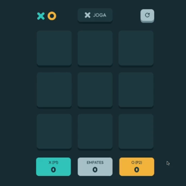
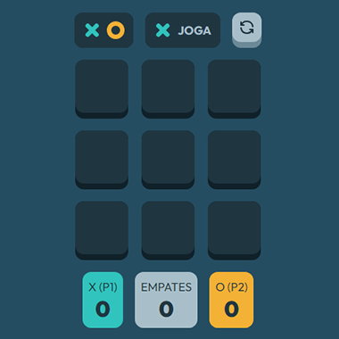

# PROJETO JOGO DA VELHA

___

***Este conteúdo faz parte do curso de Formação DEV da [COD3R](https://www.cod3r.com.br)***

Diferentemente do Projeto de Jogo da Velha da Trilha Web, este é mais avançado e tem uma Modelagem de Domínio, separando a Lógica da Interface Gráfica.

A implementação do projeto se encontra no arquivo [ANOTAÇÕES](./ANOTACOES.md), nele você conseguirá montar o projeto do zero, desde a ***Modelagem do Domínio*** até a ***Interface Gráfica.***

>Acredito que se Você se aventurar, irá gostar do projeto.
Tendei transcrever o pensamento lógico nas anotações, se tiver algo escrito errado, me envie uma mensagem para que eu possa corrigir.  

[Considerações Finais](./ANOTACOES.md#considerações-finais)

## Projeto de exemplo (expectativa)

## Projeto Final (realidade)

## BÔNUS - Componente Título

